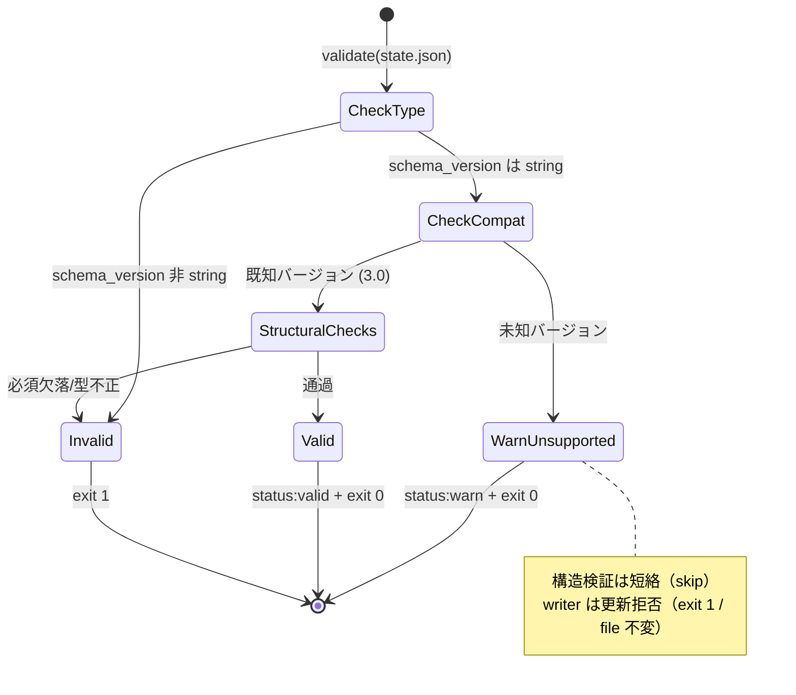

# ドメインモデル: Unit 004 state-validate.sh schema_version 互換性検証（#731）

## 概要

v3 cycle state（`state.json`）の `schema_version` に対する**互換性（compatibility）**の概念をモデル化する。これまで validator は schema_version を「string 型か」のみで扱っていたが、本 Unit では「サポート対象の既知バージョンか / 未知バージョンか」という**値レベルの互換性判定**を導入する。未知バージョンは「不正（invalid）」ではなく「互換性なし（incompatible / WARN・migration 案内対象）」として区別し、writer は非互換 state を更新しない安全境界を持つ。

**重要**: このドメインモデル設計では**コードは書かず**、構造と責務の定義のみを行う。実装は Phase 2 で行う。

## ステップ0: 事前コード読込み

### (a) Read 対象ファイル + 目的

| ファイル | Read 目的 |
|---------|----------|
| `skills/aidlc-v3/scripts/state-validate.sh` | 改修主対象。既存の検証順序（jq 存在→ファイル存在→読取可否→JSON 妥当性→必須/型/release→ISO 8601）と schema_version の string 型検証位置（line 65 付近）を把握し、値検証の挿入位置・短絡経路・出力契約を設計する |
| `skills/aidlc-v3/scripts/state-write.sh` | 改修対象。書き込み前の検証順序（jq→依存→引数→許可フィールド→JSON 妥当性→mktemp→jq 更新→post-write validate→mv）と、validator を依存（`$VALIDATE`）として呼ぶ既存パターン・rc 正規化を把握し、元ファイル事前ガードの挿入位置と rc 別ハンドリングを設計する |
| `skills/aidlc-v3/scripts/tests/test-state-scripts.sh` | 既存テストの非後退基準（valid=exit0 / 型不正=exit1 / atomic 性 / 元 invalid 保持）を把握し、追加境界テスト（既知/未知/型不正・writer 拒否+ファイル不変）の設計とフォーマット（assert_rc / assert_out / make_valid_state）を揃える |
| `docs/v3/data-model.md` §3 | schema 必須フィールドと初版 `schema_version="3.0"`（supported 集合の SoT） |
| `docs/v3/data-model.md` §6 | 未知 schema_version の方針（復帰不可 = WARN / migration・手動対応案内 / 自動修正しない）の正本 |
| `skills/aidlc/guides/exit-code-convention.md` | 終了コード規約（0=正常/valid、1=バリデーションエラー、2=システムエラー）。WARN 付き完了を exit 非 0 にしない根拠 |

### (b) 設計時に意識すべき挙動

- `state-validate.sh` の必須/型検証は **jq の単一式（if-elif チェーン）** で行われ、`schema_version` は「has → string 型」の順で検証済み。値検証はこの string 型確認の**後**に置く必要がある（非 string を値検証より先に exit 1 で弾く既存挙動を維持するため）。
- validator は最後に `echo "status:valid"` / exit 0 を出力する。呼び出し側（doctor / writer）は stdout 文字列を parse しうるため、未知バージョン時の status 行は `status:valid` と区別できる**別フォーマット**にする。
- `state-write.sh` は既に `$VALIDATE`（state-validate.sh）を依存として持ち、**post-write の temp に対してのみ** validate を実行している。元ファイルに対する検証は行っていない。元ファイル事前ガードを追加する際、validator の rc を 0/1/2 で正規化して扱う既存パターン（`set +e; rc=$?; set -e; case`）を踏襲する。
- 既存テスト（line 210-220）は「元が valid-JSON だが release.merge_approved 欠落（= schema 3.0 として invalid）」な state への書き込みが **post-write validate で exit 1・元ファイル保持** となることを確認している。元ファイル事前ガードは **未知 schema_version のみ**を拒否対象とし、この既存ケース（schema_version は "3.0"=既知だが他要因で invalid）の挙動を変えてはならない。
- 既存テスト line 188「許可外フィールド schema_version は exit 1」は writer が `schema_version` フィールドへの**書き込み**を拒否するテストであり、本 Unit のガード（既存 state の schema_version が未知なら更新拒否）とは別概念。両立させる。
- 終了コード規約は 0/1/2 のみ。未知 schema_version の validator 結果は **exit 0（WARN）**、writer の更新拒否は **exit 1（バリデーション系拒否 / システムエラーでない）**。

### (c) 既存実装に基づく代替案検討

| 方針 | 既存実装との適合性 | 採否 |
|------|------------------|------|
| **validator に値検証を extend（既存 jq if-elif 式を 2 段に分割し、schema_version の has+string 検証直後・残り構造検証の前に互換性判定を挿入。未知は WARN+exit0 短絡 / 既知は残り構造検証を継続）** | 前段 jq で schema_version has+string を保証してから値判定し、未知短絡を release 等の構造検証より**前**に置けるため「未知 schema_version + release 欠落」も warn 短絡できる。既知バージョンの従来挙動は完全保持。短絡で未知 schema に 3.0 ルールを誤適用しない | **採用**（計画 D1/D2） |
| validator の jq if-elif チェーン内で未知バージョンを invalid 文字列として返し exit 1 | §6「invalid 扱いにしない」と終了コード規約「WARN を exit 非 0 にしない」に反する | 却下 |
| **writer は validator を元ファイルに実行し `status:warn:unsupported-schema-version:*` を検知して拒否（validator が SoT / extend）** | writer は既に `$VALIDATE` 依存・rc 正規化パターンを持つ。元ファイルへの validate 呼び出しを 1 つ足すだけで supported 集合の重複定義を回避。rc=1（他要因 invalid）は従来素通しで非後退 | **採用**（計画 D3/D5） |
| writer 側で jq により schema_version を直接読んで supported リストと照合 | supported 集合が validator と writer に二重定義され drift リスク。DRY 違反 | 却下 |
| supported 集合を共有 lib に外出し | v3 scripts に共有 lib 基盤が未整備。新設はスコープ拡大。最小範囲に反する | 却下（後続フェーズ） |

## エンティティ（Entity）

### CycleState

- **ID**: `state.json` のパス（既定 `.aidlc/state.json`）
- **属性**:
  - `schema_version`: SchemaVersion - schema バージョン（本 Unit の主たる互換性判定対象）
  - `current_cycle` / `define_completed` / `release.*` / `updated_at`: 既存必須フィールド（本 Unit では参照のみ / 非後退対象）
- **振る舞い**:
  - `validate()`: 既存の構造検証（必須/型/release/ISO 8601）+ 本 Unit で追加する schema_version 互換性判定（`state-validate.sh` が担う / 状態変更なし）
  - `isSchemaCompatible()`: schema_version が SupportedSchemaVersions に含まれるかを判定（互換性判定の中核）

## 値オブジェクト（Value Object）

### SchemaVersion

- **属性**: string 値（例 `"3.0"` / `"4.0"` / `"3.1"`）
- **不変性**: state.json 作成時に確定し更新対象外（writer の許可フィールドに含まれない）
- **等価性**: 文字列値で判定
- **互換性区分**:
  - **既知（supported / compatible）**: SupportedSchemaVersions に含まれる → 従来どおり構造検証を継続
  - **未知（unsupported / incompatible）**: 含まれない → WARN + migration・手動対応案内（invalid ではない）
- **前提**: 互換性判定は「string 型であること」が確定した後に行う（非 string は型エラーとして既存どおり invalid / exit 1）

### SupportedSchemaVersions

- **属性**: 既知バージョンの集合（初版: `{ "3.0" }`）
- **SoT**: `docs/v3/data-model.md` §3（初版 `schema_version="3.0"`）。実装上は validator 内の定数として保持（Bash 3.2 互換のインデックス配列 / data-model §3 参照コメント付き）
- **一元管理**: 本集合の知識は **validator を Single Source of Truth** とする。writer は validator を介して互換性を判定し、集合を重複定義しない（計画 D3/D5）

### ValidationOutcome

- **属性**: validator の結果（stdout 1 行 + 終了コード）
  - `valid`: stdout `status:valid` / exit 0（既知バージョン + 構造検証通過）
  - `warn-unsupported`: stdout `status:warn:unsupported-schema-version:<safe-value>`（単一行 / `<safe-value>` は改行・制御文字を除去したサニタイズ済み値）/ exit 0 + stderr に migration・手動対応案内（未知バージョン）
  - `invalid`: stderr `invalid: ...` / exit 1（既存の構造・型エラー全般）
  - `system-error`: stderr `error: ...` / exit 2（jq 不在 / 読取不可）
- **解釈**: 呼び出し側（writer / doctor）は stdout の status 行と exit code の組で結果を識別する。`warn-unsupported` は exit 0 だが `valid` とは status 行で区別される
- **parse 契約（不変条件）**: status 行は**常に単一行**で、`warn-unsupported` の正準シグナルは**リテラル接頭辞 `status:warn:unsupported-schema-version:`**。schema_version は JSON 上「string 型」制約のみで任意文字（改行・制御文字・コロン）を含みうるため、status 行に載せる値はサニタイズ（改行・制御文字除去）する。呼び出し側は接頭辞一致のみで判定し、接頭辞より後ろの値内容に依存しない（値が異常でも安全に識別できる）。生値は stderr 側でのみ参考表示する

### WriteGuardOutcome

- **属性**: writer の結果（終了コード）
  - `written`: stdout `status:written` / exit 0（既知バージョン + 検証通過 + atomic 置換完了）
  - `refused-incompatible`: stderr 案内 / exit 1 + **ファイル不変**（元 state の schema_version が未知）
  - 既存の `validation-error`（exit 1）/ `system-error`（exit 2）は非後退

## 集約（Aggregate）

### State 検証集約

- **集約ルート**: CycleState（`state.json`）
- **含まれる要素**: schema_version（互換性）+ 構造（必須フィールド・型・release サブフィールド・ISO 8601）
- **境界**: validator は本集約のみを入力とし、状態を一切変更しない（読み取り専用）。writer は本集約の互換性を validator 経由で確認したうえでのみ更新する
- **不変条件**:
  - schema_version が未知の場合、validator は構造検証を**短絡**し WARN（exit 0）を返す（未知 schema に 3.0 構造ルールを適用しない）
  - writer は schema_version が未知の既存 state を**更新しない**（ファイルを不変のまま保持し migration・手動対応を案内）
  - 既存の構造検証（必須/型/release/ISO 8601）と writer の許可フィールド・atomic 性は非後退

## ドメインサービス

### SchemaCompatibilityCheck（`state-validate.sh` に追加 / 検証 SoT）

- **責務**: schema_version 値を SupportedSchemaVersions と照合し、既知/未知を区別する。未知は WARN（migration・手動対応案内 / exit 0）、既知は従来構造検証へ継続
- **操作**: `check(schema_version)` → compatible（継続）/ incompatible（WARN + 短絡 exit 0）
- **不変条件**: string 型確定後にのみ実行 / supported 集合の SoT は本サービス（validator）に一元化

### IncompatibleWriteGuard（`state-write.sh` に追加 / validator を再利用）

- **責務**: 書き込み前に元 state の schema 互換性を validator 経由で確認し、非互換なら更新を拒否してファイルを保護する
- **操作**: `guard(state-file)` → proceed（既知 / 従来書き込み継続）/ refuse（未知 / exit 1・ファイル不変・migration 案内）
- **不変条件**: validator が `status:warn:unsupported-schema-version:*`（rc=0）を返した場合のみ拒否 / validator rc=1（他要因 invalid）は従来の post-write 検証経路に委ね既存挙動を保持（非後退）/ validator rc=2 はシステムエラーとして exit 2

## ドメインモデル図（任意）

## ユビキタス言語

- **互換性（compatibility）**: schema_version 値がサポート対象の既知バージョン集合に含まれるか否か。型の正しさ（string か）とは別レイヤの概念
- **既知 / 未知バージョン（supported / unsupported）**: SupportedSchemaVersions に含まれる値 / 含まれない値。未知 ≠ 不正（invalid）
- **WARN（warn-unsupported）**: 未知バージョンを invalid にせず、migration・手動対応を案内しつつ exit 0 で完了する結果区分（§6 / 終了コード規約準拠）
- **非互換更新ガード（IncompatibleWriteGuard）**: 未知 schema_version の既存 state を writer が更新しないようにする安全境界（#731 の本質リスク対策）
- **非後退（non-regression）**: alpha.2 実装済みの構造検証・writer 挙動・atomic 性を変えないこと。基準は既存 test-state-scripts.sh の全 pass 継続

## 不明点と質問（設計中に記録）

[Question] 未知 schema_version かつ JSON 構造も壊れている（例: release 欠落）state を validator にかけた場合、warn と invalid のどちらを返すか。
[Answer]（設計判断）warn（exit 0）を返す。schema_version 検証を string 型確認直後に置き、未知なら構造検証を短絡するため、未知バージョンが優先される。未知 schema に 3.0 構造ルールを適用するのは不整合であり、§6 の「未知は migration/手動対応」に倒す。writer はいずれにせよ更新拒否するため安全。

[Question] supported 集合に将来 "3.1" 等を追加する際の拡張点はどこか。
[Answer]（設計判断）validator 内の SupportedSchemaVersions 定数（インデックス配列）に値を追加するのみ。writer は validator 経由で判定するため変更不要（DRY / D3）。data-model §3 の SoT 更新と同期する。
