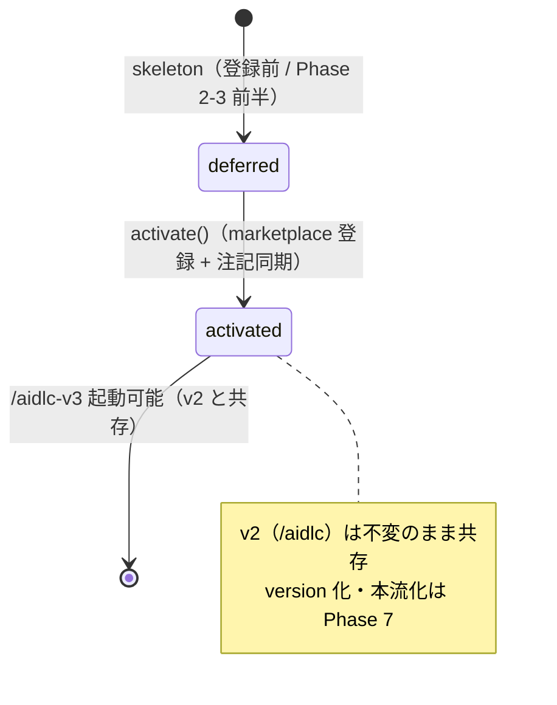

# ドメインモデル: Unit 005 aidlc-v3 起動有効化（marketplace.json 登録 + 統合検証）

## 概要

`/aidlc-v3` の**起動有効化（activation）**という概念をモデル化する。プラグイン配布定義（`marketplace.json`）に v3 スキルを登録することで、これまで skeleton として存在していた `skills/aidlc-v3` が実際に Claude Code から起動可能（ドッグフーディング可能）になる。本 Unit は「登録」「起動可能性の構造検証」「v2 共存（非影響）」「skeleton 注記の実態同期」を扱い、本流化（v3→v2 置換）・version 化は Phase 7 へ defer する。

**重要**: このドメインモデル設計では**コードは書かず**、構造と責務の定義のみを行う。実装は Phase 2 で行う。

## ステップ0: 事前コード読込み

### (a) Read 対象ファイル + 目的

| ファイル | Read 目的 |
|---------|----------|
| `.claude-plugin/marketplace.json` | 改修主対象。`plugins[0].skills` の現構造（15 エントリ / `./skills/aidlc` 〜 `./skills/write-history`）と他キー（name/owner/metadata.version=3.0.0-alpha.2/source/strict）を把握し、`./skills/aidlc-v3` を最小差分（1 要素追加）で加える位置と JSON 妥当性維持を判断する |
| `skills/aidlc-v3/SKILL.md`（L17-22 位置づけ / L29-34 共存注記 / L42-43,51 コマンド表） | skeleton 注記のうち実態同期すべき箇所（起動有効化を「Unit 005 / Phase 3 以降 defer」とする記述、stale な「本 Unit で作成」旧表現）と、据え置くべき箇所（release/reflect/doctor の予約、コマンド名正本性）を特定する |
| `skills/aidlc-v3/steps/define.md` / `steps/develop.md` / `steps/status.md` | 起動構造検証の対象（define/develop が起動後に機能するための手順ファイル）が実在することを確認する |
| `skills/aidlc-v3/scripts/`（state-*.sh / work-item-*.sh） | define/develop が参照するスクリプト群が実在することを確認する（起動可能性の構造検証範囲） |
| `skills/aidlc/SKILL.md` ほか `skills/aidlc/` 配下 | v2 非影響（変更しない対象）の境界を把握する |
| Unit 001/003 の design/SKILL 更新履歴（`construction_unit01.md` / `construction_unit03.md`） | define.md は Unit 001、develop.md は Unit 003 で作成された事実を確認し、SKILL.md の「本 Unit で作成」旧表現を正しい Unit 参照に直す根拠にする |

### (b) 設計時に意識すべき挙動

- `marketplace.json` は全プラグイン読込の起点であり、JSON 破損（カンマ抜け・括弧不整合）は全スキルの読込を壊す。追加は最小差分（配列に 1 要素）に限定し、jq による妥当性検証を必須とする。
- `plugins[0].skills` の配列順は起動に影響しない（名前で解決）。よって末尾追加で十分（D1）。
- v3 の `state.json`（`.aidlc/state.json`）は v2 の `.aidlc/config.toml` / `cycles/` と location が異なり共存可能。登録は v2 の `/aidlc` 起動表面・runtime・ファイルに一切影響しない（追加のみ / クリーンカット）。
- `/aidlc-v3` の実起動は対話セッションでありテスト不能。起動「可能性」は構造（marketplace 登録 + SKILL.md ルーティング + 手順ファイル + 参照スクリプトの存在）で担保する。
- SKILL.md の `metadata.version`（marketplace 側）更新・本流化は Phase 7 スコープ。本 Unit で触れると Phase 境界を侵す。

### (c) 既存実装に基づく代替案検討

| 方針 | 既存実装との適合性 | 採否 |
|------|------------------|------|
| **marketplace.json の `plugins[0].skills` 末尾に `./skills/aidlc-v3` を 1 要素追加** | 既存 15 エントリと同じ source（`./`）配下の skill path 列挙形式に揃う最小差分。JSON 構造を変えない | **採用**（計画 D1） |
| 新規 plugin オブジェクトとして aidlc-v3 を別登録 | `source`/`strict` 等の重複定義が増え、v2 と同一リポジトリ配布の単一 plugin 方針に反する。過剰 | 却下 |
| 起動検証を手動目視のみ | 決定的・再現性なし。Unit 001/003/004 の test-*.sh 方式（構造の自動チェック）に倣えない | 却下 |
| **起動検証を軽量チェック（jq で JSON 妥当性 + 含有 + 必須ファイル existence）で構造化** | 既存テストハーネス文化に合致。決定的・再現可能 | **採用**（計画 D2） |
| SKILL.md skeleton 全体を見直し | 責務「注記を実態に合わせて更新」を超過。予約コマンド記述まで変えると Phase 境界を侵す | 却下（起動有効化注記 + stale Unit 文脈注記のみ / D3） |

## エンティティ（Entity）

### PluginMarketplace

- **ID**: `.claude-plugin/marketplace.json` のパス
- **属性**:
  - `plugins`: プラグイン定義のリスト（本 Unit は `plugins[0]` の `skills` 配列のみ対象）
  - `metadata.version`: 配布バージョン（本 Unit では**変更しない** / Phase 7 / 参照のみ）
- **振る舞い**:
  - `registerSkill(skill_path)`: `plugins[0].skills` に skill path を追加（本 Unit で `./skills/aidlc-v3` を登録）。JSON 妥当性を保つ
  - `hasSkill(skill_path)`: 指定 skill が登録済みかを判定（検証で使用）

### V3SkillBundle

- **ID**: `skills/aidlc-v3`
- **属性**:
  - `entrypoint`: `SKILL.md`（ルーティング骨組み）
  - `flows`: `steps/define.md` / `steps/develop.md`（tiny）/ `steps/status.md`
  - `scripts`: `state-*.sh` / `work-item-*.sh`
  - `activationNotes`: SKILL.md 内の起動有効化・Unit 文脈に関する skeleton 注記
- **振る舞い**:
  - `isLaunchable()`: 起動に必要な構造（marketplace 登録 + entrypoint + flows + scripts の存在）が揃っているかを判定（構造検証）
  - `syncActivationNotes()`: skeleton 注記を実態（有効化済み / 実装済み）へ更新（予約コマンド記述・コマンド名正本性は据え置き）

## 値オブジェクト（Value Object）

### ActivationState

- **属性**: 値 ∈ {`deferred`（登録前 / skeleton）, `activated`（marketplace 登録済み / 起動可能）}
- **本 Unit の遷移**: `deferred → activated`（marketplace.json 登録 + 注記同期で表現）
- **不変性**: 起動有効化は v2 共存を壊さない（v2 は `activated` のまま不変 / 追加のみ）

### LaunchabilityCheck

- **属性**: 構造検証の結果（boolean の集合）
  - marketplace.json が有効 JSON か
  - `plugins[0].skills` に `./skills/aidlc-v3` を含むか
  - SKILL.md / steps/define.md / steps/develop.md / 参照スクリプトが存在するか
- **解釈**: 全項目 true で「起動可能（構造的に）」とみなす。実起動（対話）はスコープ外

## 集約（Aggregate）

### 配布構成集約

- **集約ルート**: PluginMarketplace（`marketplace.json`）
- **含まれる要素**: plugins[0].skills（v2 既存 + v3 新規）+ 各 V3SkillBundle ファイル群
- **境界**: 本 Unit は v3 の登録と注記同期のみ。v2 SkillBundle（`skills/aidlc`）は不変
- **不変条件**:
  - JSON 妥当性を常に保つ（破損で全プラグイン読込が壊れるため）
  - v2 非影響（`skills/aidlc/` 配下に変更なし / 追加のみ）
  - version / 本流化は変更しない（Phase 7 境界）

## ドメインサービス

### ActivationService（本 Unit の中心 / marketplace 登録 + 注記同期）

- **責務**: V3SkillBundle を marketplace に登録し起動可能にしたうえで、SKILL.md skeleton 注記を実態へ同期する
- **操作**: `activate()` → marketplace.json に `./skills/aidlc-v3` 追加 + SKILL.md 注記更新
- **不変条件**: JSON 妥当性維持 / v2 非影響 / 予約コマンド記述・version・本流化に踏み込まない

### LaunchabilityVerification（構造検証）

- **責務**: 起動可能性を構造的に検証する（marketplace 登録 + 必須ファイル存在 + JSON 妥当性）
- **操作**: `verify()` → LaunchabilityCheck（全 true で起動可能）+ v2 非影響確認

## ドメインモデル図（任意）

## ユビキタス言語

- **起動有効化（activation）**: marketplace.json に v3 スキルを登録し `/aidlc-v3` を起動可能にすること
- **共存（coexistence）**: v3（`/aidlc-v3`）と v2（`/aidlc`）が同一リポジトリ配布で併存する状態。state location が異なり衝突しない
- **構造検証（structural verification）**: 実起動（対話）の代わりに、起動に必要な構造（登録 + 必須ファイル + JSON 妥当性）の存在で起動可能性を担保すること
- **skeleton 注記の実態同期**: SKILL.md 内の「後で実装/登録」という旧 skeleton 記述を、実態（実装済み / 有効化済み）に合わせて更新すること
- **本流化（mainlining）**: v3 を v2 に置き換える（`skills/aidlc-v3 → skills/aidlc`）将来作業。本 Unit のスコープ外（Phase 7）

## 不明点と質問（設計中に記録）

[Question] marketplace.json の `metadata.version`（現 3.0.0-alpha.2）を alpha.3 に更新するか。
[Answer]（設計判断）更新しない。Unit 境界で「marketplace version の v3.0.0 化は Phase 7」と定義され、alpha バージョン更新は release/Operations の責務。本 Unit は skill 登録 + 注記同期に限定する。

[Question] 起動検証を恒久的なテストハーネス（test-*.sh）にするか、単発の確認に留めるか。
[Answer]（設計判断）論理設計で確定する（D2）。決定性・再現性の観点から軽量チェックを構造化する方針を基本とし、既存 test-*.sh 文化との整合を論理設計で具体化する。
