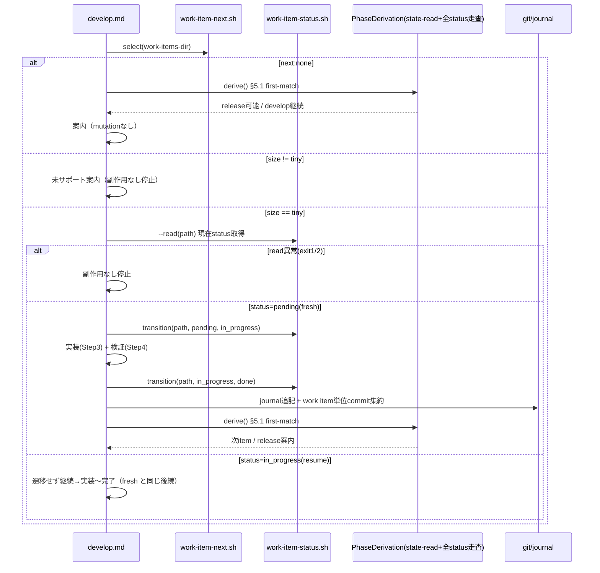

# 論理設計: Unit 003 v3 develop tiny フロー実行実装

## 概要

v3 develop tiny フローを構成する AI プロンプト（`steps/develop.md`）、frontmatter status 遷移スクリプト（`work-item-status.sh` 新規）、既存スクリプト連携（`work-item-next.sh` / `state-read.sh`）、テストハーネスのコンポーネント構成とインターフェースを定義する。

**重要**: この論理設計では**コードは書かず**、コンポーネント構成とインターフェース定義のみを行う。具体的なコードは Phase 2 で作成する。

## ステップ0: 事前コード読込み

> ドメインモデルのステップ0 はドメイン構造（状態遷移・enum）視点。本節は**論理設計固有の視点**（コンポーネント分割・スクリプトインターフェース・テスト構成の実装判断）で記述する。

### (a) Read 対象ファイル + 目的

| ファイル | 論理設計判断への効き方 |
|---------|----------------------|
| `skills/aidlc-v3/scripts/state-write.sh` | `work-item-status.sh` の atomic 実装骨格（同一 dir `mktemp` → 書出 → `mv`、`trap` クリーンアップ、`set -euo pipefail` 下の rc 正規化、`AIDLC_STATE_NOW` テストフック）を流用する判断の根拠 |
| `skills/aidlc-v3/scripts/work-item-validate.sh`（`read_scalar` L50-65） | `work-item-status.sh` の現在 status 抽出・引用符/inline コメント処理・`head -n1` の重複時挙動を把握し、status 行の一意性ガードを設計する根拠 |
| `skills/aidlc-v3/scripts/work-item-next.sh`（L149, L176） | 出力契約 `next:<id>:<size>:<path>` に **status が含まれない**ことを確認 → Step 1 で別途 status 読取が必要という API 境界判断の根拠 |
| `skills/aidlc-v3/scripts/state-read.sh` | フェーズ導出で `define_completed` / `release.*` を読む手段の確認（PhaseDerivation コンポーネント設計） |
| `skills/aidlc-v3/scripts/tests/test-define-flow.sh`（`run_define_step4` L107-130 / `make_sandbox` L134-150） | `test-develop-flow.sh` のドライバ模擬・サンドボックス・assert 関数の構成判断の根拠 |
| `skills/aidlc-v3/steps/define.md`（Step 4 / commit / journal） | develop.md の Step 記法・パス解決・commit/journal 記述を対称に揃える根拠 |

### (b) 設計時に意識すべき既存挙動

- `work-item-next.sh` の出力は `next:<id>:<size>:<path>` のみで **status / 選定経路（resume か fresh か）を含まない**（L149/L176）。develop は選定後に対象の現在 status を別途読む必要がある（コンポーネント設計に直結）。
- `read_scalar` は `grep ... | head -n1` で先頭 status 行を読むため、**frontmatter 内に status 行が複数あると曖昧**。`work-item-status.sh` は status 行の一意性を保証する責務を負う必要がある。
- `state-write.sh` は work item frontmatter を扱わない（許可フィールドは state.json のみ）→ frontmatter status 書込スクリプトは新設必須。
- テストは `.aidlc/`（v2）を破壊しないサンドボックス隔離が必須（`make_sandbox` 方式）。

### (c) 既存実装に基づく代替案検討（論理設計視点）

| 論点 | 代替案 | 採否 |
|------|--------|------|
| Step 1 の現在 status 取得 | (a) `work-item-next.sh` の出力契約を `next:<id>:<status>:<size>:<path>` に拡張 / (b) 選定後に対象 frontmatter から status を別途読取 | **(b) 採用**。(a) は完了済み Unit 002 の固定出力契約・テストを変更するため非採用（既存契約を壊さない保守的選択） |
| status 書込の atomic 実装 | (a) `state-write.sh` の temp+mv パターンを流用 / (b) 独自実装 | **(a) 採用**（実装・テストパターンの一貫性） |
| status 行の堅牢パース | `read_scalar` 流用（引用符・コメント対応）+ 一意性ガード追加 | 採用（DRY + 重複 status の曖昧さを排除） |

## アーキテクチャパターン

**AI プロンプト + 安全境界スクリプト層**（v3 define フローと同一パターン / RFC P4）。フロー制御・判断は AI プロンプト（`steps/develop.md`）が担い、atomic 性・パース安全性・決定性が必要な処理（status 遷移・選定）のみスクリプトへ委譲する。define.md が `state-*.sh` / `work-item-validate.sh` を呼ぶのと対称に、develop.md は `work-item-next.sh`（選定）/ `work-item-status.sh`（status 遷移 / 新規）を呼ぶ。

## コンポーネント構成

### レイヤー / モジュール構成

```text
skills/aidlc-v3/
├── steps/
│   └── develop.md                 (新規: tiny フロー実行手順 = AI プロンプト)
├── scripts/
│   ├── work-item-status.sh        (新規: frontmatter status の atomic 遷移)
│   ├── work-item-next.sh          (既存: Step 1 選定 / 利用のみ)
│   ├── state-read.sh              (既存: フェーズ導出の state 読取 / 利用のみ)
│   └── tests/
│       └── test-develop-flow.sh   (新規: tiny e2e + resume + 副作用なし + status単体)
└── SKILL.md                       (更新: develop を実装済みに / ルーティング参照追加)
```

### コンポーネント詳細

#### steps/develop.md（新規 / AI プロンプト）

- **責務**: tiny work item を `pending→in_progress→done` まで完了させる実行手順を Step 1/3/4/6 で記述（Step 2 設計・Step 5 レビューは tiny スキップを明記）
- **依存**: `work-item-next.sh`（選定）/ `work-item-status.sh`（status 遷移）/ `state-read.sh`（state 読取）/ git（commit）/ `journal.md`（追記）
- **公開インターフェース**: `/aidlc-v3 develop` 起動時の AI 実行手順。define.md と同じパス解決規約（scripts/ はスキルベース相対、cycle 成果物は `.aidlc/cycles/<cycle>/`）

#### work-item-status.sh（新規 / 安全境界スクリプト）

- **責務**: work item frontmatter の `status` のパースを集約する。**read モード**（現在 status を堅牢に読取）と **write モード**（期待現在 status 検証つき atomic 書換）を提供
- **依存**: なし（bash + sed/awk/grep + mktemp/mv のみ。jq 不要 = frontmatter は YAML テキスト）
- **公開インターフェース**: 下記「スクリプトインターフェース設計」

#### work-item-next.sh（既存 / 利用のみ）

- **責務**: Step 1 の次 work item 選定（resume 優先 / 決定的 / size 同梱）
- **公開インターフェース**: `work-item-next.sh <work-items-dir>` → `next:<id>:<size>:<path>` / `next:none`
- **注**: 出力に status は含まれない。develop は選定後に対象 frontmatter から現在 status を別途読取る（#2 / Step 1）

#### PhaseDerivation（develop.md 内 / state-read.sh + 全 status 走査）

- **責務**: develop 完了後に次フェーズを §5.1 first-match で導出し案内する（状態を変更しない）
- **依存**: `state-read.sh`（`define_completed` / `release.*` 読取）+ 全 work item frontmatter status 走査
- **導出ロジック（§5.1 評価順 / 正本 data-model §5.1）**: 本 Unit で develop 実行後に必要な分岐に限り適用する:
  1. `release.merge_approved: true` かつ PR merged → complete（本 Unit では到達しない / 案内対象外）
  2. `define_completed: false` → define（develop 実行の前提上、通常到達しない）
  3. `define_completed: true` かつ done/withdrawn 以外あり → **develop 継続**（次 item を案内）
  4. `define_completed: true` かつ全 work item が done/withdrawn → **release 可能**（release を案内）
- **不変条件**: `next:none` を release 可能の根拠にしない（評価順 4 は全 status 走査で判定 / §5.2 別レイヤ）。`current_phase` を保持しない

#### test-develop-flow.sh（新規 / テストハーネス）

- **責務**: develop tiny フローの決定的部分と `work-item-status.sh` を隔離サンドボックスで検証
- **依存**: `work-item-status.sh` / `work-item-next.sh` / `state-read.sh` / `state-init.sh` / `state-write.sh` / git（test-define-flow.sh と同じ前提）

## スクリプトインターフェース設計

### work-item-status.sh

#### 概要

work item の frontmatter の `status` を扱う単一の安全境界スクリプト。**read モード**（現在 status を堅牢に読取る）と **write モード**（期待現在 status 一致時に status 行のみ atomic 書換）の 2 モードを持つ。frontmatter status のパース責務を本スクリプト 1 箇所に集約し、AI プロンプト（develop.md）側に脆弱なパースを残さない（R2 指摘 #1）。

#### 引数

| 形態 | 引数 | 説明 |
|------|------|------|
| read | `--read <work-item-path>` | 対象 work item の現在 status を読取り stdout に出力（状態変更なし） |
| write | `<work-item-path> <expected-current> <next-status>` | 期待現在 status 一致時に status 行を次 status へ atomic 更新 |

- `<work-item-path>`: 対象ファイル（`.aidlc/cycles/<cycle>/work-items/<id>-<slug>.md`）
- `<expected-current>`: 期待する現在 status（enum）。実 status と不一致なら遷移せず exit 1（不正遷移 / 競合検出）
- `<next-status>`: 遷移先 status（enum）。本フローでは `in_progress` / `done`

#### 成功時出力

- read モード: `status:<value>`（例 `status:pending`） / 終了コード `0` / stdout
- write モード: `status:written` / 終了コード `0` / stdout

#### エラー時出力

```text
error: <理由>
```

- 終了コード（両モード共通の堅牢性ガード）:
  - `1` = バリデーションエラー（引数不足 / ファイル不存在 / **frontmatter 内 status 行が 0 行または 2 行以上** / status 値 malformed / enum 不正 / write モードで**期待現在 status 不一致**）
  - `2` = システムエラー（ファイル読取不可 / mktemp 失敗 / mv 失敗）
- 出力先: stderr
- **read モードも異常時は exit 1/2 を返し stdout に status を出さない**。develop.md は read 失敗時に mutation を行わず停止する（副作用なし）

#### 設計詳細（実装方針 / コードは書かない）

- **frontmatter 領域の特定**: 先頭 `---`〜次 `---` を frontmatter とみなす（`work-item-validate.sh` の awk 抽出と同方式）。本文側の `status:` は対象外。
- **status 行の一意性ガード**: frontmatter 領域内に `^status:` 行が**ちょうど 1 行**でなければ exit 1（0 行 = status 行不在 / 2 行以上 = 曖昧）。`read_scalar` の `head -n1` が曖昧に先頭を取る問題を本スクリプトでは許容しない。
- **status 抽出**: `work-item-validate.sh::read_scalar` と同等の正規表現（`^status:` 行・前後空白・inline コメント・両端引用符）で現在値を取得し enum 検証。
- **期待現在 status 検証**: 取得した現在値が `<expected-current>` と一致しない場合 exit 1（pending→in_progress を二重実行しない / 競合した変更を検出）。
- **enum 検証**: `<expected-current>` / `<next-status>` が status enum（pending/in_progress/blocked/done/withdrawn）に含まれることを検証。
- **行のみ置換**: frontmatter 領域内の唯一の `status:` 行のみを `status: <next-status>` に置換し、他行・本文・frontmatter 外の `status:`・引用符スタイル（必要に応じ）を保持（最小変更）。
- **atomic 書き込み**: `state-write.sh` 同様、対象と同一ディレクトリに `mktemp` → 置換結果を書き出し → `mv` で atomic 置換。`trap 'rm -f "$tmp"' EXIT` でクリーンアップ。
- **終了コード正規化**: `set -euo pipefail` 下で 126/127 の漏れを防ぐ（state-write.sh のパターン踏襲）。

#### 使用コマンド例

```bash
# 現在 status 読取（Step 1 / fresh・resume の分岐と expected-current 取得）
scripts/work-item-status.sh --read ".aidlc/cycles/<cycle>/work-items/003-foo.md"   # → status:pending

# pending → in_progress（Step 1 tiny 確定後）
scripts/work-item-status.sh ".aidlc/cycles/<cycle>/work-items/003-foo.md" pending in_progress

# in_progress → done（Step 6 完了）
scripts/work-item-status.sh ".aidlc/cycles/<cycle>/work-items/003-foo.md" in_progress done
```

## データモデル概要

### ファイル形式

- **work item frontmatter**: YAML（data-model §4.1）。`work-item-status.sh` は `status` キーのみ更新、他キー（id/size/risk/assigned/dependencies）と本文は不変。
- **journal.md**: Markdown 追記（§7）。`## YYYY-MM-DD` 見出し配下に `- develop completed: <id>-<slug>` 等を追記。
- **state.json**: 本 Unit では**書き込まない**（develop tiny は state.json を変更しない / フェーズ導出は読取のみ）。

## 処理フロー概要

### develop tiny フロー（Step 1/3/4/6）の処理フロー

**ステップ**:

1. **Step 1 選定 + 現在 status 読取**: `work-item-next.sh <work-items-dir>` を実行。
   - `next:none` → **PhaseDerivation を呼ぶ**（`state-read.sh` で `define_completed` / `release.*` を読み、全 work item frontmatter status を走査して §5.1 first-match を適用）。全 done/withdrawn なら **release 可能**を案内、それ以外（blocked 残存）なら **develop 継続（解決待ち）**を案内して終了（mutation なし / `next:none` 単独を release 根拠にしない）。
   - `next:<id>:<size>:<path>` を得たら、**まず size を判定**:
     - `size != tiny`（normal/risky）→ **未サポート案内のみで停止**。frontmatter/journal/commit を一切変更しない（副作用なし）。後述のとおり選定経路が resume（in_progress）でも fresh（pending）でも同様に停止する。
     - `size == tiny` → **`work-item-status.sh --read <path>` で現在 status を読取る**（`work-item-next.sh` 出力に status が含まれないため。パース・一意性・enum 検証はスクリプトに集約）。read が exit 1/2 を返した場合は mutation を行わず停止（副作用なし）。正常取得した現在 status で経路を分岐:
       - 現在 status = `pending`（fresh）→ `work-item-status.sh <path> pending in_progress` で in_progress 化。
       - 現在 status = `in_progress`（resume）→ status 遷移せず継続（既に in_progress / 二重遷移しない）。
       - それ以外（理論上 `work-item-next.sh` は pending/in_progress のみ返すが、防御的に）→ 想定外として案内のみで停止（mutation なし）。
2. **Step 3 実装**: acceptance criteria に沿って実装。tiny のため Self-Healing は軽量（検証は Step 4）。
3. **Step 4 検証**: acceptance criteria チェック（tiny に応じた最小検証 / lint・test 該当時）。
4. **Step 6 完了**:
   - `work-item-status.sh <path> in_progress done` で done 化。
   - journal.md に `- develop completed: <id>-<slug>` を追記（日付見出し配下）。
   - **work item 単位で最終 commit を 1 つに集約**: 実装変更 + status:done + journal 追記をまとめて `git commit -m "develop: <id>-<slug> <要約>"`（中間 commit があれば amend/squash で最終 commit 単体に集約 / 計画 D4）。
   - 完了後フェーズ導出（**PhaseDerivation を呼ぶ** = `state-read.sh` + 全 status 走査で §5.1 first-match を適用）: 未完了 item 残存（評価順 3）→ develop 継続を案内 / 全 done/withdrawn（評価順 4）→ release 可能を案内。

**関与するコンポーネント**: develop.md / work-item-next.sh / work-item-status.sh / state-read.sh / git / journal.md



## テスト設計（test-develop-flow.sh）

test-define-flow.sh 方式（`mktemp -d` サンドボックス / assert_rc / assert_out / ドライバ模擬）を踏襲。

| 区分 | テスト内容 | 検証手段 |
|------|----------|---------|
| 静的検査 | `bash -n` / shellcheck（利用可能時）on develop 関連スクリプト | assert_rc 0 |
| status 単体 | pending→in_progress / in_progress→done 正常遷移（`status:written` / status 行のみ変化 / 他フィールド不変） | assert_out + frontmatter 差分確認 |
| status 単体 | enum 不正（exit 1）/ 期待現在 status 不一致（exit 1）/ ファイル不在（exit 1）/ 引数不足（exit 1） | assert_rc 1 |
| status 単体 | 引用符付き status（`status: "pending"`）の正常遷移 / inline コメント付き（`status: pending # x`）の正常遷移 | assert_out + 差分確認 |
| status 単体 | frontmatter 内 status 行が 0 行（exit 1）/ 2 行以上（exit 1 / 曖昧ガード） | assert_rc 1 |
| status 単体 | 本文中の `status:` 文字列・frontmatter 外の `status:` を誤って変更しないこと | 差分確認（対象外行が不変） |
| status 単体 | atomic 性（更新後も valid な frontmatter / work-item-validate.sh 通過） | assert_gate 相当 |
| status read | `--read` で現在 status を `status:<value>` 出力（pending/in_progress 正常） | assert_out |
| status read | `--read` 異常（status 行 0/重複 / enum 不正 / ファイル不在）で exit 1、stdout に status を出さない | assert_rc 1 |
| Step1 read異常 | read が異常を返した際、frontmatter/journal/commit が無変更で停止する（副作用なし） | ハッシュ・git status 不変 |
| tiny e2e | `run_develop_tiny` ドライバ（選定→in_progress→実装模擬→done→journal→commit）後、フェーズ導出が develop 継続（他に未完了あり）/ release 可能（全 done）になる | assert_out（全 status 走査結果） |
| 副作用なし | normal/risky の新規 pending 選定時、frontmatter/journal/commit 無変更で停止 | 選定後ファイルハッシュ・git status 不変を確認 |
| 副作用なし | resume された in_progress が normal/risky の場合も無変更で停止 | 同上 |
| resume | in_progress tiny が選定され継続（status 二重遷移しない） | work-item-next 出力 + status 不変確認 |
| release 判定 | blocked 残存 + next:none で release 可能と誤判定しない（develop 継続案内） | 全 status 走査ロジックの単体検証 |

> **ドライバ模擬の境界**: develop.md の AI 判断ステップ（実装内容そのもの）はテストせず、`run_develop_tiny` が「AI が行う mutation（work-item-status.sh 経由 status 遷移・journal 追記・commit）」を決定的に再現する。検証対象はフロー副作用とスクリプトの契約。

## 非機能要件（NFR）への対応

### パフォーマンス
- **要件**: tiny work item 1 件を軽量に完了
- **対応策**: status 遷移は frontmatter 1 行の atomic 更新のみ。重い処理を持たない。

### セキュリティ
- **要件**: status 更新は frontmatter 操作の最小範囲、state は `state-write.sh` 経由（Unit 003 NFR）
- **対応策**: `work-item-status.sh` は `status` 行のみ更新（他フィールド・本文不変）。期待現在 status 検証で不正遷移を防止。state.json は develop tiny では変更しない。

### スケーラビリティ / 可用性
- 該当なし（単一 work item 処理 / ローカル）。エラー時は終了コード 0/1/2 で呼出側（develop.md）が分岐。

## 技術選定
- **言語**: Bash（既存 v3 スクリプト群と統一 / macOS bash 3.2 互換を維持）
- **依存**: sed/awk/grep/mktemp/mv（jq 不要）、git
- **フレームワーク**: なし（自己完結テストハーネス）

## 実装上の注意事項
- **ドッグフーディング特殊処理を埋めない**: develop.md にブランチ判定等の自リポジトリ特殊分岐を埋めない（define.md と同様 / リポジトリ規約）。
- **v2 非影響**: `skills/aidlc/`（v2）配下を変更しない。テストはサンドボックス隔離で `.aidlc/` を破壊しない。
- **bash 3.2 互換**: 連想配列を使わない（work-item-next.sh / validate.sh と同様の並列配列方式）。
- **status 行置換の堅牢性**: 引用符付き status（`status: "pending"`）・inline コメント・前後空白を `read_scalar` 同等に扱い、frontmatter 領域外の `status:` 文字列を誤って変更しない。

## 不明点と質問（設計中に記録）

[Question] `work-item-status.sh` の期待現在 status 検証は厳格に必須とするか（develop が必ず正しい expected を渡せる前提か）。
[Answer]（設計判断）必須とする。expected 不一致は競合や二重実行の兆候であり、安全側に倒して exit 1 で停止する方が事故を防げる。develop.md は Step 1 で選定対象の frontmatter から現在 status を読取り（`work-item-next.sh` 出力には status が含まれないため別途読取）、その値を expected として渡すため正しい値を渡せる。

[Question] SKILL.md の develop 登録は「実装済み」に変えるが、`/aidlc-v3` 起動有効化（marketplace.json 登録）は本 Unit で行うか。
[Answer]（設計判断）行わない。起動有効化は Unit 005（aidlc-v3-activation）の責務（依存関係に明記）。本 Unit は SKILL.md の develop 行と steps/develop.md 参照の整備までに留める。
