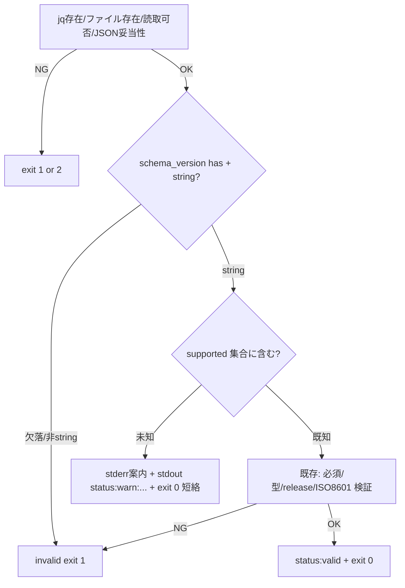
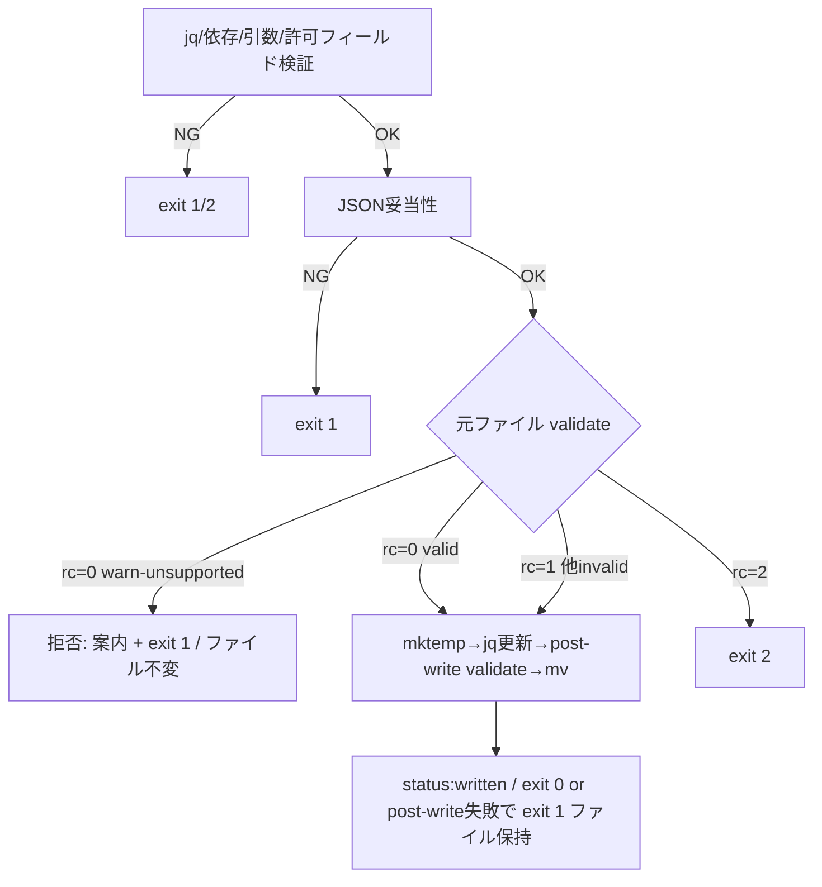

# 論理設計: Unit 004 state-validate.sh schema_version 互換性検証（#731）

## 概要

`state-validate.sh`（schema_version 値検証の追加）、`state-write.sh`（非互換 state の更新ガード追加）、`test-state-scripts.sh`（境界テスト追加）のコンポーネント構成とインターフェース変更を定義する。validator を schema 互換性の Single Source of Truth とし、writer はそれを再利用する一方向依存で #731 の本質リスク（writer が非互換 state を更新・保持）を最小範囲で塞ぐ。

**重要**: この論理設計では**コードは書かず**、コンポーネント構成とインターフェース定義のみを行う。具体的なコードは Phase 2 で作成する。

## ステップ0: 事前コード読込み

> ドメインモデルのステップ0 はドメイン構造（互換性区分・状態）視点。本節は**論理設計固有の視点**（検証順序への挿入位置・出力契約・rc 別ハンドリング・テスト構成の実装判断）で記述する。

### (a) Read 対象ファイル + 目的

| ファイル | 論理設計判断への効き方 |
|---------|----------------------|
| `skills/aidlc-v3/scripts/state-validate.sh`（L63-89 jq if-elif / L98 status:valid） | 既存 jq 単一式は schema_version の has+string 型から release/updated_at まで一括検証している（L63-84）。本 Unit は**この jq 式を 2 つに分割**する: ①schema_version の has+string のみを検証する前段 jq 式 → ②bash 側で互換性判定（未知なら WARN+exit0 短絡）→ ③既知のときのみ残り（current_cycle/define_completed/release/updated_at）を検証する後段 jq 式。互換性判定を①と③の**間**に置くことで「未知 schema_version かつ release 欠落」も warn 短絡できる、という挿入位置判断の根拠 |
| `skills/aidlc-v3/scripts/state-write.sh`（L120-156 JSON妥当性→mktemp→jq更新→post-write validate→mv） | 元ファイル事前ガードを **JSON 妥当性確認後（L124）・mktemp（L128）前**に挿入する位置判断。既存の `$VALIDATE` 呼び出し（L140-149）の rc 正規化パターン（`set +e; rc=$?; set -e; case`）を事前ガードにも流用する根拠 |
| `skills/aidlc-v3/scripts/tests/test-state-scripts.sh`（assert_rc / assert_out / make_valid_state / L210-227 atomic） | 追加テストの assert 関数・フィクスチャ生成・非後退基準（L210「元 invalid 保持」）のフォーマットを揃える根拠 |
| `docs/v3/data-model.md` §3（L73 schema_version 初版 "3.0"）/ §6（L243 未知バージョン WARN） | supported 集合 SoT と未知バージョン方針の正本 |
| `skills/aidlc/guides/exit-code-convention.md` | 0/1/2 の意味と「WARN を exit 非 0 にしない」根拠 |

### (b) 設計時に意識すべき既存挙動

- `state-validate.sh` の必須/型検証は **jq の単一 if-elif 式**（L63-84）で行われ、`schema_version` は「has → string 型」順で検証され、その後に current_cycle/define_completed/release/updated_at まで一括検証される。値検証を jq 式内に入れると「未知値=invalid文字列」となり exit 1 経路に乗ってしまう。また既存 jq 式の**後ろ**に未知判定を置くと、release 等の構造検証を先に通すことになり「未知 schema_version かつ release 欠落」を warn 短絡できない。よって**既存 jq 式を 2 段に分割**する: 前段 jq 式で schema_version の has+string のみを検証 → bash 側で互換性判定（未知なら WARN+exit0 短絡）→ 既知のときのみ後段 jq 式で残り構造（current_cycle/define_completed/release/updated_at）+ ISO 8601 を検証する。
- validator は最終行で `echo "status:valid"`（L98）。未知バージョンの status 行はこれと区別可能な `status:warn:unsupported-schema-version:<safe-value>` とする（`<safe-value>` は後述のサニタイズ済み値 / 改行・制御文字を含めない）。doctor / writer は stdout を parse して識別する。**writer の検知契約は「validator stdout 先頭行がリテラル接頭辞 `status:warn:unsupported-schema-version:` で始まるか」のみに依存し、接頭辞より後ろの値内容には依存しない**（値が異常でも安全に判定できる）。
- `state-write.sh` は `$VALIDATE` を **post-write の temp に対してのみ**実行（L140-149）。元ファイルは JSON 妥当性（L121）しか見ていない。元ファイル事前ガードは新規で、validator の rc を `set +e; rc=$?; set -e; case` で正規化する既存パターンを踏襲する。
- 既存テスト L210-220「元が release.merge_approved 欠落（schema_version は "3.0"=既知）の valid-JSON」への書き込みは **post-write validate で exit 1・元ファイル保持**。事前ガードは **未知 schema_version のみ拒否**とし、この既存ケース（validator が rc=1 を返す）は素通しして従来経路に委ねる（非後退）。
- 既存テスト L188「許可外フィールド schema_version は exit 1」は writer の **書き込み対象フィールド**としての schema_version 拒否であり、本ガード（既存 state の schema_version 値が未知なら更新拒否）とは独立。両者は別の case で処理され衝突しない。
- macOS bash 3.2 互換: 連想配列不可。supported 集合はインデックス配列 + ループ照合で表現する。

### (c) 既存実装に基づく代替案検討（論理設計視点）

| 論点 | 代替案 | 採否 |
|------|--------|------|
| 値検証の実装位置 | (a) jq if-elif 式内に未知判定を追加 / (b) 既存 jq 式を 2 段（前段=schema_version has+string / 後段=残り構造）に分割し、その間に bash 側で supported 照合・未知 WARN+exit0 短絡を置く | **(b) 採用**。(a) は未知を invalid（exit 1）経路に乗せてしまい §6・終了コード規約に反する。(b) は前段 jq で string 型を保証してから値判定し、未知短絡を構造検証（release 等）より**前**に置けるため「未知 schema_version かつ release 欠落」も warn 短絡できる |
| 短絡のタイミング | (a) schema_version の has+string 確認直後（既存 jq 式を分割し前段のみ先に評価）/ (b) 既存 jq 式（必須/型/release/ISO8601 を一括）通過後に値照合 | **(a) 採用**。(b) は構造検証を先に通すため未知 schema に 3.0 構造ルールを誤適用し、未知+release欠落を短絡できない。実装は「前段 jq: schema_version has+string のみ → bash: 値照合（未知なら WARN+exit0 短絡）→ 後段 jq: current_cycle/define_completed/release/updated_at + ISO 8601」の二段構成 |
| writer ガードの互換性検知 | (a) validator を元ファイルに実行し warn status を検知（validator=SoT）/ (b) writer で jq 直接照合（リスト重複） | **(a) 採用**（DRY / 計画 D3）。rc=0 かつ warn status → 拒否、rc=1 → 従来素通し、rc=2 → exit 2 |
| supported 集合の配置 | (a) validator 内定数 / (b) 共有 lib | **(a) 採用**（最小範囲 / 計画 D5）。共有 lib 新設はスコープ外 |

## アーキテクチャパターン

**検証 SoT + 安全境界スクリプト層**（既存 v3 state スクリプト群と同一 / RFC P4）。schema 互換性の知識は validator（`state-validate.sh`）に一元化し、writer（`state-write.sh`）は validator を呼び出して互換性を判定する一方向依存（writer → validator）。循環依存なし。validator は読み取り専用、writer のみ状態を変更する。

## コンポーネント構成

### レイヤー / モジュール構成

```text
skills/aidlc-v3/
├── scripts/
│   ├── state-validate.sh          (改修: schema_version 値の互換性検証を追加 / 検証 SoT)
│   ├── state-write.sh             (改修: 非互換 state の更新ガードを追加 / validator 再利用)
│   └── tests/
│       └── test-state-scripts.sh  (テスト追加: 既知/未知/型不正の境界 / writer 拒否+ファイル不変)
```

> `state-read.sh` / `state-init.sh` は変更しない。SKILL.md も変更不要（scripts のインターフェースは後方互換 = 既知バージョンの挙動不変）。

### コンポーネント詳細

#### state-validate.sh（改修 / 検証 SoT）

- **責務**: state.json の構造検証（既存）に加え、schema_version 値の互換性判定（新規）を行う。未知バージョンは WARN（exit 0）、既知は従来構造検証を継続。状態は変更しない
- **依存**: jq（既存）。新規依存なし
- **公開インターフェース**: `state-validate.sh [file]`（引数は不変 / 後方互換）。出力契約に warn ケースを追加

#### state-write.sh（改修 / 更新ガード）

- **責務**: 許可フィールドの atomic 更新（既存）に加え、書き込み前に元 state の schema 互換性を validator 経由で確認し、非互換なら更新を拒否（新規）
- **依存**: jq + `$VALIDATE`（state-validate.sh / 既存依存を再利用）
- **公開インターフェース**: `state-write.sh <field> <value> [file]`（引数は不変 / 後方互換）。既知バージョンへの書き込み挙動は不変

#### test-state-scripts.sh（テスト追加）

- **責務**: 既知/未知/型不正の境界（validator）と writer 拒否+ファイル不変、非後退を隔離サンドボックスで検証
- **依存**: 既存（jq / 各 state スクリプト / mktemp -d）

## スクリプトインターフェース設計

### state-validate.sh（出力契約の拡張）

#### 引数（不変）

| 形態 | 引数 | 説明 |
|------|------|------|
| 検証 | `state-validate.sh [file]` | file 省略時 `.aidlc/state.json`（既存どおり） |

#### 出力契約

| 区分 | stdout | stderr | exit | 条件 |
|------|--------|--------|------|------|
| valid（既存） | `status:valid` | - | 0 | 既知 schema_version + 構造検証通過 |
| **warn-unsupported（新規）** | `status:warn:unsupported-schema-version:<safe-value>`（1 行 / `<safe-value>` は改行・制御文字を除去したサニタイズ済み値） | 案内（migration / 手動対応 / §6 参照 / 生値は stderr 側でのみ参考表示） | **0** | schema_version が string だが supported 集合に非含有 |
| invalid（既存） | - | `invalid: <理由>` | 1 | 既存の必須欠落/型不正/release/ISO 8601 等 |
| system-error（既存） | - | `error: <理由>` | 2 | jq 不在 / 読取不可 |

#### 設計詳細（実装方針 / コードは書かない）

- **supported 集合定義**: `SUPPORTED_SCHEMA_VERSIONS=("3.0")` 相当のインデックス配列（readonly）。`docs/v3/data-model.md` §3 を SoT とするコメントを付す。
- **検証順序の変更（二段構成 / 既存 jq if-elif 式を分割）**:
  1. 既存どおり jq 存在 → ファイル存在 → 読取可否 → JSON 妥当性を確認。
  2. **前段 jq 式: schema_version の has + string 型のみを検証**（欠落 → `missing field: schema_version` exit 1 / 非 string → `type error: schema_version must be string` exit 1 / いずれも既存メッセージ・既存挙動を維持）。
  3. bash 側で schema_version 値を supported 集合とループ照合。
     - **未知**: stderr に WARN 案内（migration・手動対応 / §6 / 参考として生値を表示可）、stdout に `status:warn:unsupported-schema-version:<safe-value>`、**exit 0** で短絡（後段の構造検証を行わない）。
     - **既知**: **後段 jq 式: 残りの必須/型/release サブフィールド検証（current_cycle/define_completed/release/release.*/updated_at）+ ISO 8601 正規表現**を継続し、通過時 `status:valid` / exit 0。
- **status 行の値サニタイズ（parse 契約の保護）**: schema_version は JSON 上「string 型」制約のみで、`jq -r` 展開時に改行・制御文字・任意文字を含みうる。stdout の status 行を**必ず単一行・接頭辞固定**に保つため、`<safe-value>` は生値から改行・復帰・制御文字を除去（例: `tr -d '\000-\037'` 相当）した値とする。
  - **接頭辞固定の契約**: `status:warn:unsupported-schema-version:` は不変のリテラル接頭辞。値にコロンが含まれても、呼び出し側（writer）は**先頭行が本接頭辞で始まるか**のみで判定するため曖昧化しない。
  - 生の（未サニタイズ）schema_version は人間向け参考情報として stderr 側にのみ出す（stderr は複数行でも parse 契約に影響しない）。
- **後方互換**: 既知バージョン "3.0" の入力に対する出力（`status:valid` / exit 0）と全ての既存 invalid/system-error 経路は不変。新フォーマット出力は未知バージョンのときのみ。
- **bash 3.2 互換**: supported 照合はインデックス配列のループ（連想配列を使わない）。

#### 使用コマンド例

```bash
# 既知バージョン → valid（既存どおり）
state-validate.sh state.json            # stdout: status:valid / exit 0

# 未知バージョン → warn（新規 / exit 0）
state-validate.sh state-v4.json         # stdout: status:warn:unsupported-schema-version:4.0 / exit 0 / stderr: 案内

# schema_version 非 string → 型エラー（既存どおり exit 1）
state-validate.sh state-bad-type.json   # stderr: invalid: type error... / exit 1
```

### state-write.sh（元ファイル事前ガードの追加）

#### 引数（不変）

`state-write.sh <field> <value> [file]`（field = define_completed | release.pr_number | release.ready | release.merge_approved）

#### 出力契約

| 区分 | stdout | stderr | exit | 条件 |
|------|--------|--------|------|------|
| written（既存） | `status:written` | - | 0 | 既知 schema_version + 検証通過 + atomic 置換完了 |
| **refused-incompatible（新規）** | - | 案内（unsupported schema_version / migration required / file left unchanged） | **1** | 元 state の schema_version が未知（**ファイル不変**） |
| validation-error（既存） | - | `error: <理由>` | 1 | 引数不正 / 許可外フィールド / 値型不正 / post-write 検証失敗 等 |
| system-error（既存） | - | `error: <理由>` | 2 | jq 不在 / 依存不備 / 読取不可 / mktemp・mv 失敗 |

#### 設計詳細（実装方針 / コードは書かない）

- **挿入位置**: 既存の「JSON 妥当性確認（L121）」の**後**、「mktemp（L128）」の**前**に元ファイル事前ガードを置く。これにより拒否時は temp を作らず、ファイルにも触れない（不変保証）。
- **互換性確認（validator 再利用 / DRY）**:
  - 元ファイルに対し `$VALIDATE "$file"` を実行し、stdout と rc を取得（既存の rc 正規化パターン `set +e; out=$(...); rc=$?; set -e` を踏襲）。
  - **rc=0 かつ stdout 先頭行が `status:valid`** → 既知 + 構造健全。従来どおり mktemp → jq 更新 → post-write validate → mv へ進む。
  - **rc=0 かつ stdout 先頭行がリテラル接頭辞 `status:warn:unsupported-schema-version:` で始まる** → 更新拒否: stderr に migration・手動対応案内を出力し **exit 1**（ファイル不変）。**接頭辞のみで判定し、接頭辞より後ろの値内容には依存しない**（値に異常文字が含まれても安全 / 設計レビュー指摘 #2 対応）。先頭行抽出は値のサニタイズ（validator 側で改行除去済み）と合わせて単一行を保証する。
  - **rc=0 だが先頭行が上記いずれでもない（空・未知 status 行）** → validator 出力契約違反として **exit 2**（fail-safe / コードレビュー指摘）。valid 扱いで更新継続すると parse 契約の防御が崩れるため停止する。
  - **rc=1**（未知以外の invalid）→ **従来動作を維持**（事前ガードでは何もしない）。既存どおり書き込みを試み post-write validate で捕捉される（元 invalid 保持の既存テストを壊さない）。
  - **rc=2**（システムエラー）→ `error: validator system error` を出力し **exit 2**（既存の post-write 同種処理と整合）。
- **既存 case との独立性**: 許可フィールド検証（schema_version をフィールドとして書こうとする L188 ケース）は本ガードより前の case 文で既に exit 1。本ガードは「書き込み対象の元 state が非互換」という別軸であり衝突しない。
- **bash 3.2 互換 / 終了コード正規化**: 既存 state-write.sh のパターンを踏襲（126/127 漏れ防止）。

#### 使用コマンド例

```bash
# 既知バージョンの state を更新 → 成功（既存どおり）
state-write.sh define_completed true state.json        # status:written / exit 0

# 未知バージョンの既存 state を更新しようとする → 拒否（新規 / ファイル不変）
state-write.sh define_completed true state-v4.json     # stderr: refusing... migration required / exit 1
```

## データモデル概要

- **state.json**: §3 schema。本 Unit は schema_version の**値**にのみ新たに着目（型は既存検証済み）。writer は schema_version を更新しない（許可フィールド外 / 既存）。
- **supported 集合**: 初版 `{ "3.0" }`。data-model §3 を SoT とし、validator 内定数で表現。

## 処理フロー概要

### validator のフロー（既存 + 追加）



### writer のフロー（既存 + 追加ガード）



## テスト設計（test-state-scripts.sh 追加分）

既存ハーネス（`mktemp -d` / assert_rc / assert_out / make_valid_state）を踏襲。**既存テストは全て不変・全 pass**（非後退基準）。

| 区分 | テスト内容 | 検証手段 |
|------|----------|---------|
| validate 互換 | 既知 "3.0" は `status:valid`（既存 valid テストで担保 / 念のため stdout も確認） | assert_out `status:valid` |
| validate 互換 | 未知 "4.0" は exit 0 | assert_rc 0 |
| validate 互換 | 未知 "4.0" の stdout が `status:warn:unsupported-schema-version:4.0` | assert_out |
| validate 互換 | 未知 "2.0" / "3.1"（境界: 近い値）も warn + exit 0 | assert_rc 0 + assert_out |
| validate 互換 | schema_version 非 string（数値 3）は従来どおり exit 1（型検証が値検証より先 / 既存テスト L118 で担保 / 非後退確認） | assert_rc 1 |
| validate 互換 | schema_version 欠落は従来どおり exit 1（既存 L98-102 で担保） | assert_rc 1 |
| validate 互換 | 未知バージョンかつ release 欠落（構造も不正）でも warn + exit 0（短絡 / ドメインモデル [Answer] 整合） | assert_rc 0 + assert_out |
| validate 互換（parse 保護） | schema_version に改行・制御文字を含む未知値（例 `"4.0\nstatus:valid"`）でも、stdout が**単一行**かつ接頭辞 `status:warn:unsupported-schema-version:` で始まり exit 0（status 行が複数行化しない / 設計レビュー指摘 #2） | stdout 行数=1 + 先頭行接頭辞一致 + assert_rc 0 |
| write ガード | 未知 "4.0" の既存 state への `define_completed true` 更新は exit 1 | assert_rc 1 |
| write ガード（parse 保護） | schema_version に改行・制御文字を含む未知値の既存 state への更新も拒否（exit 1 / ファイル不変 / 接頭辞検知が値内容に依存しない） | assert_rc 1 + before==after |
| write ガード | 上記拒否時に**ファイルが不変**（before==after） | before/after 比較（既存 atomic テスト方式） |
| write ガード | 拒否時に temp file が残らない | `find .state.json.*` カウント 0 |
| write 非後退 | 既知 "3.0" への更新は従来どおり成功（既存テストで担保 / 念のため warn でないことを確認） | assert_rc 0 |
| write 非後退 | 元が release.merge_approved 欠落（"3.0"=既知だが invalid）→ exit 1・ファイル保持（既存 L210-220 が不変 pass） | 既存テスト維持 |

## 非機能要件（NFR）への対応

### パフォーマンス
- **要件**: 検証は即時
- **対応策**: supported 照合は固定長配列の線形ループ（要素 1 個）。writer の元ファイル validate は 1 回の validator 呼び出し増のみ。

### セキュリティ
- **要件**: 非互換 state の誤更新・保持を防止（本 Unit の主目的）
- **対応策**: IncompatibleWriteGuard が未知 schema_version の既存 state を更新拒否（ファイル不変）。validator が互換性の SoT で writer が再利用するため判定の一貫性を担保。

### スケーラビリティ / 可用性
- 該当なし（単一ファイル検証 / ローカル）。終了コード 0/1/2 で呼出側が分岐。

## 技術選定
- **言語**: Bash（既存 v3 スクリプト群と統一 / macOS bash 3.2 互換維持）
- **依存**: jq（既存）。新規依存なし
- **フレームワーク**: なし（自己完結テストハーネス）

## 実装上の注意事項
- **ドッグフーディング特殊処理を埋めない**: validator/writer に「自リポジトリか consumer か」の分岐を埋めない（リポジトリ規約）。supported 集合は data-model §3 SoT の純粋なバージョン知識のみ。
- **v2 非影響**: `skills/aidlc/`（v2）配下を変更しない。テストはサンドボックス隔離で `.aidlc/` を破壊しない。
- **bash 3.2 互換**: 連想配列を使わない（インデックス配列 + ループ照合）。
- **後方互換**: 既知バージョンの validator/writer 挙動・引数・出力を一切変えない。新出力は未知バージョン時のみ。
- **WARN を exit 非 0 にしない**: 未知 schema_version の validator 結果は exit 0（§6 / 終了コード規約）。writer の拒否は更新を行わない安全判断であり exit 1（システムエラーでない）。

## 不明点と質問（設計中に記録）

[Question] writer の拒否を exit 1 とすると、呼び出し側は「未知 schema による拒否」と「他のバリデーションエラー」を区別できないが問題ないか。
[Answer]（設計判断）本 Unit のスコープでは問題ない。終了コード規約は 0/1/2 のみで、拒否はシステムエラーでないため exit 1 が妥当。区別が必要な呼び出し側は stderr メッセージ（`unsupported schema_version` 文言）で識別できる。専用終了コードの新設は規約逸脱でスコープ外。

[Question] validator の warn 出力時に exit 0 とすると、`state-validate.sh && echo ok` のような既存呼び出しが未知バージョンでも成功扱いになるが問題ないか。
[Answer]（設計判断）意図的挙動。§6 で未知バージョンは「invalid にしない / WARN」と定義され、終了コード規約も「WARN を exit 非 0 にしない」。成功/失敗の二値で未知を弾きたい呼び出し側は stdout の `status:` 行を見て分岐する（writer がまさにこの方式で拒否する）。
