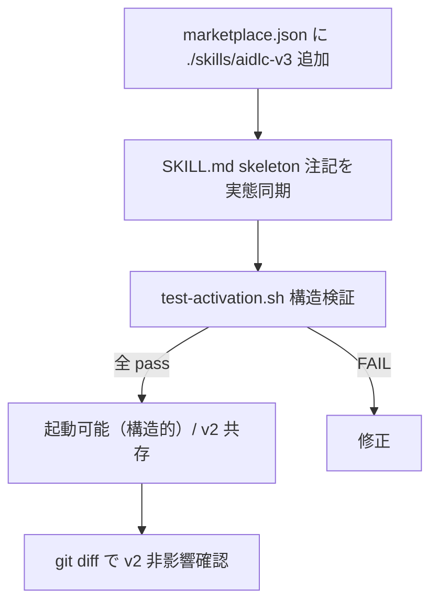

# 論理設計: Unit 005 aidlc-v3 起動有効化（marketplace.json 登録 + 統合検証）

## 概要

`marketplace.json` への v3 スキル登録（1 要素追加）、`skills/aidlc-v3/SKILL.md` の skeleton 注記実態同期、起動可能性の構造検証（軽量チェックスクリプト）、v2 非影響確認のコンポーネント構成とインターフェースを定義する。

**重要**: この論理設計では**コードは書かず**、コンポーネント構成とインターフェース定義のみを行う。具体的なコードは Phase 2 で作成する。

## ステップ0: 事前コード読込み

> ドメインモデルのステップ0 はドメイン構造（activation 概念・状態遷移）視点。本節は**論理設計固有の視点**（差分の当て方・検証スクリプトの構成・注記更新の具体箇所）で記述する。

### (a) Read 対象ファイル + 目的

| ファイル | 論理設計判断への効き方 |
|---------|----------------------|
| `.claude-plugin/marketplace.json`（`plugins[0].skills` L12-28 相当） | 配列末尾要素 `"./skills/write-history"` の後ろにカンマ + `"./skills/aidlc-v3"` を加える具体的な差分形を決める。インデント・引用符スタイルを既存に揃える |
| `skills/aidlc-v3/SKILL.md`（L19 / L22 / L29-31 / L42 / L43 / L51） | 注記更新の具体的な置換箇所を特定。L22「起動有効化は Unit 005 で行う」/ L29-31 段落「本 skeleton（v3.0.0-alpha.2 / Phase 2）... marketplace 登録も Phase 3 以降へ defer」を有効化済み + `v3.0.0-alpha.3 / Phase 3` へ、L19/L42/L43/L51 の「本 Unit で作成」を該当 Unit 参照へ |
| `skills/aidlc-v3/scripts/tests/`（test-define-flow.sh / test-develop-flow.sh / test-state-scripts.sh） | 検証スクリプトの構成（`mktemp -d` 不要な静的構造チェック / assert / PASS-FAIL 集計）の踏襲方法を判断 |
| `skills/aidlc-v3/scripts/`（state-*.sh / work-item-*.sh / steps/*.md） | 起動構造検証で existence を確認すべき必須ファイル一覧を確定 |

### (b) 設計時に意識すべき既存挙動

- marketplace.json の `plugins[0].skills` は JSON 配列。末尾要素にカンマがない（最後の要素）。追加時は既存末尾要素の後ろにカンマを付け、新要素を加える（JSON 妥当性維持）。
- SKILL.md の注記は複数箇所に分散（位置づけブロック L17-22 / 共存ブロック L29-34 / コマンド表 L42-43,51）。更新は「起動有効化が済んだ」事実と「define/develop/status が既存 Unit で実装済み」事実の反映に限定し、release/reflect/doctor の予約・コマンド名正本性（workflow.md/RFC DG-1 準拠）は据え置く。
- 検証は state を作らない純粋な構造チェック（JSON parse + 文字列含有 + ファイル existence）であり、サンドボックス（`.aidlc/` 隔離）は不要。ただし v2 非影響は `git diff` で確認する。
- `metadata.version` には触れない（Phase 7 境界）。

### (c) 既存実装に基づく代替案検討（論理設計視点）

| 論点 | 代替案 | 採否 |
|------|--------|------|
| 検証スクリプトの新設 vs 既存流用 | (a) 新規 `tests/test-activation.sh`（jq で marketplace 妥当性 + 含有、必須ファイル existence、PASS/FAIL 集計）/ (b) 既存 test に相乗り | **(a) 採用**。activation は state スクリプトと責務が異なり、独立した構造チェックが自然。既存 test-*.sh のハーネス様式（assert / 集計 / exit 0/1/2）を踏襲 |
| marketplace 妥当性検証手段 | jq（既存 state スクリプトと同じ依存）で parse + `.plugins[0].skills` 含有確認 | 採用（追加依存なし） |
| v2 非影響の検証 | `git diff --name-only` で `skills/aidlc/` 差分なしを確認（テスト内 or 手動） | 採用（既存 Unit と同じ確認方法） |

## アーキテクチャパターン

**配布定義 + skeleton 注記の実態同期**。実装は (1) 配布定義（marketplace.json）への登録、(2) ドキュメント（SKILL.md）注記の同期、(3) 起動可能性の構造検証スクリプト、の 3 コンポーネントから成る。ランタイムロジックの追加はない（既存 define/develop フローを「起動可能にする」だけ）。

## コンポーネント構成

### レイヤー / モジュール構成

```text
.claude-plugin/
└── marketplace.json              (改修: plugins[0].skills に ./skills/aidlc-v3 を追加)
skills/aidlc-v3/
├── SKILL.md                      (改修: skeleton 注記を実態同期)
└── scripts/
    └── tests/
        └── test-activation.sh    (新規: marketplace 妥当性 + 含有 + 必須ファイル existence の構造検証)
```

### コンポーネント詳細

#### marketplace.json（改修 / 配布定義）

- **責務**: 配布プラグインの skill 一覧を定義。本 Unit で `./skills/aidlc-v3` を `plugins[0].skills` に追加
- **変更**: 既存末尾要素にカンマを付与し `"./skills/aidlc-v3"` を 1 行追加。他キー不変（version 含む）
- **公開インターフェース**: Claude Code プラグインローダが参照（本 Unit で `/aidlc-v3` 起動表面が有効化される）

#### skills/aidlc-v3/SKILL.md（改修 / 注記同期）

- **責務**: v3 ルーティング骨組み。skeleton 注記を実態（有効化済み / 実装済み）へ同期
- **変更箇所**:
  - L22「`/aidlc-v3` 起動の有効化（marketplace.json 登録）は Unit 005 で行う」→「有効化済み（alpha.3 / Unit 005）」
  - L29-31 段落「本 skeleton（v3.0.0-alpha.2 / Phase 2）は v2 と共存し、marketplace.json への登録（`/aidlc-v3` 起動有効化）も Phase 3 以降へ defer している」→ 段落単位で更新。`v3.0.0-alpha.2 / Phase 2` の stale 表記を `v3.0.0-alpha.3 / Phase 3`（L17 と整合）に直し、「marketplace.json 登録済み / 現時点の起動表面は `/aidlc-v3`」を反映（最終表面 `/aidlc` への切替は本流化フェーズである点は維持 / 設計レビュー指摘 #2）
  - L19「`steps/develop.md`（tiny フローのみ / 本 Unit で作成）」/ L42「`steps/define.md`（実在 / 本 Unit で作成）」/ L43「develop ... 本 Unit で作成」/ L51「`steps/status.md`（実在 / 本 Unit で作成）」→「本 Unit で作成」を該当 Unit 参照（define=Unit 001 / status=Unit 001 / develop tiny=Unit 003）または「実装済み」へ修正
  - description（L8-9）の Phase 3 実装済み記述は実態に合致しているため据え置き可
- **据え置き**: release/reflect/doctor の予約記述、コマンド名正本性（workflow.md/RFC DG-1）、version

#### test-activation.sh（新規 / 構造検証ハーネス）

- **責務**: 起動可能性を構造的に検証する自己完結ハーネス（jq 前提）
- **依存**: jq / git（v2 非影響確認）
- **公開インターフェース**: `test-activation.sh` → PASS/FAIL 集計 + exit 0（全 pass）/ 1（失敗）/ 2（前提不備: jq 不在）

## スクリプトインターフェース設計

### test-activation.sh

#### 検証項目

| # | 検証内容 | 手段 |
|---|---------|------|
| 1 | marketplace.json が有効な JSON | `jq empty` |
| 2 | `plugins[0].skills` に `./skills/aidlc-v3` を含む | `jq -e '.plugins[0].skills \| index("./skills/aidlc-v3")'` |
| 3 | 既存 v2 skill（`./skills/aidlc`）が引き続き含まれる（共存 / 非後退） | `jq -e '... index("./skills/aidlc")'` |
| 4 | 起動必須ファイルが存在: `skills/aidlc-v3/SKILL.md` / `steps/define.md` / `steps/develop.md` / `steps/status.md` | `[[ -f ... ]]` |
| 5 | define/develop/status が参照する主要スクリプトが存在: `state-init.sh` / `state-validate.sh` / `state-write.sh` / `state-read.sh` / `work-item-validate.sh` / `work-item-next.sh` / `work-item-status.sh`（define は state-init.sh / work-item-validate.sh も参照するため含める / 設計レビュー指摘 #1） | `[[ -f ... ]]` |
| 6 | SKILL.md に stale な未同期注記が**残っていない**: 「本 Unit で作成」/「Unit 005 で行う」（起動有効化の未来形 defer）/「v3.0.0-alpha.2 / Phase 2」（activation 後に古くなる version・phase 表記）（実態同期の確認） | `grep -q` で不在を確認 |

#### 出力 / 終了コード

- 各項目 `ok` / `FAIL` を出力し PASS/FAIL を集計（既存 test-*.sh と同形式）。
- 終了コード: 0=全 pass / 1=失敗あり / 2=前提不備（jq 不在）。

#### 設計詳細（実装方針 / コードは書かない）

- スクリプト位置からリポジトリルートを解決（既存 test の `SCRIPT_DIR`/`SCRIPTS_DIR` パターン）。marketplace.json はリポジトリルートの `.claude-plugin/marketplace.json`。
- 検証項目 6 は「stale 注記の不在」を確認する負条件アサート。実装で SKILL.md を同期し忘れた場合に検出できる（注記同期の回帰防止）。
- `set -uo pipefail` + rc 正規化（既存 test 踏襲）。
- v2 非影響（`git diff --name-only -- skills/aidlc` が空）は本ハーネスに含めず、完了処理時に別途確認する（git 状態はテスト実行タイミングに依存するため）。

## 処理フロー概要



## データモデル概要

- **marketplace.json**: JSON。`plugins[0].skills` 配列に文字列 1 要素追加のみ。
- **SKILL.md**: Markdown。注記テキストの置換のみ（構造変更なし）。

## テスト設計（test-activation.sh）

| 区分 | テスト内容 | 検証手段 |
|------|----------|---------|
| 静的検査 | `bash -n` / shellcheck（利用可能時）on test-activation.sh | assert_rc 0 |
| marketplace | JSON 妥当性 / `./skills/aidlc-v3` 含有 / `./skills/aidlc` 共存 | jq |
| 必須ファイル | SKILL.md / steps（define/develop/status）/ 主要 scripts（state-init/validate/write/read + work-item-validate/next/status）の existence | `[[ -f ]]` |
| 注記同期 | SKILL.md に stale な 3 種（「本 Unit で作成」/「Unit 005 で行う（未来形 defer）」/「v3.0.0-alpha.2 / Phase 2」）が残っていない | grep 不在確認 |

## 非機能要件（NFR）への対応

### セキュリティ
- **要件**: v2 runtime / ファイルへの非影響（クリーンカット）
- **対応策**: marketplace.json は追加のみ。`skills/aidlc/` を変更しない。v3 state location（`.aidlc/state.json`）は v2 と異なり衝突しない。

### パフォーマンス / スケーラビリティ / 可用性
- 該当なし（静的構造検証 / ローカル）。

## 技術選定
- **言語**: Bash（既存 v3 test ハーネスと統一 / bash 3.2 互換）
- **依存**: jq（既存）/ git。新規依存なし
- **フレームワーク**: なし（自己完結ハーネス）

## 実装上の注意事項
- **ドッグフーディング特殊処理を埋めない**: test-activation.sh に「自リポジトリ判定」分岐を埋めない。リポジトリルートはスクリプト位置から相対解決する汎用論理に留める。
- **v2 非影響**: `skills/aidlc/` を変更しない。
- **スコープ厳守**: version 更新・本流化・予約コマンド記述の変更を行わない（Phase 7 境界 / D4・D3）。
- **JSON 妥当性**: marketplace.json は最小差分（1 要素追加）に留め、jq 検証を必須とする。

## 不明点と質問（設計中に記録）

[Question] test-activation.sh の「注記同期確認（項目 6）」で grep する文言は何を基準にするか。
[Answer]（設計判断）以下 3 種を対象とする: (1)「Unit 005 で行う」（未来形の起動有効化 defer 表現）/ (2) define/develop/status の手順ファイルを指す「本 Unit で作成」旧表現 / (3)「v3.0.0-alpha.2 / Phase 2」（activation 後に古くなる version・phase 表記 / 設計レビュー指摘 #2 R2）。実装で SKILL.md を同期したうえで、これらが残っていないことを確認する。予約コマンド（release/reflect/doctor）の「予約」「後続 Phase で実装」は正当な現状記述のため grep 対象にしない。

[Question] 起動検証スクリプトを恒久テストにすることで将来 version/path 変更時に壊れないか。
[Answer]（設計判断）検証項目はパス存在と marketplace 含有という安定した構造に依存する。本流化（Phase 7）で path が変わる際はそのフェーズで test も更新する前提（テストは実態に追従する）。本 Unit のスコープでは現構造を検証する。
