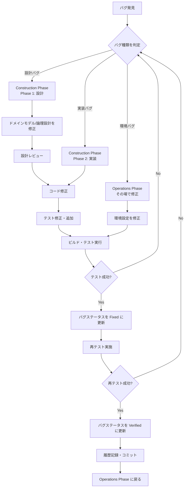

# バグ対応フロー

## 概要

このドキュメントは、Operations Phaseでバグを発見した際の対応フローを定義します。バグの種類に応じて適切なフェーズに戻り、修正後に再テストを行う手順を説明します。

---

## バグ分類ガイド

### バグ種類と対応フェーズ

| バグ種類 | 定義 | 対応フェーズ | 例 |
|----------|------|--------------|-----|
| **設計バグ** | 仕様や設計段階の問題 | Construction Phase（Phase 1: 設計） | 要件の誤解、ドメインモデルの不備、API設計の欠陥 |
| **実装バグ** | コーディング段階の問題 | Construction Phase（Phase 2: 実装） | ロジックエラー、タイプミス、境界値処理の漏れ |
| **環境バグ** | 環境設定や構成の問題 | Operations Phase（その場で修正） | 設定ファイルの誤り、環境変数の不足、依存関係の問題 |

### バグ種類の判定基準

```
バグを発見
    │
    ▼
┌─────────────────────────────────────┐
│ 問題の原因は何か？                    │
└─────────────────────────────────────┘
    │
    ├─── 仕様や設計が間違っている ──────► 設計バグ
    │    （要件の誤解、モデルの不備）
    │
    ├─── コードの実装が間違っている ────► 実装バグ
    │    （ロジックエラー、タイプミス）
    │
    └─── 環境設定が間違っている ────────► 環境バグ
         （設定ミス、依存関係の問題）
```

---

## バグ対応フローチャート



---

## バックトラック手順

### 1. 設計バグの場合（Construction Phase 設計に戻る）

**手順**:

1. **バグレポートを記録**
   - テスト記録ファイルにバグ詳細を記載
   - バグ種類: 「設計バグ」
   - 対応フェーズ: 「Construction（設計）」

2. **Construction Phaseに戻る**
   ```markdown
   以下のファイルを読み込んで、Construction Phase を継続してください：
   docs/aidlc/prompts/construction.md
   ```

3. **progress.mdを更新**
   - 該当Unitの状態を「進行中」に変更
   - バグ修正であることを備考に記載

4. **設計を修正**
   - ドメインモデル（`domain_model.md`）を修正
   - 論理設計（`logical_design.md`）を修正
   - 設計レビューを実施

5. **実装を修正**
   - 設計変更に基づいてコードを修正
   - テストを追加・修正

6. **Operations Phaseに戻る**
   - progress.mdを更新（Unitを「完了」に戻す）
   - 履歴記録とコミット
   ```markdown
   以下のファイルを読み込んで、Operations Phase を継続してください：
   docs/aidlc/prompts/operations.md
   ```

### 2. 実装バグの場合（Construction Phase 実装に戻る）

**手順**:

1. **バグレポートを記録**
   - テスト記録ファイルにバグ詳細を記載
   - バグ種類: 「実装バグ」
   - 対応フェーズ: 「Construction（実装）」

2. **Construction Phaseに戻る**
   ```markdown
   以下のファイルを読み込んで、Construction Phase を継続してください：
   docs/aidlc/prompts/construction.md
   ```

3. **progress.mdを更新**
   - 該当Unitの状態を「進行中」に変更
   - バグ修正であることを備考に記載

4. **コードを修正**
   - バグの原因を特定
   - コードを修正
   - テストを追加（再発防止）

5. **Operations Phaseに戻る**
   - progress.mdを更新（Unitを「完了」に戻す）
   - 履歴記録とコミット
   ```markdown
   以下のファイルを読み込んで、Operations Phase を継続してください：
   docs/aidlc/prompts/operations.md
   ```

### 3. 環境バグの場合（Operations Phaseで修正）

**手順**:

1. **バグレポートを記録**
   - テスト記録ファイルにバグ詳細を記載
   - バグ種類: 「環境バグ」
   - 対応フェーズ: 「Operations」

2. **環境設定を修正**
   - 設定ファイルの修正
   - 環境変数の追加・修正
   - 依存関係の解決

3. **再テスト実施**
   - 修正後にテストを再実行
   - 成功を確認

4. **履歴記録とコミット**

---

## 再テスト手順

### 再テストの実施

1. **対象テスト項目を特定**
   - バグに関連するテスト項目をリストアップ
   - 回帰テスト項目も含める

2. **テストを実行**
   - テスト記録テンプレートを使用
   - 結果を詳細に記録

3. **結果を確認**
   - すべてのテストがPassであることを確認
   - Failがある場合は再度バグ対応フローを実行

4. **バグステータスを更新**
   - テスト成功: ステータスを「Verified」に変更
   - テスト失敗: ステータスを「Open」に戻し、再調査

---

## 履歴記録

バグ修正完了時は、`history.md`に以下の形式で記録します：

```markdown
---
## YYYY-MM-DD HH:MM:SS JST

**フェーズ**: Operations Phase（バグ修正）

**実行内容**:
- バグID: BUG-XXX
- バグ種類: [設計バグ/実装バグ/環境バグ]
- 対応内容: [修正内容の概要]
- 影響Unit: [Unit名]

**成果物**:
- 修正ファイル: [修正したファイルのパス]
- テスト記録: [テスト記録ファイルのパス]

**備考**:
[その他の備考]
```

---

## 参考リンク

- テスト記録テンプレート: `docs/aidlc/templates/test_record_template.md`
- Construction Phaseプロンプト: `docs/aidlc/prompts/construction.md`
- Operations Phaseプロンプト: `docs/aidlc/prompts/operations.md`
