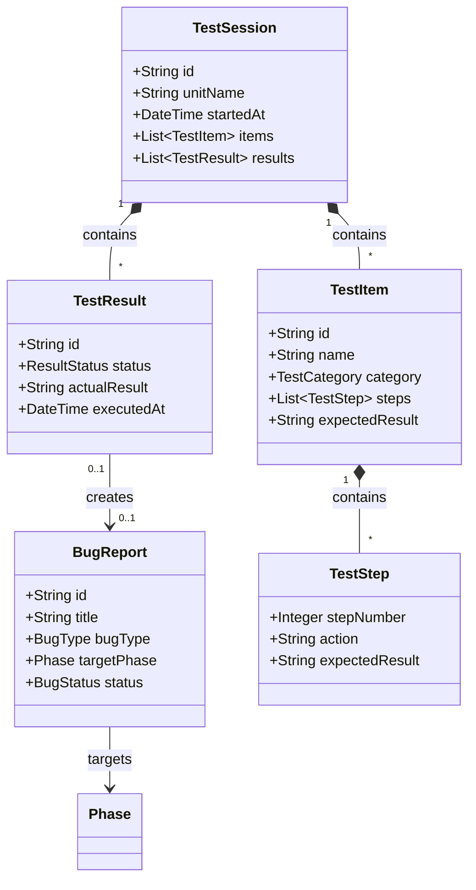

# ドメインモデル: テストとバグ対応基盤

## 概要
Operations Phaseでのテスト実施時の記録フォーマットと、バグ発見時の対応フローを定義するドメインモデル。テスト活動の記録と追跡、バグの分類と適切なフェーズへの誘導を担う。

**重要**: このドメインモデル設計では**コードは書かず**、構造と責務の定義のみを行います。実装はImplementation Phase（コード生成ステップ）で行います。

---

## エンティティ（Entity）

### テスト項目（TestItem）
- **ID**: String（例: `TEST-001`）
- **属性**:
  - name: String - テスト項目の名前
  - category: TestCategory - テストのカテゴリ（機能テスト、UIテスト等）
  - priority: Priority - 優先度（High/Medium/Low）
  - description: String - テストの説明
  - preconditions: List[String] - 前提条件
  - steps: List[TestStep] - テスト手順
  - expectedResult: String - 期待される結果
- **振る舞い**:
  - execute(): TestResult - テストを実行し結果を記録
  - isBlocked(): Boolean - 前提条件が満たされているか確認

### テスト結果（TestResult）
- **ID**: String（例: `RESULT-001`）
- **属性**:
  - testItemId: String - 対象テスト項目のID
  - status: ResultStatus - 結果ステータス（Pass/Fail/Blocked/Skipped）
  - actualResult: String - 実際の結果
  - executedAt: DateTime - 実行日時
  - executedBy: String - 実行者
  - notes: String - 備考
  - bugReportId: Optional[String] - 関連バグレポートID（Fail時）
- **振る舞い**:
  - isPassed(): Boolean - テストが成功したか
  - requiresBugReport(): Boolean - バグレポートが必要か

### バグレポート（BugReport）
- **ID**: String（例: `BUG-001`）
- **属性**:
  - title: String - バグのタイトル
  - severity: Severity - 重大度（Critical/High/Medium/Low）
  - bugType: BugType - バグの種類（設計バグ/実装バグ/環境バグ）
  - reproducSteps: List[String] - 再現手順
  - expectedBehavior: String - 期待される動作
  - actualBehavior: String - 実際の動作
  - environment: String - 発生環境
  - status: BugStatus - ステータス（Open/InProgress/Fixed/Verified/Closed）
  - targetPhase: Phase - 修正対象フェーズ
  - reportedAt: DateTime - 報告日時
  - resolvedAt: Optional[DateTime] - 解決日時
- **振る舞い**:
  - determineTargetPhase(): Phase - バグ種類から修正対象フェーズを決定
  - markAsFixed(): void - 修正完了をマーク
  - requiresRetest(): Boolean - 再テストが必要か

---

## 値オブジェクト（Value Object）

### テスト手順（TestStep）
- **属性**:
  - stepNumber: Integer - 手順番号
  - action: String - 操作内容
  - expectedResult: String - 期待される結果
- **不変性**: テスト手順は一度定義されたら変更しない（変更する場合は新しいテスト項目として定義）
- **等価性**: stepNumber + action + expectedResult の組み合わせで等価性を判定

### バグ種類（BugType）
- **種類**:
  - DESIGN_BUG: 設計バグ（仕様や設計の問題）
  - IMPLEMENTATION_BUG: 実装バグ（コーディングエラー）
  - ENVIRONMENT_BUG: 環境バグ（設定や環境の問題）
- **不変性**: 列挙型として定義、値は不変
- **等価性**: 種類の値で等価性を判定

### フェーズ（Phase）
- **種類**:
  - CONSTRUCTION_DESIGN: Construction Phase（Phase 1: 設計）
  - CONSTRUCTION_IMPLEMENTATION: Construction Phase（Phase 2: 実装）
  - OPERATIONS: Operations Phase
- **不変性**: 列挙型として定義、値は不変
- **等価性**: フェーズの値で等価性を判定

### 重大度（Severity）
- **種類**:
  - CRITICAL: クリティカル（システム停止、データ損失）
  - HIGH: 高（主要機能が使用不可）
  - MEDIUM: 中（機能は使えるが問題あり）
  - LOW: 低（軽微な問題、UIの不具合等）
- **不変性**: 列挙型として定義
- **等価性**: 重大度の値で等価性を判定

---

## 集約（Aggregate）

### テストセッション集約（TestSession Aggregate）
- **集約ルート**: TestSession
- **含まれる要素**:
  - TestItem（複数）
  - TestResult（複数）
- **境界**: 1回のテストセッション（例: Unit完了後のテスト）に含まれるすべてのテスト項目と結果
- **不変条件**:
  - すべてのTestResultは対応するTestItemを持つ
  - TestResultのステータスはTestItemの実行後にのみ変更可能

### バグ対応集約（BugHandling Aggregate）
- **集約ルート**: BugReport
- **含まれる要素**:
  - BugReport
  - 修正対象フェーズ情報
  - 再テスト情報
- **境界**: 1つのバグの報告から解決までのライフサイクル
- **不変条件**:
  - BugTypeが設定されている場合、targetPhaseは自動的に決定される
  - ステータスがFixed以降の場合、resolvedAtが設定されている

---

## ドメインサービス

### バグ分類サービス（BugClassificationService）
- **責務**: バグの種類を判定し、適切な修正対象フェーズを決定
- **操作**:
  - classifyBug(bugReport): BugType - バグの症状から種類を判定
  - determineTargetPhase(bugType): Phase - バグ種類から修正対象フェーズを決定

### テスト進捗サービス（TestProgressService）
- **責務**: テストセッション全体の進捗を追跡
- **操作**:
  - calculateProgress(session): ProgressReport - 進捗を計算
  - summarizeResults(session): TestSummary - 結果をサマリー

---

## リポジトリインターフェース

### テストセッションリポジトリ（TestSessionRepository）
- **対象集約**: TestSession
- **操作**:
  - find(id) - ID で検索
  - save(session) - 永続化（Markdownファイルとして保存）
  - findByUnit(unitName) - Unit名で検索

### バグレポートリポジトリ（BugReportRepository）
- **対象集約**: BugReport
- **操作**:
  - find(id) - ID で検索
  - save(report) - 永続化
  - findByStatus(status) - ステータスで検索
  - findByPhase(phase) - 修正対象フェーズで検索

---

## ドメインモデル図

---

## ユビキタス言語

このドメインで使用する共通用語：

- **テスト項目（Test Item）**: 検証すべき1つの機能や動作の定義
- **テスト結果（Test Result）**: テスト項目を実行した結果の記録
- **バグレポート（Bug Report）**: 発見された問題の詳細な記録
- **設計バグ（Design Bug）**: 仕様や設計段階で発生した問題（Construction Phase 設計に戻る）
- **実装バグ（Implementation Bug）**: コーディング段階で発生した問題（Construction Phase 実装に戻る）
- **環境バグ（Environment Bug）**: 環境設定や構成に起因する問題（Operations Phaseで修正）
- **バックトラック（Backtrack）**: バグ修正のために以前のフェーズに戻ること
- **再テスト（Retest）**: バグ修正後に同じテストを再実行すること

---

## 不明点と質問（設計中に記録）

現時点で不明点はありません。
