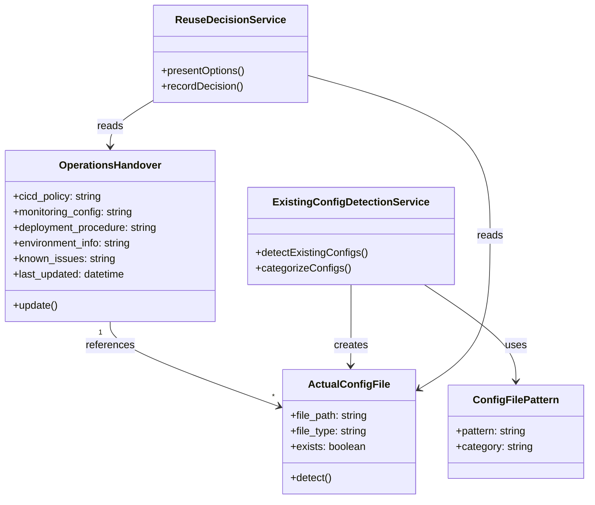

# ドメインモデル: Operations Phase再利用性

## 概要

Operations Phaseの成果物（運用情報）をサイクル横断で引き継げる仕組みを定義する。運用引き継ぎ情報の格納場所と、既存実設定ファイルの認識フローを構造化する。

**重要**: このドメインモデル設計では**コードは書かず**、構造と責務の定義のみを行います。実装はImplementation Phase（コード生成ステップ）で行います。

## エンティティ（Entity）

### 運用引き継ぎ情報（OperationsHandover）
- **ID**: サイクル識別子（例: v1.0.0, v1.1.0）
- **属性**:
  - cicd_policy: テキスト - CI/CD設定方針（使用ツール、パイプライン構成など）
  - monitoring_config: テキスト - 監視設定（監視対象メトリクス、アラート閾値など）
  - deployment_procedure: テキスト - デプロイ手順・注意事項
  - environment_info: テキスト - 環境情報（本番/ステージング等の構成）
  - known_issues: テキスト - 運用時の既知の問題・注意点
  - last_updated: 日時 - 最終更新日時
- **振る舞い**:
  - update(): 各項目を更新し、last_updatedを現在時刻に設定

### 実設定ファイル（ActualConfigFile）
- **ID**: ファイルパス（例: .github/workflows/ci.yml）
- **属性**:
  - file_type: 文字列 - ファイル種別（cicd, monitoring, deployment等）
  - exists: 真偽値 - ファイルが存在するか
  - description: テキスト - ファイルの説明（任意）
- **振る舞い**:
  - detect(): プロジェクト内に存在するか検出

## 値オブジェクト（Value Object）

### 設定ファイルパターン（ConfigFilePattern）
- **属性**:
  - pattern: 文字列 - 検出パターン（例: `.github/workflows/*.yml`）
  - category: 文字列 - カテゴリ（cicd, monitoring等）
- **不変性**: 検出パターンは定義後に変更されない
- **等価性**: patternとcategoryの組み合わせで判定

## 集約（Aggregate）

### 運用引き継ぎ集約（OperationsHandoverAggregate）
- **集約ルート**: 運用引き継ぎ情報（OperationsHandover）
- **含まれる要素**:
  - 実設定ファイル（ActualConfigFile）のリスト
- **境界**: 単一プロジェクト内のサイクル横断での運用情報
- **不変条件**:
  - 引き継ぎ情報は常に最新のサイクルで更新される
  - 実設定ファイルとの整合性は手動で確認

## ドメインサービス

### 既存設定検出サービス（ExistingConfigDetectionService）
- **責務**: プロジェクト内の既存CI/CD・監視設定ファイルを検出する
- **操作**:
  - detectExistingConfigs() - 定義されたパターンに基づいて既存設定ファイルを検出
  - categorizeConfigs() - 検出したファイルをカテゴリ別に分類

### 再利用判定サービス（ReuseDecisionService）
- **責務**: 引き継ぎ情報と既存設定を基に、再利用/更新/新規作成の選択肢を提示
- **操作**:
  - presentOptions() - ユーザーに選択肢を提示
  - recordDecision() - ユーザーの選択を記録

## リポジトリインターフェース

### 運用引き継ぎリポジトリ（OperationsHandoverRepository）
- **対象集約**: 運用引き継ぎ集約
- **操作**:
  - load() - `docs/aidlc/operations/handover.md` から読み込み
  - save() - `docs/aidlc/operations/handover.md` に保存
  - exists() - 引き継ぎ情報が存在するか確認

## ドメインモデル図

## ユビキタス言語

このドメインで使用する共通用語：

- **運用引き継ぎ情報**: サイクル横断で引き継ぐべき運用に関する知見・設定方針
- **実設定ファイル**: プロジェクトルートに実際に存在するCI/CD・監視等の設定ファイル
- **再利用**: 既存の設定をそのまま使用すること
- **更新**: 既存の設定を修正して使用すること
- **新規作成**: 設定を一から作成すること

## 不明点と質問（設計中に記録）

[Question] 引き継ぎ情報として格納する内容について、構造化テンプレートか自由形式か
[Answer] ベースのテンプレートを用意し、毎回同じ質問をせずに済むようにする

[Question] テンプレートに含める引き継ぎ項目（CI/CD設定方針、監視設定、デプロイ手順、環境情報、既知の問題）で過不足はあるか
[Answer] 上記5項目でOK
