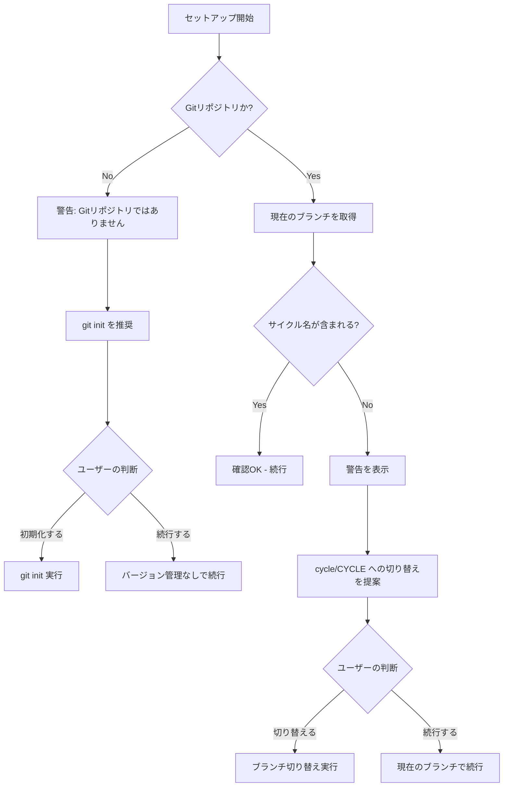

# ドメインモデル: ブランチ確認機能

## 概要

セットアップ時にGitブランチ名とサイクル名の整合性を確認し、不一致時に適切なブランチへの切り替えを提案する機能の概念モデル。

**重要**: このドメインモデル設計では**コードは書かず**、構造と責務の定義のみを行います。実装はImplementation Phase（コード生成ステップ）で行います。

## 注意事項

このUnitは「プロンプトファイルへの指示追加」が主な実装であり、プログラムコードを生成するものではありません。そのため、エンティティやリポジトリといった従来のDDD概念は簡略化し、概念の整理に焦点を当てます。

## エンティティ（Entity）

### BranchCheckResult（ブランチ確認結果）
- **ID**: 該当なし（一時的な判定結果）
- **属性**:
  - currentBranch: String - 現在のGitブランチ名
  - cycleName: String - サイクル名（例: v1.1.0）
  - isMatch: Boolean - ブランチ名にサイクル名が含まれているか
  - suggestedBranch: String - 推奨ブランチ名（`cycle/{cycleName}`形式）
- **振る舞い**:
  - checkMatch(): 現在のブランチ名にサイクル名が含まれているか判定
  - generateSuggestion(): 推奨ブランチ名を生成

## 値オブジェクト（Value Object）

### BranchName（ブランチ名）
- **属性**: name: String - ブランチ名
- **不変性**: ブランチ名は判定時点で固定
- **等価性**: 文字列としての一致

### CycleName（サイクル名）
- **属性**: version: String - バージョン文字列（例: v1.1.0）
- **不変性**: セットアップ時に決定され、変更されない
- **等価性**: バージョン文字列の一致

## 集約（Aggregate）

このUnitでは永続化が不要なため、集約は定義しません。

## ドメインサービス

### BranchCheckService
- **責務**: ブランチ名とサイクル名の整合性を確認し、結果を返す
- **操作**:
  - getCurrentBranch(): 現在のブランチ名を取得（`git branch --show-current`）
  - checkBranchCycleMatch(currentBranch, cycleName): 整合性を判定
  - suggestBranchSwitch(cycleName): 切り替え先ブランチを提案

## リポジトリインターフェース

このUnitでは永続化が不要なため、リポジトリは定義しません。

## ファクトリ（必要な場合のみ）

該当なし

## ドメインモデル図

## ユビキタス言語

このドメインで使用する共通用語：

- **サイクル名（Cycle Name）**: AI-DLCのバージョン単位（例: v1.1.0）
- **ブランチ名（Branch Name）**: Gitの作業ブランチ名
- **整合性（Match）**: ブランチ名にサイクル名が含まれている状態
- **推奨ブランチ（Suggested Branch）**: `cycle/{サイクル名}` 形式のブランチ名

## 不明点と質問（設計中に記録）

（現時点で不明点なし - 計画承認時にブランチ形式を `cycle/{CYCLE}` に確定済み）
