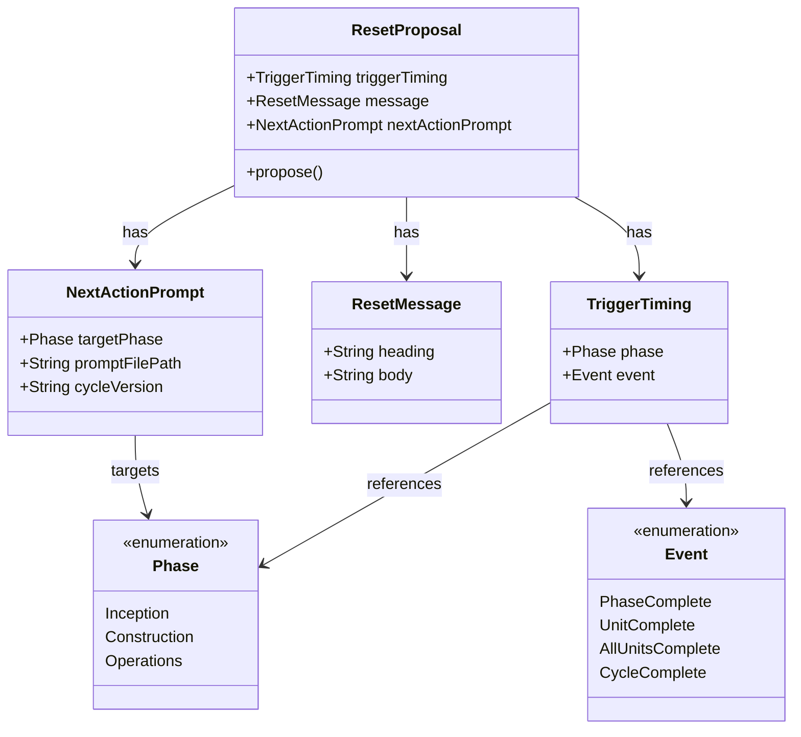

# ドメインモデル: コンテキストリセット提案機能

## 概要

フェーズ移行時およびUnit完了時にコンテキストリセットを推奨し、次のアクションを開始するためのプロンプトを提示する機能の概念モデル。

**重要**: このドメインモデル設計では**コードは書かず**、構造と責務の定義のみを行います。実装はImplementation Phase（コード生成ステップ）で行います。

## エンティティ（Entity）

### リセット提案（ResetProposal）
- **ID**: 発動タイミング（TriggerTiming）で識別
- **属性**:
  - triggerTiming: TriggerTiming - 提案が発動するタイミング
  - message: ResetMessage - 表示するメッセージ
  - nextActionPrompt: NextActionPrompt - 次のアクションを開始するためのプロンプト
- **振る舞い**:
  - propose(): ユーザーにリセットを提案する（メッセージと次アクションプロンプトを表示）

## 値オブジェクト（Value Object）

### 発動タイミング（TriggerTiming）
- **属性**:
  - phase: Phase - 対象フェーズ（Inception/Construction/Operations）
  - event: Event - 発動イベント（PhaseComplete/UnitComplete/AllUnitsComplete）
- **不変性**: 発動タイミングは固定的に定義され、変更されない
- **等価性**: phase と event の組み合わせで等価性を判定

### リセットメッセージ（ResetMessage）
- **属性**:
  - heading: String - セクション見出し（「コンテキストリセット推奨」）
  - body: String - 本文（完了通知とリセット推奨の説明）
- **不変性**: メッセージ内容は発動タイミングごとに固定
- **等価性**: heading と body の内容で判定

### 次アクションプロンプト（NextActionPrompt）
- **属性**:
  - targetPhase: Phase - 次に開始するフェーズ
  - promptFilePath: String - 読み込むプロンプトファイルのパス
  - cycleVersion: String - サイクルバージョン（動的に決定）
- **不変性**: フェーズ移行先は固定的に定義
- **等価性**: targetPhase と promptFilePath で判定

### フェーズ（Phase）
- **属性**: name: String - フェーズ名
- **列挙値**: Inception, Construction, Operations
- **不変性**: フェーズは固定の3種類
- **等価性**: name で判定

### イベント（Event）
- **属性**: name: String - イベント名
- **列挙値**:
  - PhaseComplete - フェーズ完了
  - UnitComplete - 単一Unit完了
  - AllUnitsComplete - 全Unit完了
  - CycleComplete - サイクル完了
  - UserRequest - ユーザーからのリセット要求
- **不変性**: イベント種別は固定
- **等価性**: name で判定

### ユーザーリセット要求（UserResetRequest）
- **属性**:
  - keywords: List<String> - 検知するキーワード群
  - currentState: WorkState - 現在の作業状態
- **キーワード例**:
  - 「継続プロンプト」「リセットしたい」
  - 「コンテキストが溢れそう」「コンテキストオーバーフロー」
  - 「長くなってきた」「一旦区切りたい」
- **不変性**: キーワードリストはプロンプトで定義
- **等価性**: keywords の内容で判定

### 作業状態（WorkState）
- **属性**:
  - phase: Phase - 現在のフェーズ
  - unitName: String - 現在のUnit名（Construction時のみ）
  - stepNumber: Integer - 現在のステップ番号
  - stepName: String - 現在のステップ名
- **不変性**: 作業状態は動的に変化するが、リセット要求時点での状態をスナップショット
- **等価性**: 全属性の組み合わせで判定

## 集約（Aggregate）

### リセット提案集約（ResetProposalAggregate）
- **集約ルート**: リセット提案（ResetProposal）
- **含まれる要素**:
  - TriggerTiming（値オブジェクト）
  - ResetMessage（値オブジェクト）
  - NextActionPrompt（値オブジェクト）
- **境界**: 1つの発動タイミングに対して1つのリセット提案が存在
- **不変条件**:
  - 各発動タイミングには必ず対応するメッセージと次アクションプロンプトが存在する
  - 次アクションプロンプトは有効なフェーズを指す

## ドメインサービス

### リセット提案サービス（ResetProposalService）
- **責務**: 発動タイミングに応じた適切なリセット提案を構築・表示する
- **操作**:
  - buildProposal(timing): 発動タイミングに応じたリセット提案を構築
  - formatOutput(proposal): リセット提案を出力フォーマットに変換

## ドメインモデル図

## ユビキタス言語

このドメインで使用する共通用語：

- **コンテキストリセット**: AIとの会話履歴をクリアし、新しいセッションを開始すること
- **発動タイミング**: リセット提案が表示される条件（フェーズ完了、Unit完了など）
- **次アクションプロンプト**: コンテキストリセット後に入力すべきプロンプト文
- **フェーズ移行**: Inception → Construction → Operations の遷移
- **サイクルバージョン**: AI-DLCの開発サイクルを識別するバージョン番号（例: v1.1.0）

## 発動タイミング一覧

| # | フェーズ | イベント | 次のアクション |
|---|---------|---------|---------------|
| 1 | Inception | PhaseComplete | Construction Phase開始 |
| 2 | Construction | UnitComplete | 次Unit開始（同フェーズ継続） |
| 3 | Construction | AllUnitsComplete | Operations Phase開始 |
| 4 | Operations | CycleComplete | 次サイクル開始 |
| 5 | Any | UserRequest | 現在の作業を継続（同フェーズ・同Unit） |

## 不明点と質問（設計中に記録）

[Question] 概念モデルとして設計するか、簡略化するか
[Answer] 概念モデルとして設計する（選択肢1）

[Question] フェーズ途中でコンテキストが足りなくなった場合の対応は？キーワードでプロンプトを出すこともできるか？
[Answer] ユーザーが「継続プロンプト」「コンテキストオーバーフロー」「コンテキストが溢れそう」などのキーワードを発言した場合、現在の作業状態に応じた継続用プロンプトを出力する機能を追加する

---

*設計完了: ドメインモデルの構造と責務を定義*
