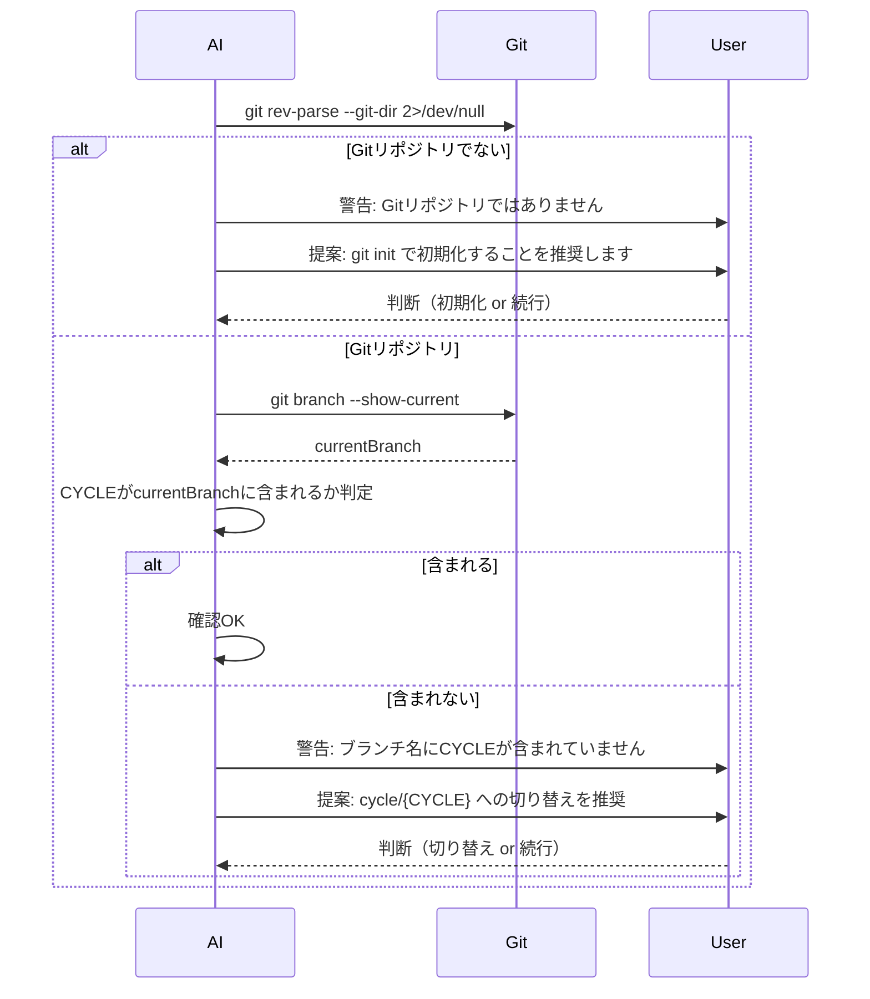

# 論理設計: ブランチ確認機能

## 概要

setup-prompt.md の「実行環境の確認」セクションに、Gitブランチ名とサイクル名の整合性確認を追加するための論理設計。

**重要**: この論理設計では**コードは書かず**、コンポーネント構成とインターフェース定義のみを行います。具体的なコード（SQL、JSON、実装コード等）はImplementation Phase（コード生成ステップ）で作成します。

## 注意事項

このUnitは「プロンプトファイルへの指示追加」であり、プログラムコードではありません。そのため、従来の論理設計の構成要素（API、データベース等）は該当せず、プロンプト構造の設計に焦点を当てます。

## アーキテクチャパターン

プロンプトベースの指示追加 - 既存の setup-prompt.md の構造に従い、適切なセクションに確認ロジックを挿入

## コンポーネント構成

### 対象ファイル

```
prompts/
└── setup-prompt.md
    └── 「実行環境の確認」セクション（変更対象）
        ├── 既存: プロジェクト概要確認
        ├── 既存: 技術スタック確認
        └── 追加: ブランチ確認機能 ← NEW
```

### コンポーネント詳細

#### ブランチ確認セクション
- **責務**: セットアップ時にブランチ名とサイクル名の整合性を確認
- **依存**: Gitコマンド（`git branch --show-current`）
- **公開インターフェース**: AIへの確認指示（プロンプトテキスト）

## インターフェース設計

### コマンド（AIが実行する）

#### git branch --show-current
- **目的**: 現在のGitブランチ名を取得
- **パラメータ**: なし
- **戻り値**: ブランチ名（文字列）
- **副作用**: なし（読み取り専用）

## データモデル概要

該当なし（プロンプトファイルの修正のため）

## 処理フロー概要

### ブランチ確認の処理フロー

**前提条件**: セットアップ時、`CYCLE` 変数が設定されている

**ステップ**:
1. **Gitリポジトリ判定**: カレントディレクトリがGitリポジトリか確認
   - リポジトリでない場合 → 警告表示 + `git init` の提案
2. **現在ブランチ取得**: `git branch --show-current` を実行
3. **整合性判定**: ブランチ名に `CYCLE` の値が含まれているか確認
   - 含まれている場合 → 確認OK、続行
   - 含まれていない場合 → 警告表示へ
4. **警告表示**: 不一致の旨を警告
5. **切り替え提案**: `cycle/{CYCLE}` 形式のブランチへの切り替えを提案
6. **ユーザー判断**: ユーザーの指示を待つ（切り替え or 続行）



## 非機能要件（NFR）への対応

### パフォーマンス
- **要件**: 特になし
- **対応策**: 不要

### セキュリティ
- **要件**: 特になし
- **対応策**: 不要

### スケーラビリティ
- **要件**: 特になし
- **対応策**: 不要

### 可用性
- **要件**: Gitリポジトリでない場合はスキップ
- **対応策**: `git rev-parse --git-dir 2>/dev/null` で事前判定

## 技術選定

- **言語**: Markdown（プロンプトファイル）
- **フレームワーク**: 該当なし
- **ライブラリ**: 該当なし
- **外部依存**: Git CLI

## 実装上の注意事項

1. **Gitリポジトリ判定を先に行う**: Gitが利用できない環境ではエラーを出さずスキップ
2. **ユーザーの自律性を尊重**: ブランチ切り替えは提案のみ、強制しない
3. **明確な警告メッセージ**: 何が問題で、どうすべきかを明示
4. **既存フローへの影響最小化**: 確認項目の追加のみ、既存の流れを変えない

## プロンプト追加位置

setup-prompt.md の「実行環境の確認」セクション内、以下の位置に追加：

```
### 1. 実行環境の確認【必須】
    ├── 既存の確認項目
    │   └── ...
    └── ブランチ確認（追加） ← ここに挿入
```

## 不明点と質問（設計中に記録）

（現時点で不明点なし）
