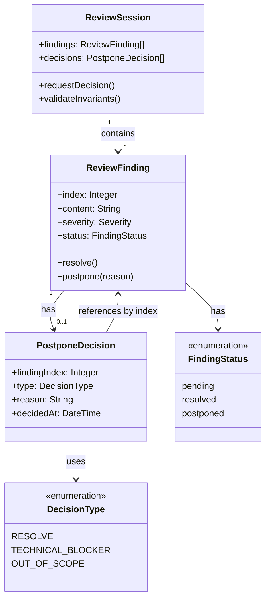

# ドメインモデル: AIレビュー指摘先送り抑制ルール

## 概要

AIレビューで検出された指摘事項に対して、安易な先送りを抑制し、品質を担保するためのルールを定義する。

**重要**: このドメインモデル設計では**コードは書かず**、構造と責務の定義のみを行います。実装はImplementation Phase（コード生成ステップ）で行います。

## エンティティ（Entity）

### ReviewFinding（レビュー指摘）

- **ID**: index: Integer - セッション内の連番（1から開始、安定した識別子として使用）
- **属性**:
  - content: String - 指摘内容
  - severity: Severity - 重要度（critical/warning/info）
  - status: FindingStatus - 対応状況（pending/resolved/postponed）
- **振る舞い**:
  - resolve(): 指摘を修正済みとしてマーク（status=resolved）
  - postpone(reason): 先送りとしてマーク（status=postponed、理由必須）
- **不変条件**:
  - status=postponed の場合、必ず PostponeDecision が存在する（type=TECHNICAL_BLOCKER または OUT_OF_SCOPE）
  - status=resolved の場合、PostponeDecision は任意（RESOLVE の判断はサマリで追跡可能）

## 値オブジェクト（Value Object）

### PostponeDecision（対応判断）

- **属性**:
  - findingIndex: Integer - 対象指摘の連番（ReviewFinding.index と紐づけ）
  - type: DecisionType - 判断種別
  - reason: String - 先送り理由（type=TECHNICAL_BLOCKER, OUT_OF_SCOPE の場合必須）
  - decidedAt: DateTime - 判断日時
- **不変性**: 一度決定した対応判断は変更不可（履歴として保持）
- **等価性**: findingIndex と type の組み合わせで判定

### DecisionType（判断種別）

- **値**:
  1. RESOLVE - 指摘を修正する（先送りしない）
  2. TECHNICAL_BLOCKER - 技術的理由で対応不可
  3. OUT_OF_SCOPE - スコープ外として次サイクルで対応
- **ルール**:
  - 「パッチだから」「小さい変更だから」は単独では許可しない（バリデーションで拒否）
  - type=TECHNICAL_BLOCKER, OUT_OF_SCOPE は reason が必須かつ非空文字
- **バリデーション（禁止パターン）**:
  - 以下のパターンのみで構成される理由は拒否:
    - 「パッチだから」「パッチなので」
    - 「小さい変更だから」「軽微な変更なので」
    - 「時間がないから」「急ぎだから」
  - これらを含む場合でも、具体的な技術的理由や根拠が併記されていれば許可

## 集約（Aggregate）

### ReviewSession（レビューセッション）

- **集約ルート**: ReviewSession
- **含まれる要素**:
  - ReviewFinding (複数、indexで識別)
  - PostponeDecision (各指摘に対して最大1つ)
- **境界**: 1回のAIレビュー実行に対する全指摘と対応判断
- **不変条件**:
  - 判断フロー完了時、全ての指摘は resolved または postponed に遷移していること（pending は判断前の初期状態）
  - DecisionType が TECHNICAL_BLOCKER または OUT_OF_SCOPE の場合は必ず理由が記録されている
  - FindingStatus と DecisionType の整合性が保たれている:
    - status=pending: 判断前の初期状態（対応判断はまだ存在しない）
    - status=resolved: type=RESOLVE（PostponeDecision は任意、サマリで追跡）
    - status=postponed ⇔ type=TECHNICAL_BLOCKER または OUT_OF_SCOPE（PostponeDecision 必須）

## ドメインサービス

### PostponeApprovalService（対応判断サービス）

- **責務**: 指摘への対応判断を管理し、履歴を記録する
- **操作**:
  - requestDecision(findings): 未対応指摘に対して各指摘ごとにユーザー判断を要求
  - validateReason(reason): 先送り理由のバリデーション（禁止パターンチェック）
  - recordPostponeDecision(decision): 先送り判断を履歴に記録（write-history.sh 互換フォーマット）
  - recordDecisionSummary(decisions): 全判断のサマリを履歴に記録（RESOLVE/先送りの一覧）

## リポジトリインターフェース

なし（プロンプトファイルへの直接記述で実現）

## ドメインモデル図

## ユビキタス言語

- **指摘 (Finding)**: AIレビューで検出された問題点や改善提案
- **対応判断 (Decision)**: 指摘への対応方針（修正/技術的理由/スコープ外）
- **先送り (Postpone)**: 指摘への対応を現在のサイクルで行わないこと
- **技術的ブロッカー (Technical Blocker)**: 技術的な制約により現時点で対応できない理由
- **スコープ外 (Out of Scope)**: 現在のUnitやサイクルの範囲外として扱う判断
- **禁止パターン (Forbidden Pattern)**: 安易な先送りを防ぐため拒否される理由のパターン

## 不明点と質問（設計中に記録）

なし（Unit定義で詳細が特定済み）
