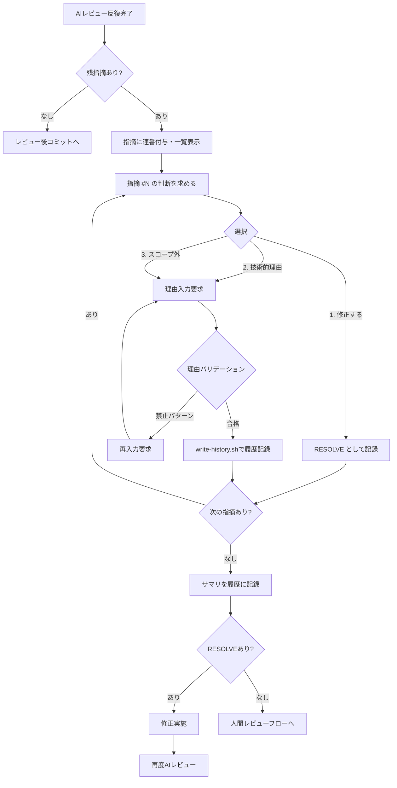

# 論理設計: AIレビュー指摘先送り抑制ルール

## 概要

`review-flow.md` に指摘対応判断フローを追加し、AIレビュー指摘への対応を明確化する。

**重要**: この論理設計では**コードは書かず**、コンポーネント構成とインターフェース定義のみを行います。具体的なコード（SQL、JSON、実装コード等）はImplementation Phase（コード生成ステップ）で作成します。

## アーキテクチャパターン

Markdownドキュメントへのセクション追加による既存フローの拡張

## コンポーネント構成

### 変更対象ファイル構成

```text
prompts/package/prompts/common/
└── review-flow.md
    ├── (既存) 設定確認
    ├── (既存) ai_tools設定
    ├── (既存) AIレビューツール利用可否の確認
    ├── (既存) 処理フロー
    │   └── ステップ4: AIレビューフロー
    │       ├── (既存) レビュー前コミット
    │       ├── (既存) 反復レビュー
    │       ├── (追加) 指摘対応判断フロー ← 新規サブセクション
    │       ├── (既存) レビュー後コミット
    │       └── (既存) 人間に提示
    └── (既存) 外部入力検証ルール
```

### コンポーネント詳細

#### 指摘対応判断フローセクション（新規追加）

- **責務**: AIレビュー指摘が残っている場合の対応判断フローを定義
- **依存**: 既存の「処理フロー」セクション（ステップ4のAIレビューフロー）
- **公開インターフェース**:
  - 起動条件
  - 各指摘に対する対応判断の選択肢（ツール非依存の形式）
  - 理由入力とバリデーション
  - 履歴記録フォーマット（write-history.sh 互換）:
    - 先送り判断（TECHNICAL_BLOCKER/OUT_OF_SCOPE）: 各指摘ごとに個別記録
    - 修正判断（RESOLVE）: サマリで一括記録

## インターフェース設計

### 起動条件

指摘対応判断フローは以下のタイミングで起動する:

1. **反復レビュー完了後**: AIレビューの反復が完了し、まだ指摘が残っている場合
2. **継続確認時**: 既存の「3回/6回後の継続確認」の選択肢として統合

**既存フローとの統合ポイント**:

現在の `review-flow.md` ステップ4の「反復レビュー」では:
- 3回後に「継続する/人間が確認する」の2択
- 6回後に「人間に提示して判断を仰ぐ」

これを以下に変更:
- 3回後/6回後に「指摘対応判断フロー」を起動
- 各指摘に対してユーザーが判断を選択
- 全指摘が「修正する」または「先送り（履歴記録済み）」になったら次のステップへ

### 対応判断の選択肢（ツール非依存形式）

#### ユーザーへの質問形式（各指摘ごと）

**表示タイミング**: 反復レビュー後に指摘が残っている場合

**質問文（全体提示）**:

```text
【確認】AIレビューで指摘が残っています。各指摘について対応を選択してください。

残りの指摘:
1. [指摘内容1]
2. [指摘内容2]
...

指摘 #1 について、どのように対応しますか？
1. 指摘を修正する（推奨）
2. 技術的理由で対応不可（理由を記録）
3. スコープ外として次サイクルで対応（理由を記録）
```

**各指摘への質問（繰り返し）**:

```text
指摘 #[N] について、どのように対応しますか？
「[指摘内容]」

1. 指摘を修正する（推奨）
2. 技術的理由で対応不可（理由を記録）
3. スコープ外として次サイクルで対応（理由を記録）
```

**選択肢の詳細**:

| 選択肢 | DecisionType | 理由入力 | 次のアクション |
|--------|--------------|----------|----------------|
| 1 | RESOLVE | 不要 | この指摘の判断を記録し、次の指摘へ |
| 2 | TECHNICAL_BLOCKER | 必須 | 理由入力後、この指摘の判断を履歴記録し、次の指摘へ |
| 3 | OUT_OF_SCOPE | 必須 | 理由入力後、この指摘の判断を履歴記録し、次の指摘へ |

**全指摘の判断完了後**:
- RESOLVE を選んだ指摘がある場合: 修正を実施し、再度AIレビューへ
- 全て先送りの場合: 人間レビューフローへ

### 理由入力フロー

#### 選択肢2または3が選択された場合

**質問文**:

```text
指摘 #[N] の先送り理由を入力してください。
「[指摘内容]」

【注意】以下のような理由は単独では受け付けられません:
- 「パッチだから」「小さい変更だから」
- 「時間がないから」「急ぎだから」

具体的な技術的理由や根拠を含めて記載してください。
```

**バリデーション**:
- 空文字・空白のみは不可
- 禁止パターンのみで構成される理由は拒否し、再入力を要求

**禁止パターン判定**:

```text
以下のパターンにマッチする理由は拒否:
- /^(パッチ|小さい変更|軽微|時間がない|急ぎ)(だから|なので|のため)$/
- 上記パターンのみで構成される場合に拒否
- 他の具体的理由が併記されていれば許可
```

**拒否時のメッセージ**:

```text
【理由が不十分です】
入力された理由: "[入力内容]"

この理由では先送りを承認できません。
具体的な技術的理由や根拠を含めて、再度入力してください。

例:
- 「依存ライブラリXのバグにより、現バージョンでは対応不可。Issue #123 で追跡中」
- 「この変更はUnit 005のスコープに含まれており、そちらで対応予定」
```

## データモデル概要

### 履歴記録フォーマット（write-history.sh 互換、各指摘ごと）

**記録先**: `docs/cycles/{{CYCLE}}/history/construction_unit{NN}.md`

**記録方法**: `write-history.sh` を使用（各指摘ごとに1回呼び出し）

**先送り判断の場合（TECHNICAL_BLOCKER または OUT_OF_SCOPE）**:

```bash
docs/aidlc/bin/write-history.sh \
    --cycle {{CYCLE}} \
    --phase construction \
    --unit {N} \
    --unit-name "[Unit名]" \
    --unit-slug "[unit-slug]" \
    --step "AIレビュー指摘対応判断" \
    --content "[対応判断の内容]"
```

**--content の形式（先送りの場合）**:

```text
【指摘 #{index}】{指摘内容の要約}
【判断種別】{TECHNICAL_BLOCKER|OUT_OF_SCOPE}
【先送り理由】{ユーザーが入力した理由}
```

**修正判断の場合（RESOLVE）**:

修正を選択した指摘は、修正完了後の次回AIレビューで解消されることを確認する。履歴への明示的な記録は不要（次回のAIレビュー結果で確認可能）。

ただし、判断のトレーサビリティのため、全指摘の判断完了時にサマリを1回記録する:

```bash
docs/aidlc/bin/write-history.sh \
    --cycle {{CYCLE}} \
    --phase construction \
    --unit {N} \
    --unit-name "[Unit名]" \
    --unit-slug "[unit-slug]" \
    --step "AIレビュー指摘対応判断サマリ" \
    --content "[サマリ内容]"
```

**--content の形式（サマリ）**:

```text
【AIレビュー指摘対応判断サマリ】
  指摘 #1: RESOLVE（修正予定）
  指摘 #2: TECHNICAL_BLOCKER（理由記録済み）
  指摘 #3: OUT_OF_SCOPE（理由記録済み）
【次のアクション】{修正実施後に再レビュー|人間レビューへ}
```

※ 行頭の `-` を使用しないのは、`--content` 引数内でMarkdownリストとして解釈されるのを防ぐため

## 処理フロー概要

### 指摘対応判断の処理フロー

**ステップ**:

1. AIレビュー反復完了後、残指摘をカウント
2. 残指摘がある場合:
   - 各指摘に連番（index）を付与
   - 全指摘を一覧表示
3. 各指摘について順番に判断を求める:
   - 選択肢1（修正する）: RESOLVE として記録
   - 選択肢2,3（先送り）: 理由入力を要求
4. 先送りを選択した場合:
   - 理由のバリデーション（禁止パターンチェック）
   - 不合格の場合は再入力を要求
   - 合格後、write-history.sh でこの指摘の判断を履歴に記録
5. 全指摘の判断完了後:
   - サマリを履歴に記録
   - RESOLVE を選んだ指摘がある場合: 修正を実施し、再度AIレビューへ
   - 全て先送りの場合: 人間レビューフローへ進む

**関与するコンポーネント**: review-flow.md の処理フローセクション

### フロー図



### 既存フローへの統合

**変更前（現在のreview-flow.md ステップ4）**:

```text
5. 3回後も指摘が残る場合は、ユーザーに継続確認を求める:
   1. レビューを継続する（さらに3回まで）
   2. 人間が残りの指摘を確認する
```

**変更後**:

```text
5. 3回後も指摘が残る場合は、指摘対応判断フローを実行:
   - 詳細は「## 指摘対応判断フロー」セクションを参照
   - 各指摘について対応を選択（修正する/技術的理由/スコープ外）
   - 「修正する」を選択した指摘がある場合: さらに最大3回のレビューを実施
   - 全て「先送り」を選択した場合: 履歴記録後、人間レビューへ
```

## 非機能要件（NFR）への対応

該当なし（プロンプト修正のみ）

## 技術選定

- **形式**: Markdown
- **記述言語**: 自然言語（日本語）
- **対象ツール**: 全AIツール共通（ツール固有機能に依存しない）

## 実装上の注意事項

- **ツール非依存**: Claude Code の AskUserQuestion や他ツール固有の機能に依存せず、テキストベースの選択肢形式を使用
- **既存フローとの整合**: 「反復レビュー（3回/6回）」の継続確認と統合し、二重のユーザー確認を避ける
- **write-history.sh 互換**: 履歴記録は既存の write-history.sh を使用し、フォーマットを統一
- **禁止パターン**: 「パッチだから」等の安易な理由を単独で許可しない
- **指摘の識別**: 連番（index）を使用して指摘と判断を紐づけ
- **各指摘ごとの判断**: ドメインモデルに従い、各指摘に対して個別に判断を求め、履歴に記録

## 追加するセクションの配置

既存の「処理フロー」セクションのステップ4（AIレビューフロー）内に新規サブセクションとして追加。具体的には「反復レビュー」の後、「レビュー後コミット」の前に挿入。

## 不明点と質問（設計中に記録）

なし（Unit定義で詳細が特定済み）
