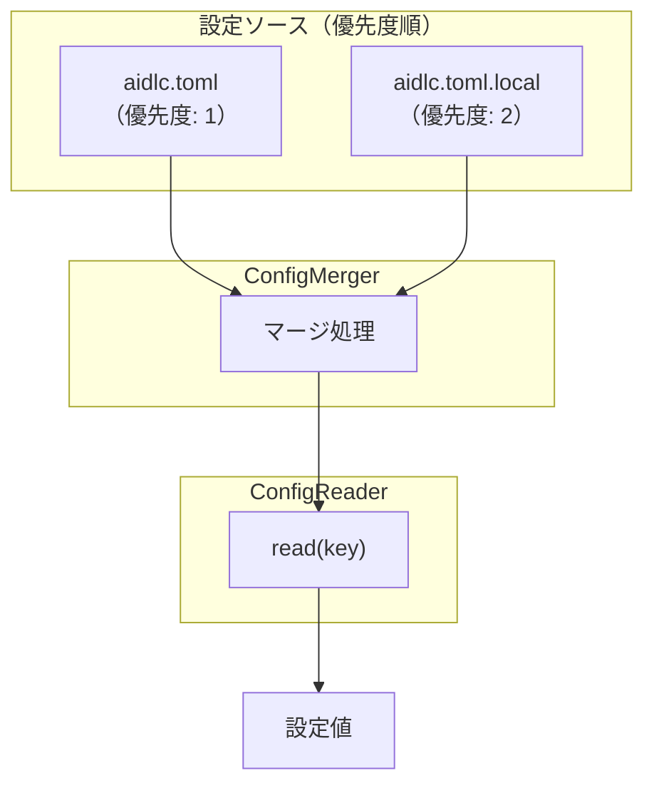

# ドメインモデル: プロジェクト個人設定

## 概要

プロジェクト共有設定（`aidlc.toml`）と個人設定（`aidlc.toml.local`）をマージし、統一された設定値を提供する機能のドメインモデル。

**重要**: このドメインモデル設計では**コードは書かず**、構造と責務の定義のみを行います。

## 値オブジェクト（Value Object）

### ConfigSource（設定ソース）

- **属性**:
  - path: String - ファイルパス
  - priority: Integer - 優先度（数値が大きいほど優先）
- **不変性**: ソースの定義は変更されない
- **等価性**: pathで判定

### ConfigKey（設定キー）

- **属性**:
  - key: String - ドット区切りのキーパス（例: `rules.mcp_review.mode`）
- **不変性**: キーの形式は固定
- **等価性**: key文字列で判定

### ConfigValue（設定値）

- **属性**:
  - value: Any - 値（スカラー、配列、テーブル）
  - type: Enum - SCALAR | ARRAY | TABLE
- **不変性**: 取得後の値は変更されない
- **等価性**: valueとtypeで判定

## ドメインサービス

### ConfigMerger（設定マージャー）

- **責務**: 複数の設定ソースをマージルールに従って統合
- **操作**:
  - merge(base, override) - 2つの設定をマージ
- **マージルール**:
  1. **キー単位優先**: overrideにキーが存在すれば、baseを上書き
  2. **配列置換**: 配列型の値は完全に置換（要素のマージはしない）
  3. **ネスト再帰マージ**: テーブル型はキーごとに再帰的にマージ

### ConfigReader（設定リーダー）

- **責務**: 指定されたキーの設定値を取得
- **操作**:
  - read(key) - マージ済み設定からキーの値を取得
  - readWithDefault(key, default) - デフォルト値付きで取得

## ドメインモデル図



## マージルール詳細

### ルール1: キー単位優先

```
base:     { a = 1, b = 2 }
override: { b = 3, c = 4 }
result:   { a = 1, b = 3, c = 4 }
```

### ルール2: 配列置換

```
base:     { items = ["a", "b"] }
override: { items = ["c"] }
result:   { items = ["c"] }  # 置換、マージではない
```

### ルール3: ネスト再帰マージ

```
base:     { rules = { git = { enabled = true }, jj = { enabled = false } } }
override: { rules = { jj = { enabled = true } } }
result:   { rules = { git = { enabled = true }, jj = { enabled = true } } }
```

## ユビキタス言語

- **プロジェクト設定**: `docs/aidlc.toml` - チーム共有の設定ファイル
- **個人設定**: `docs/aidlc.toml.local` - 個人の上書き設定（gitignore対象）
- **マージ済み設定**: 両ファイルをマージした結果の設定
- **設定キー**: ドット区切りのパス（例: `rules.mcp_review.mode`）

## 不明点と質問（設計中に記録）

（なし - Unit定義で明確化済み）
