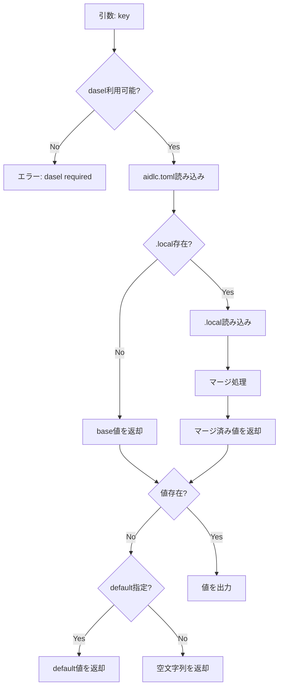

# 論理設計: プロジェクト個人設定

## 概要

設定マージ機能のスクリプト（`read-config.sh`）と共通ガイド（`config-merge.md`）の論理設計。

**重要**: この論理設計では**コードは書かず**、コンポーネント構成とインターフェース定義のみを行います。

## アーキテクチャパターン

シンプルなシェルスクリプトによるユーティリティパターン。既存の `docs/aidlc/bin/` スクリプト群と同様の構成。

## コンポーネント構成

```text
prompts/package/
├── bin/
│   ├── read-config.sh          # 新規: 設定読み込みスクリプト
│   └── (既存スクリプト群)
├── guides/
│   ├── config-merge.md         # 新規: マージロジックガイド
│   └── (既存ガイド群)
└── prompts/
    └── common/
        └── rules.md            # 修正: 設定読み込み方法を追加
```

### コンポーネント詳細

#### read-config.sh

- **責務**: 設定キーを受け取り、マージ済み設定値を出力
- **依存**: `dasel`（TOML パーサー）
- **公開インターフェース**: コマンドライン引数による設定値取得

#### config-merge.md

- **責務**: 設定マージの仕組みと使用方法をドキュメント化
- **依存**: なし
- **公開インターフェース**: AIが参照するガイドドキュメント

## インターフェース設計

### コマンド: read-config.sh

#### 基本形式

```bash
docs/aidlc/bin/read-config.sh <key> [--default <value>]
```

#### パラメータ

| パラメータ | 必須 | 説明 |
|-----------|------|------|
| `key` | Yes | ドット区切りの設定キー（例: `rules.mcp_review.mode`） |
| `--default` | No | キーが存在しない場合のデフォルト値 |

#### 戻り値

- 成功時: 設定値を標準出力に出力、終了コード 0
- キー不在（デフォルトなし）: 空文字列を出力、終了コード 0
- エラー: エラーメッセージを標準エラー出力、終了コード 1

#### 使用例

```bash
# モード取得
docs/aidlc/bin/read-config.sh rules.mcp_review.mode
# 出力: required

# デフォルト値付き
docs/aidlc/bin/read-config.sh rules.custom.foo --default "bar"
# 出力: bar（キーが存在しない場合）

# 配列取得
docs/aidlc/bin/read-config.sh rules.mcp_review.ai_tools
# 出力: ["codex"]
```

## 処理フロー概要

### 設定値取得の処理フロー



**ステップ**:
1. 引数（key, default）をパース
2. `dasel` の利用可否を確認
3. `docs/aidlc.toml` を読み込み
4. `docs/aidlc.toml.local` の存在を確認
5. 存在すれば読み込み、マージ処理を実行
6. 指定されたキーの値を取得
7. 値が存在しなければデフォルト値を使用
8. 結果を標準出力に出力

## 非機能要件（NFR）への対応

### パフォーマンス

- **要件**: 設定読み込みに追加の遅延が発生しないこと
- **対応策**:
  - `dasel` による高速なTOML パース
  - ファイル存在チェックは `test -f` で軽量に実施

### セキュリティ

- **要件**: .localファイルに機密情報を含む可能性があるため、gitignoreで保護
- **対応策**:
  - `.gitignore` に `docs/aidlc.toml.local` を追加
  - スクリプト内でファイルパスをハードコード（インジェクション防止）

### 可用性

- **要件**: .localファイルがなくても正常動作すること
- **対応策**:
  - `.local` ファイル不在時は `aidlc.toml` のみを使用
  - `dasel` 未インストール時はエラーメッセージを出力

## 技術選定

- **言語**: Bash
- **ツール**: dasel（TOMLパーサー）
- **対象OS**: macOS, Linux

## 実装上の注意事項

- `dasel` のバージョン差異に注意（v2系を想定）
- 配列値の出力形式はJSON形式（`["item1", "item2"]`）
- ネストされたキーはドット区切りで指定（`rules.mcp_review.mode`）
- 空文字列と未定義の区別は終了コードではなく、出力の有無で判断

## 不明点と質問（設計中に記録）

（なし - 設計完了）
