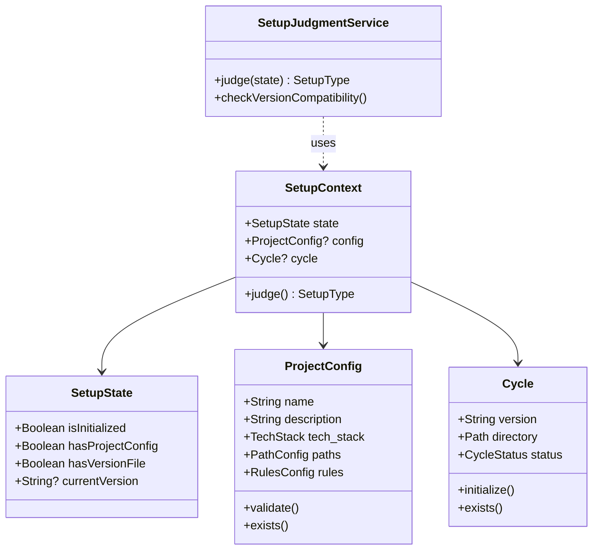

# ドメインモデル: セットアップ分離

## 概要

AI-DLC スターターキットのセットアップ処理を「初回セットアップ」と「サイクル開始」に分離し、それぞれの責務と処理フローを定義する。

**重要**: このドメインモデル設計では**コードは書かず**、構造と責務の定義のみを行います。実装はImplementation Phase（コード生成ステップ）で行います。

## エンティティ（Entity）

### ProjectConfig（プロジェクト設定）

プロジェクト全体の設定を管理するエンティティ。初回セットアップ時に生成され、以降は読み取り専用として扱う。

- **ID**: ファイルパス（`docs/aidlc/project.toml`）
- **属性**:
  - project.name: String - プロジェクト名
  - project.description: String - プロジェクト概要
  - project.tech_stack: TechStack - 技術スタック情報
  - paths: PathConfig - パス設定
  - rules: RulesConfig - 開発ルール
- **振る舞い**:
  - validate(): 設定値の妥当性を検証
  - exists(): 設定ファイルが存在するか確認

### Cycle（サイクル）

開発サイクルを表すエンティティ。サイクル開始時に初期化される。

- **ID**: サイクルバージョン（例: `v1.2.0`）
- **属性**:
  - version: String - サイクルバージョン
  - directory: Path - サイクルディレクトリパス
  - status: CycleStatus - 状態（未開始/進行中/完了）
- **振る舞い**:
  - initialize(): サイクルディレクトリと初期ファイルを作成
  - exists(): サイクルディレクトリが存在するか確認

## 値オブジェクト（Value Object）

### SetupState（セットアップ状態）

現在のセットアップ状態を表す値オブジェクト。

- **属性**:
  - isInitialized: Boolean - 初回セットアップ完了済みか
  - hasProjectConfig: Boolean - project.toml が存在するか
  - hasVersionFile: Boolean - version.txt が存在するか（後方互換）
  - currentVersion: String? - 現在のスターターキットバージョン
- **不変性**: 状態確認時点のスナップショットとして不変
- **等価性**: 全属性の値が一致すれば等価

### PathConfig（パス設定）

プロジェクト内のパス構成を表す値オブジェクト。

- **属性**:
  - setup_prompt: Path - セットアッププロンプトのパス
  - aidlc_dir: Path - AI-DLCディレクトリ（docs/aidlc）
  - cycles_dir: Path - サイクルディレクトリルート（docs/cycles）
- **不変性**: プロジェクト構造に依存し変更しない
- **等価性**: 全パスが一致すれば等価

### TechStack（技術スタック）

プロジェクトの技術スタックを表す値オブジェクト。

- **属性**:
  - languages: List[String] - 使用言語
  - frameworks: List[String] - フレームワーク
  - tools: List[String] - ツール
- **不変性**: セットアップ時に決定し、通常変更しない
- **等価性**: 全リストの内容が一致すれば等価

## 集約（Aggregate）

### SetupContext（セットアップコンテキスト）

セットアップ処理全体を管理する集約。

- **集約ルート**: SetupContext
- **含まれる要素**:
  - SetupState（値オブジェクト）
  - ProjectConfig（エンティティ、null可）
  - Cycle（エンティティ、null可）
- **境界**: セットアップ処理に必要な全情報
- **不変条件**:
  - 初回セットアップは ProjectConfig が存在しない場合のみ実行可能
  - サイクル開始は ProjectConfig が存在する場合のみ実行可能

## ドメインサービス

### SetupJudgmentService（セットアップ判定サービス）

セットアップの種類を判定するサービス。

- **責務**: 現在の状態から実行すべきセットアップ処理を判定
- **操作**:
  - judge(state: SetupState): SetupType - 初回/サイクル開始/エラーを判定
  - checkVersionCompatibility(current, required): CompatibilityResult - バージョン互換性確認

### ProjectConfigFactory（プロジェクト設定ファクトリ）

プロジェクト設定を生成するサービス。

- **責務**: ユーザー入力からプロジェクト設定を生成
- **操作**:
  - createFromUserInput(input): ProjectConfig - 対話結果から設定を生成
  - createDefault(): ProjectConfig - デフォルト設定を生成

### CycleInitializer（サイクル初期化サービス）

サイクルのディレクトリ構造を初期化するサービス。

- **責務**: サイクルディレクトリと初期ファイルの作成
- **操作**:
  - initialize(version: String, config: ProjectConfig): Cycle - サイクルを初期化
  - createDirectoryStructure(cycle: Cycle): void - ディレクトリ構造を作成
  - createInitialFiles(cycle: Cycle): void - history.md等の初期ファイルを作成

## ドメインモデル図



## ユビキタス言語

このドメインで使用する共通用語：

- **初回セットアップ（Initial Setup）**: プロジェクトに AI-DLC を初めて導入する処理。project.toml と共通ファイルを生成。
- **サイクル開始（Cycle Start）**: 新しい開発サイクルを開始する処理。サイクルディレクトリを作成。
- **プロジェクト設定（Project Config）**: プロジェクト固有の設定を集約した TOML ファイル。
- **サイクル（Cycle）**: 開発の1単位。バージョン番号で識別。
- **スターターキット（Starter Kit）**: AI-DLC の実行環境を提供するツールセット。

## 処理フロー概要

### セットアップ判定フロー

```
1. docs/aidlc/project.toml の存在確認
   ├─ 存在しない → 初回セットアップ
   └─ 存在する → 2へ

2. バージョン互換性確認
   ├─ 互換あり → サイクル開始
   └─ 互換なし → アップグレード案内 → サイクル開始
```

### 初回セットアップフロー

```
1. ユーザーとの対話でプロジェクト情報を収集
2. project.toml を生成
3. docs/aidlc/ に静的ファイルを配置
4. サイクル開始フローを続行
```

### サイクル開始フロー

```
1. project.toml を読み込み
2. サイクルバージョンを確認
3. サイクルディレクトリを作成
4. history.md を初期化
5. Inception Phase 開始を案内
```

## 不明点と質問（設計中に記録）

（現時点で不明点なし - Unit 2 の設計アーキテクチャに準拠）
