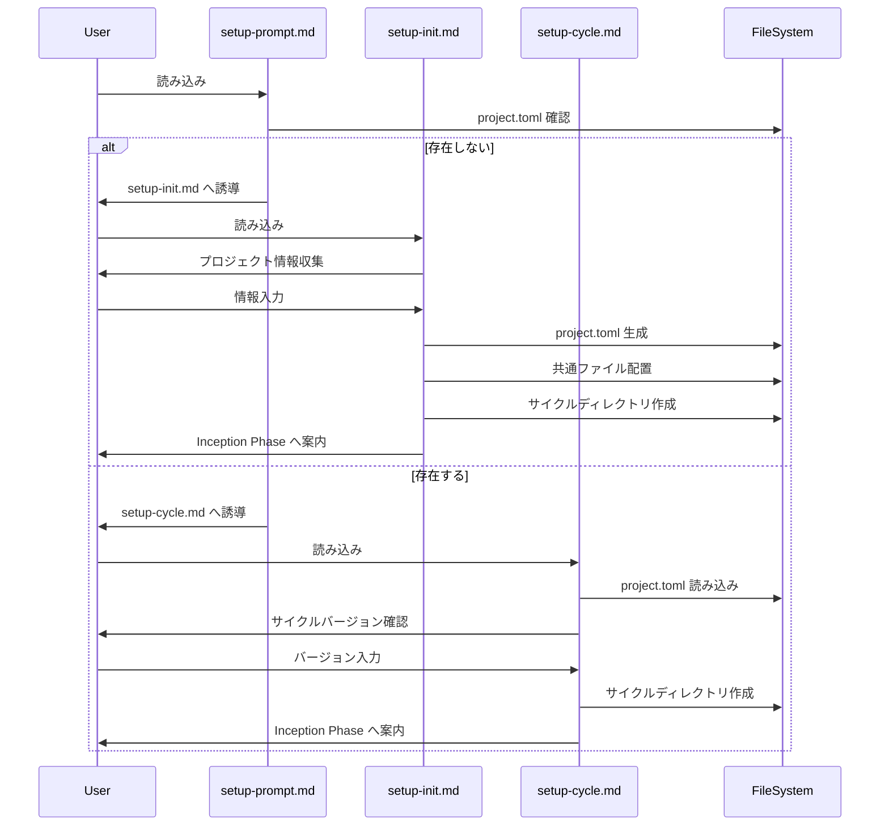

# 論理設計: セットアップ分離

## 概要

セットアップ処理を3つのプロンプトファイルに分離し、それぞれの責務と処理フローを定義する。

**重要**: この論理設計では**コードは書かず**、コンポーネント構成とインターフェース定義のみを行います。具体的なコード（プロンプト文）はImplementation Phase（コード生成ステップ）で作成します。

## アーキテクチャパターン

**パターン**: ルーター/ハンドラーパターン

**選定理由**:
- エントリーポイント（setup-prompt.md）が状態を判定し、適切なハンドラーに処理を委譲
- 初回セットアップとサイクル開始の責務を明確に分離
- 将来の処理追加（アップグレード等）に対応しやすい

## コンポーネント構成

### ファイル構成

```
prompts/
├── setup-prompt.md      # エントリーポイント（ルーター）
├── setup-init.md        # 初回セットアップハンドラー
├── setup-cycle.md       # サイクル開始ハンドラー
└── setup/               # 既存ディレクトリ（当面維持）
    ├── common.md
    ├── inception.md
    ├── construction.md
    └── operations.md
```

### コンポーネント詳細

#### setup-prompt.md（エントリーポイント）

- **責務**: セットアップの種類を判定し、適切なサブプロンプトに誘導
- **依存**: なし（最初に読み込まれる）
- **公開インターフェース**:
  - 実行環境確認
  - セットアップ判定ロジック
  - サブプロンプトへの誘導指示

#### setup-init.md（初回セットアップ）

- **責務**: プロジェクトへの AI-DLC 初回導入
- **依存**: setup-prompt.md から呼び出される
- **公開インターフェース**:
  - ユーザー対話によるプロジェクト情報収集
  - project.toml 生成
  - 共通ファイル配置
  - サイクル開始への継続

#### setup-cycle.md（サイクル開始）

- **責務**: 新規サイクルのディレクトリ構造作成
- **依存**: setup-prompt.md から呼び出される、project.toml を読み込む
- **公開インターフェース**:
  - サイクルバージョン確認
  - ディレクトリ構造作成
  - history.md 初期化
  - Inception Phase への案内

## インターフェース設計

### 判定ロジック

#### セットアップ種類判定

- **入力**: プロジェクトの現在状態
- **出力**: SetupType（InitialSetup | CycleStart | VersionUpgrade）
- **判定条件**:

| 条件 | project.toml | version.txt | 結果 |
|------|--------------|-------------|------|
| 完全新規 | 存在しない | 存在しない | InitialSetup |
| 旧形式 | 存在しない | 存在する | InitialSetup（移行） |
| 設定済み | 存在する | - | CycleStart |

### ユーザー入力インターフェース

#### 初回セットアップ時の収集項目

| 項目 | 必須 | デフォルト値 | 説明 |
|------|------|-------------|------|
| project.name | Yes | リポジトリ名 | プロジェクト名 |
| project.description | Yes | - | プロジェクト概要 |
| tech_stack.languages | No | [] | 使用言語 |
| tech_stack.frameworks | No | [] | フレームワーク |
| tech_stack.tools | No | ["Claude Code"] | ツール |
| rules.coding.naming | No | lowerCamelCase | 命名規則 |

#### サイクル開始時の確認項目

| 項目 | 必須 | デフォルト値 | 説明 |
|------|------|-------------|------|
| cycle_version | Yes | - | サイクルバージョン |
| branch_name | No | cycle/{version} | ブランチ名 |

## データモデル概要

### project.toml 構造

```toml
# 構造の概要（実際のテンプレートは実装時に作成）

[project]
name = ""           # プロジェクト名
description = ""    # 概要

[project.tech_stack]
languages = []      # 使用言語
frameworks = []     # フレームワーク
tools = []          # ツール

[paths]
setup_prompt = ""   # セットアッププロンプトパス
aidlc_dir = ""      # AI-DLCディレクトリ
cycles_dir = ""     # サイクルディレクトリ

[rules]
# 開発ルール（旧 additional-rules.md の内容）

[rules.coding]
naming_convention = ""

[rules.security]
validate_user_input = true
use_env_for_secrets = true
```

### サイクルディレクトリ構造

```
docs/cycles/{version}/
├── plans/
├── requirements/
├── story-artifacts/
│   └── units/
├── design-artifacts/
│   ├── domain-models/
│   ├── logical-designs/
│   └── architecture/
├── inception/
├── construction/
│   └── units/
├── operations/
└── history.md
```

## 処理フロー概要

### エントリーポイント（setup-prompt.md）の処理フロー

**ステップ**:
1. 実行環境確認（カレントディレクトリ、Git状態）
2. ユーザーに実行確認
3. `docs/aidlc/project.toml` の存在確認
4. 判定結果に基づきサブプロンプトを案内:
   - 存在しない → 「setup-init.md を読み込んでください」
   - 存在する → 「setup-cycle.md を読み込んでください」

**関与するコンポーネント**: setup-prompt.md のみ

### 初回セットアップ（setup-init.md）の処理フロー

**ステップ**:
1. スターターキットのバージョン確認
2. ユーザーとの対話でプロジェクト情報を収集
3. `docs/aidlc/project.toml` を生成
4. `docs/aidlc/` ディレクトリに共通ファイルを配置
5. バージョンファイルを配置
6. Git コミット
7. サイクル開始処理を続行（setup-cycle.md の内容を実行）

**関与するコンポーネント**: setup-init.md, (setup-cycle.md 相当の処理)

### サイクル開始（setup-cycle.md）の処理フロー

**ステップ**:
1. `docs/aidlc/project.toml` を読み込み
2. サイクルバージョンを確認（ユーザー入力）
3. Git ブランチ確認・作成
4. サイクルディレクトリを作成
5. `history.md` を初期化
6. Git コミット
7. Inception Phase 開始を案内

**関与するコンポーネント**: setup-cycle.md, project.toml



## 非機能要件（NFR）への対応

### パフォーマンス

- **要件**: サイクル開始の高速化（初回処理をスキップ）
- **対応策**:
  - サイクル開始時は project.toml のみ読み込み
  - 不要なユーザー対話を省略

### ユーザビリティ

- **要件**: 初回/継続を自動判定
- **対応策**:
  - project.toml の存在で自動判定
  - 明確な誘導メッセージ

### 後方互換性

- **要件**: 既存プロジェクトの移行サポート
- **対応策**:
  - version.txt のみ存在する場合も検出
  - 移行ガイダンスを提供

## 技術選定

- **形式**: Markdown（プロンプトファイル）
- **設定形式**: TOML（project.toml）
- **理由**:
  - Markdown: AI が読みやすい
  - TOML: セクション明確、コメント可、YAMLより記述ミスが少ない

## 実装上の注意事項

- **コンテキスト節約**: 各プロンプトは独立して読み込める設計
- **冪等性**: ディレクトリ作成は `mkdir -p` で冪等に
- **エラーハンドリング**: 異常状態（project.toml破損等）への対応を明記
- **Git 操作**: コミットタイミングを明確に指示

## 不明点と質問（設計中に記録）

（現時点で不明点なし - Unit 2 の設計アーキテクチャに準拠）
