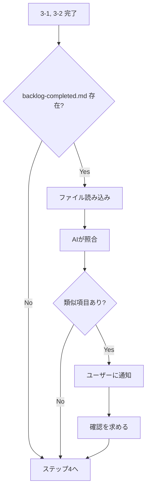

# 論理設計: バックログ対応済みチェック

## 概要

Inception Phaseのバックログ確認ステップ（ステップ3）に「対応済みバックログとの照合」機能を追加するための論理設計。

**重要**: この論理設計では**コードは書かず**、プロンプト修正の構成と手順のみを定義します。

## アーキテクチャパターン

プロンプト駆動型ワークフロー - AIがプロンプトの指示に従って処理を実行する形式

## コンポーネント構成

### プロンプト構成

```
prompts/package/prompts/inception.md
└── ステップ3: バックログ確認
    ├── 3-1. 共通バックログ（既存）
    ├── 3-2. サイクル固有バックログ（既存）
    └── 3-3. 対応済みバックログとの照合（新規追加）
```

### コンポーネント詳細

#### 3-3. 対応済みバックログとの照合
- **責務**: バックログ項目と対応済み項目を照合し、重複・類似を通知
- **依存**: 3-1, 3-2で取得したバックログ項目
- **公開インターフェース**: ユーザーへの通知メッセージ

## インターフェース設計

### AIへの指示（プロンプト追加部分）

#### 3-3. 対応済みバックログとの照合

**入力**:
- `docs/cycles/backlog-completed.md` のファイル内容
- 3-1, 3-2で確認したバックログ項目

**処理**:
1. `docs/cycles/backlog-completed.md` の存在確認
2. 存在する場合、内容を読み込み
3. バックログ項目と対応済み項目をAIが比較
4. 類似項目があれば通知メッセージを生成

**出力**:
- 類似項目がある場合: 通知メッセージ + 確認質問
- 類似項目がない場合: 次のステップへ進行

### 通知メッセージ形式

```markdown
以下のバックログ項目は過去に対応済みの可能性があります：

| バックログ項目 | 対応済み項目 | 類似の根拠 |
|--------------|------------|----------|
| [項目名] | [対応済み項目名] | [AIによる判断理由] |

これらの項目について確認しますか？（重複であれば対応不要として扱います）
```

## データモデル概要

### ファイル形式

#### backlog-completed.md
- **形式**: Markdown
- **主要フィールド**:
  - 見出し（##, ###）: 対応済み項目のタイトル
  - 完了サイクル: どのサイクルで対応したか
  - 完了日: 対応完了日

## 処理フロー概要

### バックログ照合の処理フロー

**ステップ**:
1. ステップ3-1, 3-2完了後に実行
2. `docs/cycles/backlog-completed.md` の存在をlsで確認
3. 存在しない場合: スキップしてステップ4へ
4. 存在する場合: ファイルを読み込み
5. AIが3-1, 3-2で確認したバックログ項目と照合
6. 類似項目を検出した場合: ユーザーに通知し確認を求める
7. ユーザーの回答に基づいて対応を決定

**関与するコンポーネント**: inception.md（ステップ3）



## 非機能要件（NFR）への対応

### パフォーマンス
- **要件**: 特になし
- **対応策**: ファイル読み込みは必要時のみ実行

### セキュリティ
- **要件**: 特になし
- **対応策**: 対象はプロジェクト内のMarkdownファイルのみ

### スケーラビリティ
- **要件**: 特になし
- **対応策**: N/A

### 可用性
- **要件**: backlog-completed.mdが存在しない場合もエラーなく動作
- **対応策**: 存在確認を先に行い、存在しない場合はスキップ

## 技術選定
- **言語**: Markdown（プロンプト記述）
- **フレームワーク**: N/A
- **ライブラリ**: N/A
- **データベース**: N/A

## 実装上の注意事項
- 既存のステップ3-1, 3-2のフローを壊さないこと
- 3-3は3-1, 3-2の後に追加する形式とする
- backlog-completed.mdが存在しない場合のエラーハンドリングを明記

## 不明点と質問（設計中に記録）

[Question] バックログ項目の照合において、「類似項目」の判定基準は？
[Answer] AIによる判断（文脈を読み取って類似性を判断）
