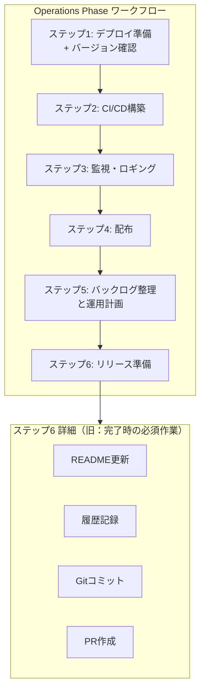

# ドメインモデル: Unit 3 - Operations Phase構造改善

## 概要
Operations Phaseプロンプトの構造を改善し、完了作業をステップ化することで進捗管理を容易にする。また、デプロイ準備時のバージョン確認を追加する。

**重要**: このドメインモデル設計では**コードは書かず**、構造と責務の定義のみを行います。実装はImplementation Phase（コード生成ステップ）で行います。

## ドメイン概念（プロンプト文書の構造）

### Operations Phaseステップ構造

Operations Phaseは以下のステップで構成される（変更後）:

| ステップ | 名称 | 責務 |
|----------|------|------|
| 1 | デプロイ準備 | 環境準備、**バージョン確認**、チェックリスト作成 |
| 2 | CI/CD構築 | パイプライン設定、自動化 |
| 3 | 監視・ロギング戦略 | 監視設定、アラート定義 |
| 4 | 配布 | ストア申請、配布作業（PROJECT_TYPE依存） |
| 5 | バックログ整理と運用計画 | バックログ整理、リリース後運用計画 |
| 6 | リリース準備 | README更新、履歴記録、コミット、PR作成 |

### エンティティ（プロンプト構造要素）

#### OperationsStep（Operations Phase ステップ）
- **ID**: ステップ番号（1-6）
- **属性**:
  - name: String - ステップ名称
  - responsibility: String - 責務の説明
  - artifacts: List<String> - 成果物ファイルパス
  - isSkippable: Boolean - スキップ可能かどうか（例: 配布ステップ）
- **振る舞い**:
  - 開始時にprogress.mdを「進行中」に更新
  - 完了時にprogress.mdを「完了」に更新

#### VersionCheckConfig（バージョン確認設定）
- **属性**:
  - targetFiles: List<String> - 確認対象ファイル（例: package.json, pyproject.toml）
  - versionField: String - バージョンフィールドのパス
  - checkCommand: String - 確認コマンド例
- **責務**: デプロイ前にアプリバージョンが適切に設定されていることを確認

## 値オブジェクト

### StepStatus（ステップ状態）
- **属性**: value: Enum(未着手 | 進行中 | 完了 | スキップ)
- **不変性**: 一度設定された状態は履歴として保持
- **等価性**: value の文字列比較

### Artifact（成果物）
- **属性**:
  - path: String - ファイルパス
  - template: String - テンプレートパス
- **等価性**: pathの一致

## 集約

### OperationsPhaseWorkflow（Operations Phase ワークフロー）
- **集約ルート**: OperationsPhaseWorkflow
- **含まれる要素**:
  - steps: List<OperationsStep>（ステップ1-6）
  - progress: ProgressRecord
- **境界**: Operations Phase全体の進捗管理
- **不変条件**:
  - ステップは順番に実行される
  - 前のステップが完了しないと次のステップに進めない

## ドメインサービス

### VersionCheckService
- **責務**: デプロイ準備時のバージョン確認を実行
- **操作**:
  - checkVersion() - 設定されたファイルからバージョンを取得・確認
  - suggestVersionUpdate() - バージョン更新の提案（必要な場合）

### BacklogIntegrationService
- **責務**: バックログ整理をステップ5に統合
- **操作**:
  - collectCycleBacklog() - サイクル固有バックログを収集
  - categorizeItems() - 項目を分類（対応済み/未対応）
  - migrateToCommonBacklog() - 共通バックログへの移行

## ドメインモデル図

## ユビキタス言語

- **ステップ**: Operations Phase内の作業単位。progress.mdで進捗管理される
- **バージョン確認**: デプロイ前にアプリケーションのバージョン情報が正しく設定されているか確認する作業
- **バックログ整理**: サイクル中に発見した課題・改善点を分類し、共通バックログに移行する作業
- **リリース準備**: コミット、PR作成など、コードをリリース可能な状態にする最終作業
- **運用引き継ぎ**: サイクル間で引き継ぐ運用設定・方針を記録するドキュメント

## 不明点と質問

[Question] バージョン確認で、バージョンが未更新の場合の対応はどうすべきですか？（警告のみ / 更新を促す / 自動更新提案）

[Answer] 自動更新提案 - AIがバージョン更新を提案し、ユーザー承認後に更新する
