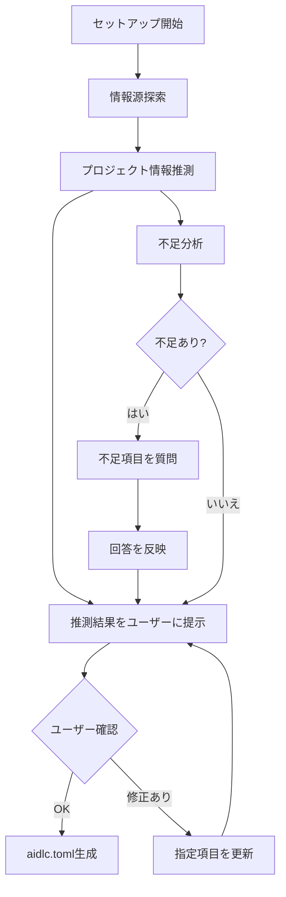

# ドメインモデル: グリーンフィールドセットアップ改善

## 概要

初回セットアップ時のプロジェクト情報収集フローを改善し、複数の情報源から推測を試み、不足分のみ質問する柔軟なフローを設計する。

**重要**: このドメインモデル設計では**コードは書かず**、構造と責務の定義のみを行います。

## 値オブジェクト（Value Object）

### ProjectInfo（プロジェクト情報）
- **属性**:
  - name: String - プロジェクト名
  - description: String - プロジェクト概要
  - languages: List<String> - 使用言語
  - frameworks: List<String> - フレームワーク
  - namingConvention: String - 命名規則
- **不変性**: 収集完了後は変更しない
- **等価性**: 全属性の一致

### InformationSource（情報源）
- **属性**:
  - type: Enum(README, PACKAGE_JSON, GO_MOD, DOCS, SOURCE_CODE, OTHER)
  - path: String - ファイル/ディレクトリパス
  - content: String - 内容（抜粋）
- **不変性**: 読み込み後は変更しない

### InferredValue（推測値）
- **属性**:
  - field: String - 対象フィールド名
  - value: String - 推測された値
  - source: InformationSource - 推測の根拠となった情報源
  - confidence: Enum(HIGH, MEDIUM, LOW) - 確信度
- **不変性**: 推測後は変更しない

## ドメインサービス

### InformationSourceDiscovery（情報源探索サービス）
- **責務**: プロジェクト内の情報源を探索・収集
- **操作**:
  - discoverSources() - 以下の順序で情報源を探索
    1. README.md（ルート直下）
    2. package.json / go.mod / Cargo.toml / pyproject.toml 等
    3. docs/ 配下の .md ファイル（最大5ファイル、各100行まで）
    4. src/ または主要ソースディレクトリの構造

### ProjectInfoInference（プロジェクト情報推測サービス）
- **責務**: 情報源からプロジェクト情報を推測
- **操作**:
  - inferFromSources(sources: List<InformationSource>) → List<InferredValue>
  - 推測対象:
    - name: README.mdのタイトル or package.jsonのname or ディレクトリ名
    - description: README.mdの冒頭 or package.jsonのdescription
    - languages: 設定ファイルの種類、ソースコードの拡張子から推測
    - frameworks: 依存関係から推測
    - namingConvention: 既存コードのスタイルから推測

### GapAnalysis（不足分析サービス）
- **責務**: aidlc.toml構成に必要な情報の不足を特定
- **操作**:
  - analyzeGaps(inferred: List<InferredValue>) → List<MissingField>
  - 必須フィールド: name, description
  - 推奨フィールド: languages, frameworks, namingConvention

### InteractiveQuestioning（対話的質問サービス）
- **責務**: 不足フィールドについてユーザーに質問
- **操作**:
  - askForMissingFields(missing: List<MissingField>) → List<UserAnswer>
  - 一問一答形式で質問（複数まとめて質問しない）

## フロー図

## ユビキタス言語

- **情報源（Information Source）**: プロジェクト情報を推測するための入力ファイル/ディレクトリ
- **推測値（Inferred Value）**: 情報源から推測されたプロジェクト情報の値
- **確信度（Confidence）**: 推測の確からしさ（HIGH/MEDIUM/LOW）
- **不足フィールド（Missing Field）**: aidlc.toml構成に必要だが推測できなかったフィールド
- **グリーンフィールド**: 情報源がほぼない新規プロジェクト
- **ブラウンフィールド**: 既存の情報源があるプロジェクト

## 不明点と質問（設計中に記録）

[Question] グリーンフィールド判定の基準について
[Answer] グリーンフィールド/ブラウンフィールドの二分法ではなく、情報源を広く探索し、推測を試み、aidlc.toml構成に必要な情報が足りない項目のみ質問する柔軟なフローとする。
