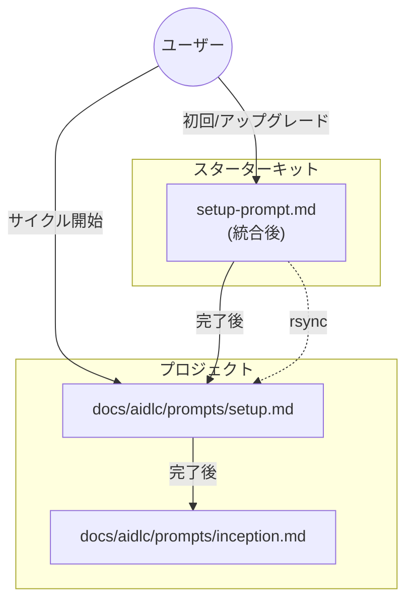

# ドメインモデル: セットアッププロンプトの統合・整理

## 概要

AI-DLCのセットアッププロセスを2つの責務に分離し、各プロンプトファイルの役割と関係を明確化する。

## セットアッププロセスの概念モデル

```
┌─────────────────────────────────────────────────────────────────┐
│                    AI-DLC セットアップ                           │
├─────────────────────────────┬───────────────────────────────────┤
│  スターターキットセットアップ  │      サイクルセットアップ          │
│  (setup-prompt.md)          │      (setup.md)                   │
├─────────────────────────────┼───────────────────────────────────┤
│  - 初回導入                  │  - スターターキットバージョン確認    │
│  - アップグレード             │  - サイクルバージョン決定           │
│  - 移行                     │  - ブランチ管理                    │
│  - aidlc.toml管理           │  - ディレクトリ作成                 │
│  - prompts/templates同期     │  - 履歴初期化                      │
│  - プロジェクトタイプ設定      │                                   │
└─────────────────────────────┴───────────────────────────────────┘
```

## 責務の定義

### 1. スターターキットセットアップ

**ファイル**: `prompts/setup-prompt.md`（統合後）

**責務**: AI-DLC環境の構築と更新

| 責務 | 説明 |
|------|------|
| 実行環境確認 | カレントディレクトリがプロジェクトルートか確認 |
| セットアップ種類判定 | 初回/アップグレード/移行/サイクル開始を判定 |
| 初回セットアップ | aidlc.toml作成、プロジェクト情報収集、プロジェクトタイプ設定 |
| アップグレード | starter_kit_version更新、設定マイグレーション、ファイル同期 |
| 移行 | 旧形式から新形式へのファイル移行 |
| ファイル同期 | prompts/templates を rsync で同期 |

**境界**:
- スターターキットの存在が前提（スターターキットリポジトリ内で実行）
- 初回/アップグレード時のみ使用
- 完了後は setup.md へ誘導

### 2. サイクルセットアップ

**ファイル**: `prompts/package/prompts/setup.md`

**責務**: 開発サイクルの開始

| 責務 | 説明 |
|------|------|
| スターターキットバージョン確認 | 最新バージョンとの比較、アップグレード促進 |
| サイクルバージョン決定 | 次のサイクルバージョンを決定 |
| ブランチ確認 | サイクル用ブランチの作成・確認 |
| ディレクトリ作成 | サイクルディレクトリ構造を作成 |
| 履歴初期化 | history/inception.md を作成 |

**境界**:
- プロジェクト内で完結（スターターキット不要）
- サイクル開始時に毎回使用
- Inception Phase へ誘導

## ファイル間の関係



## 用語定義

| 用語 | 定義 |
|------|------|
| **スターターキットバージョン** | AI-DLCスターターキット自体のバージョン（例: 1.4.0） |
| **サイクルバージョン** | 開発サイクルの識別子（例: v1.5.1） |
| **初回セットアップ** | プロジェクトにAI-DLCを初めて導入する処理 |
| **アップグレード** | スターターキットの新バージョンに更新する処理 |
| **移行** | 旧形式（project.toml等）から新形式（aidlc.toml）への変換 |

## 統合によるファイル構成の変化

### 変更前

```
prompts/
├── setup-prompt.md    # エントリーポイント、判定
├── setup-init.md      # 初回/アップグレード処理
└── package/prompts/
    └── setup.md       # サイクル開始
```

### 変更後

```
prompts/
├── setup-prompt.md    # 統合（判定 + 初回/アップグレード処理）
└── package/prompts/
    └── setup.md       # サイクル開始（プロジェクトタイプ確認削除）
```

## 不明点と質問

（現時点で不明点はありません）
