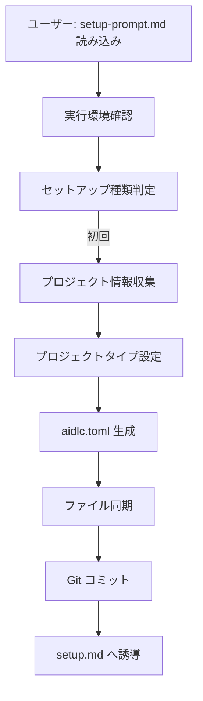
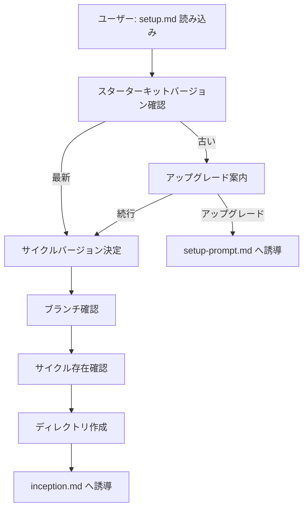

# 論理設計: セットアッププロンプトの統合・整理

## 概要

setup-prompt.md と setup-init.md を統合し、setup.md を整理する具体的な変更内容を定義する。

## ファイル変更一覧

| ファイル | 操作 | 変更内容 |
|----------|------|----------|
| `prompts/setup-prompt.md` | 編集 | setup-init.md の内容を統合 |
| `prompts/setup-init.md` | 削除 | - |
| `prompts/package/prompts/setup.md` | 編集 | プロジェクトタイプ確認削除、バージョン確認移動 |

---

## 1. setup-prompt.md の統合設計

### 統合後のセクション構成

```
# AI-DLC セットアップ

## 共通ルール
  - 予想禁止・一問一答質問ルール

## 1. 実行環境の確認
  - カレントディレクトリ確認
  - ユーザー承認待ち

## 2. セットアップ種類の判定
  - aidlc.toml / project.toml の存在確認
  - バージョン比較
  - ケース判定（A: 初回, B: サイクル開始, C: アップグレード, D: 警告）

## 3. ファイル移行【移行モードのみ】
  - project.toml → aidlc.toml
  - additional-rules.md → rules.md
  - version.txt 削除

## 4. Git環境の確認

## 5. プロジェクト情報の収集【初回のみ】
  - 情報源の探索
  - プロジェクト情報の推測
  - 推測結果の確認
  - 不足項目の質問

## 6. プロジェクトタイプの設定【初回のみ】 ← 新規追加
  - タイプ選択（web, backend, cli, desktop, ios, android, general）
  - aidlc.toml への追記

## 7. aidlc.toml の生成【初回のみ】/ 更新【アップグレード】

## 8. 共通ファイルの配置
  - rsync によるファイル同期
  - プロジェクト固有ファイルの初期配置

## 9. Git コミット

## 10. 完了メッセージと次のステップ
  - setup.md への誘導

## AI-DLC 概要（末尾に配置）
```

### 統合時の注意点

1. **共通ルール**: setup-init.md の共通ルールは削除（setup-prompt.md に統合済み）
2. **セクション番号**: 統合後のセクション番号を振り直す
3. **「前提」記述の削除**: setup-init.md にあった「前提: setup-prompt.md から誘導」は不要
4. **プロジェクトタイプ設定**: setup.md から移動し、セクション6として追加

---

## 2. setup.md の変更設計

### 変更後のセクション構成

```
# サイクルセットアップ プロンプト

## AI-DLC手法の要約

## プロジェクト情報

## あなたの役割

## 最初に必ず実行すること

### 1. スターターキットバージョン確認 ← 移動（元セクション4）
  - GitHubから最新バージョン取得
  - aidlc.toml の starter_kit_version と比較
  - アップグレード推奨時は setup-prompt.md を案内

### 2. サイクルバージョンの決定 ← 番号変更（元セクション1）
  - 既存サイクルの検出
  - バージョン提案
  - 重複チェック

### 3. ブランチ確認 ← 番号変更（元セクション2）

### 4. サイクル存在確認 ← 番号変更（元セクション3）

### 5. サイクルディレクトリ作成 ← 番号変更（元セクション6）
  ※ プロジェクトタイプ確認（元セクション5）は削除

## 完了時の作業

## 補足: git worktree の使用
```

### 削除するセクション

- **セクション5: プロジェクトタイプ確認** → setup-prompt.md に移動

### 移動するセクション

- **セクション4: バージョン確認** → セクション1に移動（最初に実行）

---

## 3. 処理フロー

### 初回セットアップ



### サイクル開始



---

## 4. 実装上の注意事項

1. **行数の管理**: 統合後の setup-prompt.md は約800行になる。可読性を維持するためセクション見出しを明確に
2. **後方互換性**: 既存プロジェクトへの影響を最小限に
3. **エラーハンドリング**: 各ステップで適切なエラーメッセージを維持

---

## 不明点と質問

（現時点で不明点はありません）
