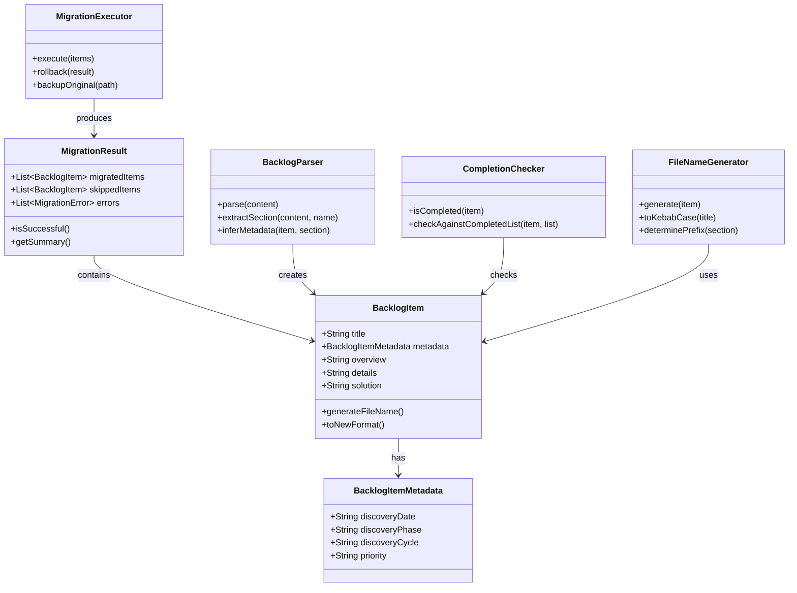

# ドメインモデル: backlog.md移行処理

## 概要

旧形式の `docs/cycles/backlog.md`（単一ファイル）を新形式（`docs/cycles/backlog/` ディレクトリに個別ファイル）に自動移行する処理のビジネスロジックを定義する。

**重要**: このドメインモデル設計では**コードは書かず**、構造と責務の定義のみを行います。実装はImplementation Phase（コード生成ステップ）で行います。

## 値オブジェクト（Value Object）

### BacklogItemMetadata
- **属性**:
  - discoveryDate: String - 発見日（YYYY-MM-DD形式、デフォルト: "不明"）
  - discoveryPhase: String - 発見フェーズ（Inception/Construction/Operations、デフォルト: "不明"）
  - discoveryCycle: String - 発見サイクル（vX.X.X形式、デフォルト: 旧形式の「元サイクル」または "不明"）
  - priority: String - 優先度（高/中/低、デフォルト: セクションから推測）
- **不変性**: メタデータは一度設定されたら変更されない
- **等価性**: 全属性の一致で判定

### FileNameComponents
- **属性**:
  - prefix: String - カテゴリプレフィックス（deferred-, chore-, feature-, refactor-, docs-, perf-, security-）
  - slug: String - ケバブケース化されたタイトル
- **不変性**: ファイル名は一度生成されたら変更されない
- **等価性**: prefix + slug の組み合わせで判定

## エンティティ（Entity）

### BacklogItem
- **ID**: String（生成されたファイル名 = prefix + slug）
- **属性**:
  - title: String - 項目タイトル（### 見出しから抽出）
  - metadata: BacklogItemMetadata - メタデータ
  - overview: String - 概要セクションの内容
  - details: String - 詳細セクションの内容
  - solution: String - 対応案セクションの内容
  - originalSection: String - 元の大セクション名（延期タスク、技術的負債等）
  - rawContent: String - 元のMarkdown内容（変換失敗時の保全用）
- **振る舞い**:
  - generateFileName(): FileNameComponents - ファイル名を生成
  - toNewFormat(): String - 新形式Markdownに変換

### MigrationResult
- **ID**: Integer（実行番号）
- **属性**:
  - migratedItems: List[BacklogItem] - 移行された項目リスト
  - skippedItems: List[BacklogItem] - スキップされた項目リスト（完了済み等）
  - errors: List[MigrationError] - 発生したエラーリスト
  - originalFileBackupPath: String - 元ファイルのバックアップパス
- **振る舞い**:
  - isSuccessful(): Boolean - 移行が成功したか判定
  - getSummary(): String - 移行結果サマリを取得

## 集約（Aggregate）

### BacklogMigration
- **集約ルート**: MigrationResult
- **含まれる要素**:
  - MigrationResult（1つ）
  - BacklogItem（複数）
- **境界**: 1回の移行処理で生成される全項目
- **不変条件**:
  - 同名ファイルは上書きしない（既存チェック必須）
  - 完了済み項目は移行しない
  - 元ファイルは削除前にバックアップ

## ドメインサービス

### BacklogParser
- **責務**: 旧形式backlog.mdを解析し、BacklogItemリストに変換
- **操作**:
  - parse(markdownContent: String): List[BacklogItem] - Markdown解析
  - extractSection(content: String, sectionName: String): String - セクション抽出
  - inferMetadata(item: BacklogItem, sectionName: String): BacklogItemMetadata - メタデータ推測

### CompletionChecker
- **責務**: 項目が完了済みかどうかを判定
- **操作**:
  - isCompleted(item: BacklogItem): Boolean - 完了判定
  - checkAgainstCompletedList(item: BacklogItem, completedItems: List[String]): Boolean - 完了リストと照合
- **判定ロジック**:
  - タイトルに「~~取消線~~」が含まれる → 完了
  - タイトルに「対応済み」「完了」が含まれる → 完了
  - backlog-completed.md または backlog-completed/ に類似項目がある → 完了（警告表示）

### FileNameGenerator
- **責務**: BacklogItemからファイル名を生成
- **操作**:
  - generate(item: BacklogItem): FileNameComponents - ファイル名生成
  - toKebabCase(title: String): String - ケバブケース変換
  - determinePrefix(sectionName: String): String - プレフィックス決定
- **プレフィックスマッピング**:
  - 延期タスク → `deferred-`
  - 技術的負債・修正タスク → `chore-`
  - 次サイクルで検討するタスク → `feature-`
  - 低優先度タスク → `feature-`（優先度: 低）

### MigrationExecutor
- **責務**: 移行処理の実行とロールバック
- **操作**:
  - execute(items: List[BacklogItem]): MigrationResult - 移行実行
  - rollback(result: MigrationResult): Boolean - ロールバック
  - backupOriginal(path: String): String - 元ファイルバックアップ
  - deleteOriginal(path: String, backupPath: String): Boolean - 元ファイル削除

## リポジトリインターフェース

### BacklogRepository
- **対象**: バックログファイル
- **操作**:
  - readOldFormat(path: String): String - 旧形式ファイル読み込み
  - writeNewFormat(item: BacklogItem, directory: String): Boolean - 新形式ファイル書き込み
  - exists(path: String): Boolean - ファイル存在確認
  - listExisting(directory: String): List[String] - 既存ファイル一覧
  - backup(sourcePath: String, backupPath: String): Boolean - バックアップ
  - delete(path: String): Boolean - ファイル削除

## ドメインモデル図

## ユビキタス言語

- **旧形式**: `docs/cycles/backlog.md` 単一ファイルにすべてのバックログ項目が記載された形式
- **新形式**: `docs/cycles/backlog/` ディレクトリに各項目が個別ファイルとして存在する形式
- **移行**: 旧形式から新形式への変換処理
- **完了済み項目**: 対応が完了し、移行対象外となる項目（取消線、backlog-completed参照等）
- **プレフィックス**: ファイル名先頭のカテゴリ識別子（feature-, chore-, deferred-等）
- **スラッグ**: タイトルをケバブケース化したファイル名の一部

## 不明点と質問（設計中に記録）

[Question] 欠けているメタデータをどう扱いますか？
[Answer] デフォルト値を設定（発見日="不明"、フェーズ="不明"、優先度=セクション名から推測）

[Question] 大セクション（カテゴリ）をどうマッピングしますか？
[Answer] prefixで表現（延期タスク→deferred-、技術的負債→chore-、次サイクル検討→feature-）
