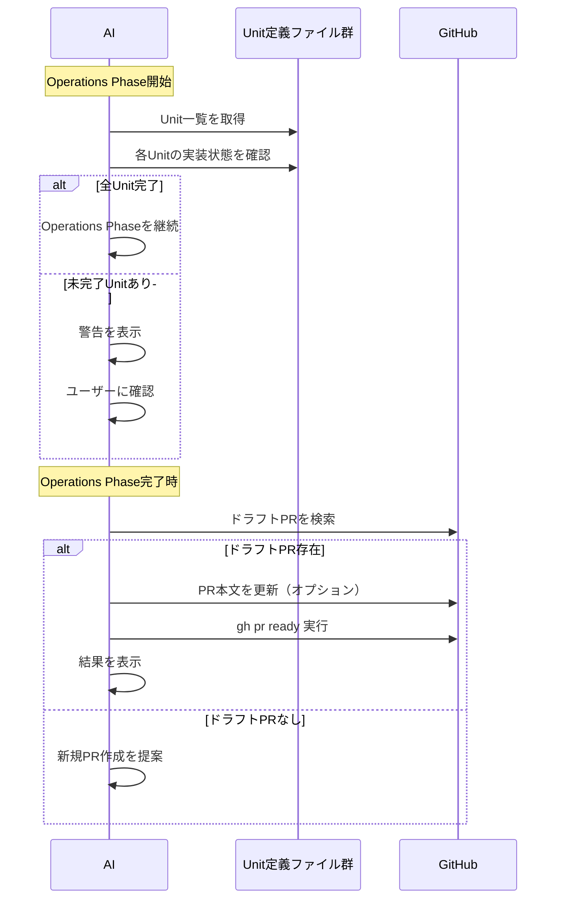

# ドメインモデル: Operations Phase 全Unit完了確認とPR Ready化

## 概要
Operations Phase開始時に全Unitが完了していることを確認し、完了時にドラフトPRをReady for Reviewにする機能の責務と構造を定義する。

**重要**: このドメインモデル設計では**コードは書かず**、構造と責務の定義のみを行います。

## ドメイン概念

### 全Unit完了確認プロセス
Operations Phase開始前に、全てのUnit定義ファイルの「実装状態」が「完了」であることを確認する。未完了のUnitがある場合は警告を表示し、Construction Phaseへの戻りを提案する。

### ドラフトPR Ready化プロセス
Operations Phase完了時に、Inception Phaseで作成されたドラフトPRをReady for Reviewに変更する。これにより、レビュー・マージが可能な状態になる。

## 責務定義

### 1. 全Unit完了確認（Operations Phase開始時）

#### 1.1 Unit定義ファイル収集
- **責務**: Unit定義ファイル群の一覧を取得
- **対象ディレクトリ**: `docs/cycles/{{CYCLE}}/story-artifacts/units/`
- **ファイル形式**: `{NNN}-{unit-name}.md`

#### 1.2 実装状態チェック
- **責務**: 各Unit定義ファイルの「実装状態」セクションを確認
- **チェック項目**:
  - 状態が「完了」か
  - 完了日が記載されているか

#### 1.3 結果判定と表示
- **責務**: 確認結果に基づいて処理を分岐
- **全Unit完了の場合**: Operations Phaseを継続
- **未完了Unitがある場合**:
  - 未完了Unit一覧を表示
  - Construction Phaseへの戻りを提案
  - ユーザーが継続を選択した場合のみ進行

### 2. ドラフトPR Ready化（Operations Phase完了時）

#### 2.1 前提条件チェック
- **責務**: PR Ready化に必要な条件が満たされているか確認
- **チェック項目**:
  - GitHub CLI（gh）がインストールされているか
  - GitHub認証が完了しているか
  - サイクルブランチのドラフトPRが存在するか

#### 2.2 PR検索
- **責務**: 現在のサイクルブランチに対応するドラフトPRを検索
- **コマンド**: `gh pr list --head cycle/{CYCLE} --state open --json number,url,isDraft`
- **確認事項**: ドラフト状態であること

#### 2.3 PR本文更新（オプション）
- **責務**: PRの本文にサイクル成果を追記
- **追記内容**:
  - 完了したUnit一覧
  - 主要な変更点
  - テスト結果サマリー

#### 2.4 Ready化実行
- **責務**: ドラフトPRをReady for Reviewに変更
- **コマンド**: `gh pr ready {PR番号}`

#### 2.5 結果表示
- **責務**: Ready化の結果を表示
- **成功時**: PR URLを提示、レビュー依頼の案内
- **失敗時**: エラー内容と対処法を提示

## エラーハンドリング

### GitHub CLI利用不可
- **条件**: `gh` コマンドが存在しない
- **対応**: スキップし、手動でのPR Ready化を案内

### ドラフトPRが存在しない
- **条件**: サイクルブランチからのPRが存在しない、またはすでにReady状態
- **対応**:
  - PRが存在しない場合: 新規PR作成を提案
  - すでにReady状態の場合: その旨を表示し、スキップ

### 未完了Unitがある
- **条件**: Unit定義ファイルの「実装状態」が「完了」でないUnitがある
- **対応**:
  - 未完了Unit一覧を警告表示
  - 「続行」または「Construction Phaseに戻る」を選択させる

## ワークフロー図

## ユビキタス言語

- **ドラフトPR**: レビュー準備が整っていない作業中のPR
- **Ready for Review**: レビュー準備が完了した状態のPR
- **Unit定義ファイル**: `docs/cycles/{{CYCLE}}/story-artifacts/units/` 配下のMarkdownファイル
- **実装状態**: Unit定義ファイル内の「## 実装状態」セクション
- **サイクルブランチ**: `cycle/{CYCLE}` 形式のブランチ

## 不明点と質問

なし（Unit定義で明確化済み）
