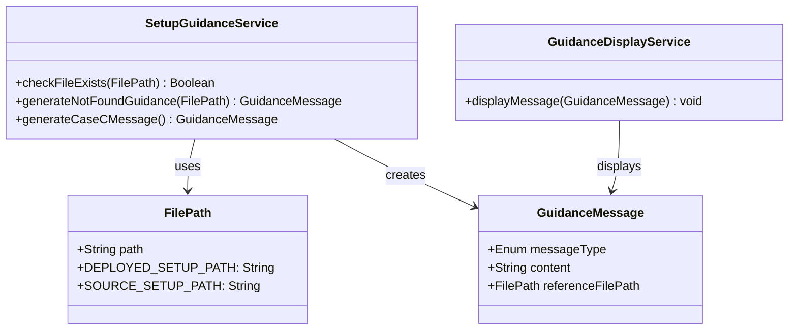

# ドメインモデル: setup-prompt.md改善

## 概要
setup.mdプロンプトファイルの存在確認と案内メッセージ表示機能を提供するドメインモデル。アップグレードしない場合でもサイクル開始できるよう、代替ファイルへの参照を案内する責務を持つ。

**重要**: このドメインモデル設計では**コードは書かず**、構造と責務の定義のみを行います。実装はImplementation Phase（コード生成ステップ）で行います。

## 設計方針

このタスクはシンプルなファイル存在確認と案内表示のため、DDDの完全パターン（エンティティ、集約等）は適用せず、**値オブジェクト + ドメインサービス**の軽量な構成を採用する。

## 値オブジェクト（Value Object）

### FilePath
- **属性**: path: String - ファイルパス文字列（リポジトリルートからの相対パス）
- **不変性**: ファイルパスは一度設定されたら変更されないべき
- **等価性**: パス文字列が同一であれば等価
- **定数**:
  - DEPLOYED_SETUP_PATH: `docs/aidlc/prompts/setup.md`（デプロイ先）
  - SOURCE_SETUP_PATH: `prompts/package/prompts/setup.md`（コピー元）

### GuidanceMessage
- **属性**:
  - messageType: Enum（INFO, SUCCESS） - メッセージ種別（※ERRORではなくINFO: 正常系として扱う）
  - content: String - メッセージ内容
  - referenceFilePath: FilePath - 参照すべきファイルパス
- **不変性**: 一度生成されたメッセージは変更されない
- **等価性**: メッセージ種別、内容、参照先パスが全て同一であれば等価

## ドメインサービス

### SetupGuidanceService
- **責務**: setup.mdの存在状態に応じた案内メッセージの生成
- **操作**:
  - checkFileExists(path: FilePath): Boolean - ファイル存在確認（純粋な判定のみ）
  - generateNotFoundGuidance(referenceFilePath: FilePath): GuidanceMessage - 不在時の案内メッセージ生成
  - generateCaseCMessage(): GuidanceMessage - ケースC完了メッセージの生成

### GuidanceDisplayService（アプリケーションサービス）
- **責務**: 案内メッセージの表示（I/O処理）
- **操作**:
  - displayMessage(message: GuidanceMessage): void - メッセージ表示

## ドメインモデル図

## ユビキタス言語

このドメインで使用する共通用語：

- **GuidanceMessage**: ユーザーに次の行動を案内するメッセージ（エラーではなく案内）
- **FilePath**: ファイルシステム上のパス（リポジトリルートからの相対パス）
- **DeployedSetupPath**: デプロイ先のsetup.mdパス（`docs/aidlc/prompts/setup.md`）
- **SourceSetupPath**: コピー元のsetup.mdパス（`prompts/package/prompts/setup.md`）
- **ケースC**: アップグレードプロセスで「バージョンが同じ」場合のケース
- **参照先ファイル**: ユーザーが次に参照すべきファイル

## 不変条件（Invariants）

1. **編集対象の制約【メタ開発の意識】**:
   - 編集対象は常に `prompts/package/prompts/setup.md`（SourceSetupPath）
   - `docs/aidlc/prompts/setup.md`（DeployedSetupPath）は直接編集しない
   - 理由: DeployedSetupPathはrsyncでSourceSetupPathからコピーされるため

2. **実行ディレクトリの前提**:
   - setup.mdはリポジトリルートから実行されることを前提とする
   - 相対パスはこの前提に基づいて解決される

3. **メッセージ種別の制約**:
   - ファイル不在は正常系として扱う（ERRORではなくINFO）
   - ユーザーを案内することが目的であり、エラー報告ではない

## レビュー指摘への対応

| 指摘 | 対応 |
|------|------|
| エンティティ過剰 | エンティティ・集約を削除し、値オブジェクト+サービスに簡略化 |
| ExistenceStatusの二重化 | ExistenceStatusを削除 |
| source/targetの用語不統一 | `referenceFilePath`（参照先ファイルパス）に統一 |
| メタ開発の意識が未記載 | 不変条件セクションに明記 |
