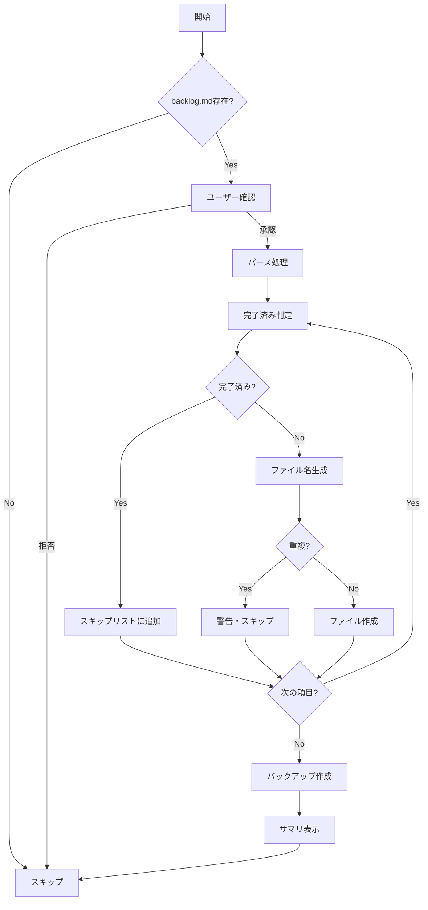

# 論理設計: backlog.md移行処理

## 概要

旧形式の `docs/cycles/backlog.md` を新形式（`docs/cycles/backlog/` ディレクトリ）に自動移行する処理の実装アーキテクチャを定義する。この処理は `prompts/package/prompts/setup.md` に組み込まれ、サイクル開始時に実行される。

**重要**: この論理設計では**コードは書かず**、コンポーネント構成とインターフェース定義のみを行います。具体的なコード（Bashスクリプト等）はImplementation Phase（コード生成ステップ）で作成します。

## アーキテクチャパターン

**パイプライン処理パターン**

移行処理を段階的なステップに分割し、各ステップの出力を次のステップの入力とする。エラー発生時はロールバック可能な設計とする。

選定理由:
- 処理の進捗が明確
- 障害発生時に問題箇所を特定しやすい
- 部分的なリトライが可能

## コンポーネント構成

### 配置場所

```
prompts/package/prompts/setup.md
└── ステップ 4.5（新規追加）: backlog.md 移行処理
    ├── 4.5.1 旧形式ファイル確認
    ├── 4.5.2 移行実行確認
    ├── 4.5.3 パース処理
    ├── 4.5.4 完了済み判定
    ├── 4.5.5 ファイル生成
    └── 4.5.6 クリーンアップ
```

### コンポーネント詳細

#### ステップ 4.5.1: 旧形式ファイル確認
- **責務**: `docs/cycles/backlog.md` の存在確認
- **依存**: なし
- **処理**:
  - ファイル存在確認（`[ -f path ]`）
  - 存在しない場合は移行処理をスキップ
- **出力**: 移行が必要かどうかの判定結果

#### ステップ 4.5.2: 移行実行確認
- **責務**: ユーザーに移行実行の確認を求める
- **依存**: ステップ 4.5.1
- **処理**:
  - 移行内容の説明表示
  - ユーザー確認（Y/n）
- **出力**: 実行許可の有無

#### ステップ 4.5.3: パース処理
- **責務**: backlog.mdをセクション単位で解析
- **依存**: ステップ 4.5.2
- **処理**:
  - `##` で大セクション分割
  - `###` で項目分割
  - メタデータ抽出・推測
- **出力**: 構造化された項目リスト

#### ステップ 4.5.4: 完了済み判定
- **責務**: 各項目が完了済みかどうかを判定
- **依存**: ステップ 4.5.3
- **処理**:
  - 取消線（~~）チェック
  - 「対応済み」「完了」キーワードチェック
  - backlog-completed との照合
- **出力**: 移行対象/スキップ対象の分類

#### ステップ 4.5.5: ファイル生成
- **責務**: 新形式ファイルを生成
- **依存**: ステップ 4.5.4
- **処理**:
  - ファイル名生成（prefix + kebab-case）
  - 既存ファイル重複チェック
  - テンプレート形式でファイル作成
- **出力**: 作成されたファイルリスト

#### ステップ 4.5.6: クリーンアップ
- **責務**: 元ファイルのバックアップと削除
- **依存**: ステップ 4.5.5
- **処理**:
  - 元ファイルを `.bak` にリネーム（または削除確認）
  - 移行結果サマリ表示
- **出力**: 完了メッセージ

## インターフェース設計

### 処理フロー（ユーザー視点）

```
【ステップ 4.5】backlog.md 移行確認

旧形式の docs/cycles/backlog.md が見つかりました。
この形式は非推奨となり、新形式（docs/cycles/backlog/ ディレクトリ）への移行を推奨します。

検出された項目:
- 延期タスク: 2件
- 技術的負債・修正タスク: 0件
- 次サイクルで検討するタスク: 3件（うち完了済み: 2件）
- 低優先度タスク: 0件

移行を実行しますか？（Y/n）
→ 移行後、元ファイルは backlog.md.bak として保存されます
```

### エラーハンドリング

#### ファイル重複エラー
```
警告: 以下のファイルは既に存在するためスキップします:
- docs/cycles/backlog/deferred-issue-driven-integration.md

残りの項目の移行を続行しますか？（Y/n）
```

#### パースエラー
```
警告: 以下の項目はパースできませんでした:
- [項目タイトル]（理由: セクション構造が不正）

この項目は元ファイルに残ります。手動で移行してください。
```

## データモデル概要

### ファイル形式

#### 入力: 旧形式 backlog.md

```markdown
# バックログ（サイクル横断）

## 延期タスク

### [タイトル]
- **元サイクル**: vX.X.X
- **延期日**: YYYY-MM-DD
- **概要**: [概要テキスト]
- ...

## 次サイクルで検討するタスク

### ~~完了済みタスク~~
- ~~内容~~
```

#### 出力: 新形式（個別ファイル）

```markdown
# [タイトル]

- **発見日**: 不明
- **発見フェーズ**: 不明
- **発見サイクル**: vX.X.X（元サイクルから取得）
- **優先度**: 中（セクションから推測）

## 概要

[概要テキスト]

## 詳細

[詳細テキスト]

## 対応案

[対応案テキスト]
```

### ファイル名生成ルール

| 元セクション | prefix | 優先度デフォルト |
|-------------|--------|-----------------|
| 延期タスク | `deferred-` | 中 |
| 技術的負債・修正タスク | `chore-` | 高 |
| 次サイクルで検討するタスク | `feature-` | 中 |
| 低優先度タスク | `feature-` | 低 |

**slug生成**:
- タイトルから日本語を除去（または維持）
- 空白を `-` に置換
- 小文字化
- 特殊文字を除去

## 処理フロー概要

### メイン処理フロー

**ステップ**:
1. `docs/cycles/backlog.md` の存在確認
2. 存在しない場合 → スキップ、setup.md の次ステップへ
3. 存在する場合 → ユーザーに移行確認
4. 拒否された場合 → スキップ、setup.md の次ステップへ
5. 承認された場合 → パース処理開始
6. 各項目について:
   - 完了済み判定 → スキップ対象に追加
   - 未完了 → ファイル名生成 → 重複チェック → ファイル作成
7. 元ファイルをバックアップ（.bak）
8. 移行結果サマリ表示
9. setup.md の次ステップへ

**関与するコンポーネント**: setup.md内のBashスクリプト



## 非機能要件（NFR）への対応

### パフォーマンス
- **要件**: backlog.md読み込み・分割処理は数秒以内
- **対応策**: シェルスクリプトによる逐次処理。100件以上の項目でも数秒で完了する設計

### セキュリティ
- **要件**: ファイル操作の安全性（上書き防止）
- **対応策**:
  - 既存ファイル重複チェック必須
  - 上書き前に必ずユーザー確認
  - 元ファイルは削除せずバックアップ

### スケーラビリティ
- **要件**: 大量のバックログ項目（100件以上）にも対応
- **対応策**: 項目ごとの逐次処理でメモリ効率を維持

### 可用性
- **要件**: エラー時のロールバック機能
- **対応策**:
  - 元ファイルはバックアップとして保持
  - 部分的な移行失敗時も既に作成したファイルは維持
  - 失敗した項目は元ファイル（.bak）から手動移行可能

## 技術選定
- **言語**: Bash
- **ツール**: sed, awk, grep（標準コマンド）
- **プラットフォーム**: macOS, Linux

## 実装上の注意事項

### セキュリティ上の注意点
- ファイル名に特殊文字が含まれる場合のエスケープ処理
- パス・トラバーサル攻撃の防止（ファイル名に `../` を含まない）

### パフォーマンス上の注意点
- 大きなファイルの場合、一度に全体を読み込まず行単位で処理
- 不要な外部コマンド呼び出しを最小化

### 保守性・拡張性に関する注意点
- 新しいprefixタイプの追加が容易な構造
- エラーメッセージは具体的で対処可能な内容に

## 不明点と質問（設計中に記録）

[Question] 欠けているメタデータをどう扱いますか？
[Answer] デフォルト値を設定（発見日="不明"、フェーズ="不明"、優先度=セクション名から推測）

[Question] 大セクション（カテゴリ）をどうマッピングしますか？
[Answer] prefixで表現（延期タスク→deferred-、技術的負債→chore-、次サイクル検討→feature-）

[Question] backlog.md移行処理をどこに実装しますか？
[Answer] setup.md内（サイクル開始時にbacklog.mdがあれば移行を提案）
