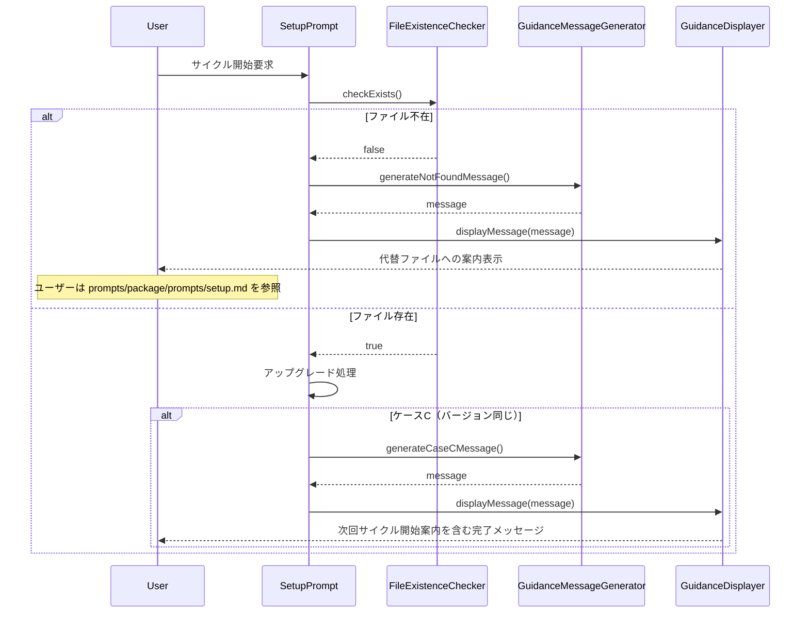

# 論理設計: setup-prompt.md改善

## 概要
setup.mdプロンプトファイルにファイル存在確認とガイダンスメッセージ表示機能を追加し、アップグレードしない場合でもサイクル開始できるよう改善する論理設計。

**重要**: この論理設計では**コードは書かず**、コンポーネント構成とインターフェース定義のみを行います。具体的なコード（SQL、JSON、実装コード等）はImplementation Phase（コード生成ステップ）で作成します。

## アーキテクチャパターン
**シェルスクリプトベースのガイダンスパターン**

- **選定理由**: setup.mdはBashコマンドを含むMarkdownドキュメントであり、ファイル存在確認とメッセージ表示は既存のシェルスクリプト構造に統合する必要があるため

## 実行前提条件

**重要**: setup.mdは**リポジトリルートから実行**されることを前提とする。

```bash
# 正しい実行方法
cd /path/to/repository-root
# setup.mdを参照して実行
```

相対パスはこの前提に基づいて解決される。

## コンポーネント構成

### レイヤー / モジュール構成

```
prompts/package/prompts/setup.md
├── サイクル存在確認セクション（既存）
├── ファイル存在確認セクション（新規）
│   ├── docs/aidlc/prompts/setup.md の存在確認（判定のみ）
│   └── 不在時のガイダンス表示（案内して終了）
├── アップグレード処理セクション（既存）
│   ├── ケースA: 新規アップグレード
│   ├── ケースB: 既存アップグレード
│   └── ケースC: バージョン同じ（改善: 次回案内追加）
└── サイクル開始案内セクション（既存）
```

### コンポーネント詳細

#### FileExistenceChecker
- **責務**: `docs/aidlc/prompts/setup.md`の存在確認（純粋な判定のみ）
- **依存**: Bashのファイルテストコマンド（`[ -f path ]`）
- **公開インターフェース**:
  - checkExists(): Boolean - ファイル存在確認（表示は行わない）

#### GuidanceMessageGenerator
- **責務**: ガイダンスメッセージの生成
- **依存**: なし
- **公開インターフェース**:
  - generateNotFoundMessage(): String - 不在時のメッセージ生成
  - generateCaseCMessage(): String - ケースC完了メッセージ生成

#### GuidanceDisplayer
- **責務**: メッセージの表示（I/O処理）
- **依存**: GuidanceMessageGenerator
- **公開インターフェース**:
  - displayMessage(message: String): void - メッセージ表示

## インターフェース設計

### コマンド（Bash関数として実装）

#### check_setup_file_exists
- **パラメータ**: なし
- **戻り値**: 0（存在） / 1（不在）
- **副作用**: なし（純粋な判定のみ）

#### display_not_found_guidance
- **パラメータ**: なし
- **戻り値**: なし
- **副作用**: 標準出力にガイダンスメッセージを表示

## データモデル概要

### ファイル形式
- **形式**: Markdown（Bashコマンド埋め込み）
- **主要セクション**:
  - サイクル存在確認: Boolean - サイクルディレクトリの存在確認
  - ファイル存在確認: Boolean - setup.mdファイルの存在確認
  - ガイダンスメッセージ: String - 表示するメッセージ内容

## 処理フロー概要

### setup.md実行時の処理フロー

**ステップ**:
1. サイクル存在確認（既存処理）
2. **[新規] `docs/aidlc/prompts/setup.md`の存在確認**
   - **存在する場合**: 次のステップへ（アップグレード処理）
   - **不在の場合**: 代替ファイルへの案内を表示し、**正常終了**
     - 案内先: `prompts/package/prompts/setup.md`
     - 終了理由: ユーザーは別のファイルを参照する必要があるため、同じスクリプトを継続しても意味がない
3. アップグレード処理（既存処理）
   - ケースA: 新規アップグレード
   - ケースB: 既存アップグレード
   - ケースC: バージョン同じ（**完了メッセージ改善**）
4. サイクル開始案内（既存処理）

**関与するコンポーネント**: FileExistenceChecker, GuidanceMessageGenerator, GuidanceDisplayer

### シーケンス図



## 非機能要件（NFR）への対応

### パフォーマンス
- **要件**: ファイル存在確認は瞬時
- **対応策**: Bashの組み込みコマンド（`[ -f path ]`）を使用し、外部コマンド呼び出しを最小化

### セキュリティ
- **要件**: なし（ローカルファイルシステムの読み取りのみ）
- **対応策**: 不要

### スケーラビリティ
- **要件**: なし
- **対応策**: 不要

### 可用性
- **要件**: 必ず正しいパスを案内すること
- **対応策**:
  - ハードコードされたパス（`prompts/package/prompts/setup.md`）を使用
  - リポジトリルートからの実行を前提とする

## 技術選定
- **言語**: Bash（Markdownドキュメント内）
- **フレームワーク**: なし
- **ライブラリ**: なし（Bash組み込みコマンドのみ）
- **データベース**: なし

## 実装上の注意事項

### メタ開発の意識【最重要】
- **編集対象**: `prompts/package/prompts/setup.md`（`docs/aidlc/prompts/setup.md`ではない）
- **理由**: `docs/aidlc/` は `prompts/package/` からrsyncでコピーされるため、直接編集すると変更が消える
- **反映タイミング**: 次回のsetup時（Operations Phaseのrsync実行時）

### 既存構造の保持
- サイクル存在確認の直後に新しいファイル存在確認を追加
- 既存のアップグレード処理には影響を与えない
- ケースCのメッセージのみ更新

### メッセージのトーン
- ファイル不在は**正常系**として扱う（エラーではない）
- メッセージは「案内」「お知らせ」のトーンで記述
- ユーザーが次に何をすべきか明確に案内

### 責務の分離
- 判定（checkExists）とI/O（displayMessage）を分離
- 判定は副作用なし、I/Oは表示のみ

## 実装ファイルと変更箇所

### 対象ファイル
`prompts/package/prompts/setup.md`

### 変更箇所1: ファイル存在確認の追加（サイクル存在確認の直後）
**挿入位置**: サイクル存在確認セクションの後
**内容**:
- `[ -f docs/aidlc/prompts/setup.md ]`で存在確認
- 不在の場合のガイダンスメッセージ表示（INFOトーン）:
  ```
  【お知らせ】docs/aidlc/prompts/setup.md が見つかりません。

  アップグレードせずにサイクルを開始する場合は、以下のファイルを参照してください：
  prompts/package/prompts/setup.md

  このファイルには setup.md の最新版が含まれています。
  ```
- 案内表示後は正常終了（exit 0）

### 変更箇所2: ケースCの完了メッセージ修正
**修正位置**: ケースC（バージョン同じ）の完了メッセージ
**内容**: 次のサイクルを開始する際の案内を追加
- 既存: 「アップグレードは不要です。」
- 追加: 「次のサイクルを開始するには、上記のsetup.mdを参照してください。」

## レビュー指摘への対応

| 指摘 | 対応 |
|------|------|
| 「終了」と要件の衝突 | 代替ファイルへ誘導して正常終了することを明確化。同じスクリプトを継続するのではなく、別ファイルを参照する想定 |
| 相対パスの前提 | 「実行前提条件」セクションでリポジトリルートからの実行を明示 |
| 責務重複（checkとdisplay） | 判定（checkExists）とI/O（displayMessage）を分離 |
| メッセージが「エラー」なのに「正常系」 | メッセージトーンを「お知らせ」「案内」に変更 |
