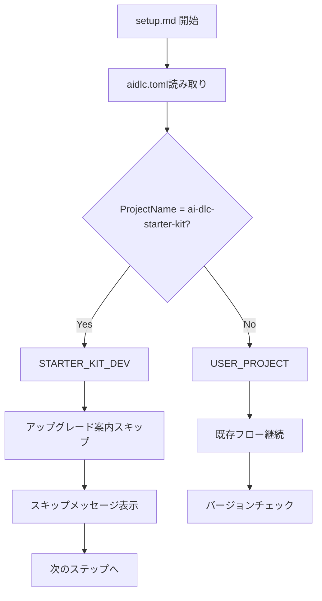

# ドメインモデル: スターターキットアップグレードフロー改善

## 概要

AI-DLCスターターキット開発リポジトリを識別し、アップグレード案内をスキップする機能のドメイン設計。

**重要**: このドメインモデル設計では**コードは書かず**、構造と責務の定義のみを行います。実装はImplementation Phase（コード生成ステップ）で行います。

## 値オブジェクト（Value Object）

### ProjectName

- **属性**: name: String - プロジェクト名
- **不変性**: aidlc.tomlから読み取られた後は変更されない
- **等価性**: 文字列の完全一致で判定
- **特別な値**: `ai-dlc-starter-kit` がスターターキット開発リポジトリを示す

### RepositoryType

- **属性**: type: Enum - リポジトリの種類
- **値**:
  - `STARTER_KIT_DEV`: スターターキット開発リポジトリ
  - `USER_PROJECT`: 通常のユーザープロジェクト
- **判定基準**: ProjectName が `ai-dlc-starter-kit` の場合は `STARTER_KIT_DEV`

## ドメインサービス

### ProjectTypeDetector

- **責務**: プロジェクトの種類を判定する
- **操作**:
  - `detectRepositoryType()` - aidlc.tomlからプロジェクト名を読み取り、RepositoryTypeを返す

### UpgradeAdvisor

- **責務**: アップグレード案内の表示可否を決定する
- **操作**:
  - `shouldShowUpgradeAdvice(repositoryType)` - リポジトリ種類に基づき、アップグレード案内を表示すべきかを判定
    - `STARTER_KIT_DEV` の場合: false（スキップ）
    - `USER_PROJECT` の場合: true（表示）

## ビジネスルール

### R1: スターターキット開発リポジトリの識別

- プロジェクト名が `ai-dlc-starter-kit` と完全一致する場合、スターターキット開発リポジトリとみなす
- aidlc.tomlへの専用フラグ追加は行わない（プロジェクト名のみで判定）

### R2: アップグレード案内のスキップ

- スターターキット開発リポジトリでは、アップグレード案内をスキップする
- スキップ時は以下のメッセージを表示:
  ```
  スターターキット開発リポジトリを検出しました。
  アップグレード案内はスキップします（開発リポジトリでは、次サイクルで変更を加えてリリースするためです）。
  ```

### R3: 通常プロジェクトの動作維持

- 通常のプロジェクト（ProjectName != `ai-dlc-starter-kit`）では、既存のアップグレード案内フローを維持する

## ドメインモデル図



## ユビキタス言語

- **スターターキット開発リポジトリ**: AI-DLCスターターキット自体を開発しているリポジトリ（プロジェクト名: `ai-dlc-starter-kit`）
- **ユーザープロジェクト**: AI-DLCスターターキットを利用している一般のプロジェクト
- **アップグレード案内**: 新しいバージョンのスターターキットが利用可能な場合に表示される案内

## 不明点と質問（設計中に記録）

現時点で不明点はありません。Unit定義とバックログから十分な情報が得られています。
