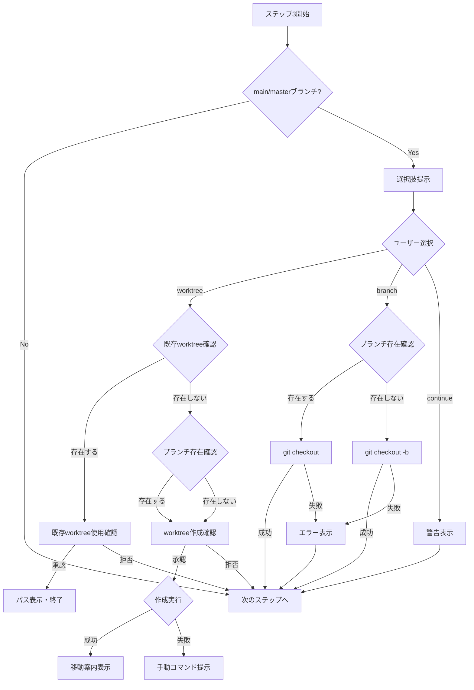

# ドメインモデル: セットアップフロー改善

## 概要

setup.mdのセットアップフロー（特にステップ2.2とステップ3）の構造と責務を定義する。このUnitはプロンプトファイルの修正のため、通常のコード向けドメインモデルではなく、フローの概念構造として文書化する。

**重要**: このドメインモデル設計では**コードは書かず**、構造と責務の定義のみを行います。実装はImplementation Phase（コード生成ステップ）で行います。

## フロー構造

### ステップ2.2: 既存サイクル検出

**責務**: 既存サイクルディレクトリの一覧を表示する

**現状の問題**:
- コマンド: `ls -d docs/cycles/*/ 2>/dev/null | sort -V`
- globパターン `*/` と `ls -d` の組み合わせで末尾スラッシュが二重になる

**改善後の構造**:
- コマンド: `ls -d docs/cycles/* 2>/dev/null | sort -V`
- 末尾スラッシュを除去してシンプルな出力に

### ステップ3: ブランチ確認フロー

**責務**: サイクル用ブランチの作成方法をユーザーに提示し、選択に応じて適切な処理を実行する

#### 値オブジェクト: BranchCreationOption

ユーザーが選択できる3つのオプション:

| オプション | 説明 | 処理 |
|-----------|------|------|
| worktree | 新しい作業ディレクトリとブランチを同時作成 | `git worktree add -b` または `git worktree add` |
| branch | 現在のディレクトリでブランチ作成・切り替え | `git checkout -b` または `git checkout`（既存ブランチ時） |
| continue | 現在のブランチで続行 | なし（警告表示のみ） |

#### 状態遷移: WorktreeCreationFlow

```
[START] → [既存worktree確認] ← ※作成前に確認
              ↓
         存在する?
         /    \
        Yes    No
        ↓      ↓
[既存使用確認]  [ブランチ存在確認]
        ↓              ↓
   承認?          存在する?
   /   \          /    \
  Yes   No      Yes    No
   ↓     ↓       ↓      ↓
[パス表示] [終了] [作成確認]
                     ↓
                  承認?
                  /   \
                Yes    No
                 ↓      ↓
              [実行]  [終了]
                 ↓
         ブランチ存在する?
         /    \
        Yes    No
        ↓      ↓
   git worktree add    git worktree add -b
   ${PATH} ${BRANCH}   ${BRANCH} ${PATH}
```

#### 状態遷移: BranchCreationFlow（branch選択時）

```
[START] → [ブランチ存在確認]
              ↓
         存在する?
         /    \
        Yes    No
        ↓      ↓
[git checkout]  [git checkout -b]
   ${BRANCH}      ${BRANCH}
        ↓              ↓
      成功?          成功?
      /   \          /   \
    Yes    No      Yes    No
     ↓      ↓       ↓      ↓
  [続行]  [エラー表示] [続行] [エラー表示]
```

#### ドメインルール

1. **worktree選択時のブランチ作成**
   - 既存ブランチがある場合: `git worktree add ${PATH} ${BRANCH}`
   - 新規ブランチの場合: `git worktree add -b ${BRANCH} ${PATH}`

2. **選択肢の統一**
   - worktree設定（enabled/disabled）に関わらず、3つの選択肢を常に表示
   - ただし、worktree設定が無効の場合は「推奨」表示をブランチ作成に変更

3. **エラーハンドリング**
   - worktree作成失敗時はフォールバック（手動コマンド提示）

## 値オブジェクト

### WorktreePath
- **属性**: path: string - worktreeの作成先パス
- **生成規則**: `../${PROJECT_NAME}-${CYCLE}`
- **不変性**: 一度決定したパスは変更しない

### BranchName
- **属性**: name: string - ブランチ名
- **生成規則**: `cycle/${CYCLE}`（例: `cycle/v1.6.0`）
- **不変性**: サイクルバージョンに基づく固定命名

## ドメインサービス

### BranchExistenceChecker
- **責務**: 指定ブランチの存在確認
- **操作**: `check(branchName)` - ブランチ存在確認コマンドを実行

### WorktreeCreator
- **責務**: worktreeの作成（ブランチ同時作成を含む）
- **操作**:
  - `createWithNewBranch(path, branchName)` - 新規ブランチと同時にworktree作成
  - `createWithExistingBranch(path, branchName)` - 既存ブランチでworktree作成

## フロー図



## ユビキタス言語

- **worktree**: 同じリポジトリの複数ブランチを別ディレクトリで同時に開く機能
- **サイクル**: AI-DLCにおける開発の単位（バージョンに対応）
- **サイクルブランチ**: サイクル作業用のブランチ（命名規則: `cycle/vX.Y.Z`）

## 不明点と質問

なし（要件は明確）

---

作成日: 2026-01-09
