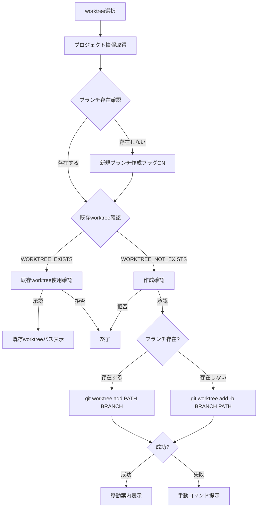

# 論理設計: セットアップフロー改善

## 概要

setup.mdの2箇所（ステップ2.2のlsコマンド、ステップ3のブランチ・ワークツリーフロー）を修正する。

**重要**: この論理設計では**コードは書かず**、修正箇所と変更内容の構造のみを定義します。具体的な修正はImplementation Phase（コード生成ステップ）で行います。

## 対象ファイル

- `prompts/package/prompts/setup.md`

## 修正1: lsコマンドの二重スラッシュ問題

### 修正箇所

- **行番号**: 154行目付近（ステップ2.2: 既存サイクルの検出）

### 変更内容

| 項目 | 修正前 | 修正後 |
|------|--------|--------|
| コマンド | `ls -d docs/cycles/*/ 2>/dev/null \| sort -V` | `ls -d docs/cycles/* 2>/dev/null \| sort -V` |
| 問題 | 末尾スラッシュが二重表示 | - |
| 影響範囲 | 表示のみ（機能に影響なし） | - |

## 修正2: ブランチ・ワークツリー作成フローの改善

### 修正箇所

- **行番号**: 194行目〜301行目（ステップ3: ブランチ確認）

### 変更内容の構造

#### A. 選択肢の統一（194〜233行目）

**現状**: worktree設定（enabled/disabled）によって選択肢の数と内容が異なる

**改善後**: 設定に関わらず3つの選択肢を統一表示

```text
現在 main/master ブランチで作業しています。
サイクル用ブランチで作業することを推奨します。

1. worktreeを使用して新しい作業ディレクトリを作成する
   → ブランチとworktreeを同時に作成します
2. 新しいブランチを作成して切り替える
   → 現在のディレクトリでブランチを作成して切り替えます
3. 現在のブランチで続行する（非推奨）
```

**推奨表示の条件**:
- worktree設定が有効: 選択肢1に「（推奨）」
- worktree設定が無効: 選択肢2に「（推奨）」

#### B. worktree作成フローの改善（236〜299行目）

**現状の問題**:
- `git worktree add "${WORKTREE_PATH}" "cycle/{{CYCLE}}"` は既存ブランチが必要
- ブランチが存在しない場合にエラーになる

**改善後の処理フロー**:

1. **ブランチ存在確認**（新規追加）:
   ```bash
   git show-ref --verify --quiet "refs/heads/cycle/{{CYCLE}}"
   ```

2. **条件分岐**:
   - 既存ブランチあり: `git worktree add "${WORKTREE_PATH}" "cycle/{{CYCLE}}"`
   - 新規ブランチ: `git worktree add -b "cycle/{{CYCLE}}" "${WORKTREE_PATH}"`

3. **既存worktree確認**（変更なし）

4. **作成確認と実行**（変更なし）

### フロー図（改善後）



## 処理フロー詳細

### ステップ3: ブランチ確認（改善後）

**ステップ**:
1. 現在のブランチを確認
2. main/masterの場合、選択肢を表示
3. ユーザーの選択を待つ
4. 選択に応じて処理を分岐:
   - **worktree**: ブランチ存在確認 → worktree作成（ブランチ同時作成含む）
   - **branch**: `git checkout -b cycle/{{CYCLE}}`
   - **continue**: 警告表示

## 非機能要件（NFR）への対応

Unit定義にNFRの指定なし（N/A）

## 技術選定

- **対象**: Markdownファイル（setup.md）
- **ツール**: bash（gitコマンド）

## 実装上の注意事項

1. **後方互換性**: 既存の動作を壊さない
2. **エラーハンドリング**: worktree作成失敗時のフォールバック（手動コマンド提示）を維持
3. **コマンド順序**: `git worktree add -b` はオプション順序に注意（`-b BRANCH PATH`）

## 不明点と質問

なし（要件は明確）

---

作成日: 2026-01-09
