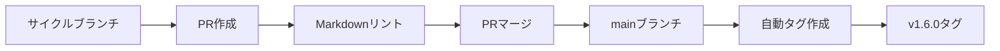

# CI/CD構築

## 概要
- **サイクル**: v1.6.0
- **作成日**: 2026-01-10
- **CI/CDツール**: GitHub Actions

## 既存ワークフロー

### 1. 自動タグ付け（auto-tag.yml）

**トリガー**: mainブランチへのpush

**処理内容**:
1. `version.txt` からバージョンを読み取り
2. 同名タグが存在しないか確認
3. タグが存在しなければ `v{VERSION}` タグを作成・push

**設定ファイル**: `.github/workflows/auto-tag.yml`

### 2. PRチェック（pr-check.yml）

**トリガー**: mainブランチへのPR（Markdownファイル変更時）

**処理内容**:
- markdownlint-cli2によるMarkdownリント実行
- 対象: `docs/translations/**/*.md`, `prompts/**/*.md`, `*.md`

**設定ファイル**: `.github/workflows/pr-check.yml`

## リリースフロー

1. サイクルブランチで `version.txt` を更新（1.6.0）
2. PRを作成（mainブランチへ）
3. Markdownリントが自動実行
4. PRをマージ
5. GitHub Actionsが自動で `v1.6.0` タグを作成

## v1.6.0での変更

**変更なし** - 既存のCI/CD設定で十分機能しているため、v1.6.0では追加の変更は行いません。

## 将来の拡張案

- テンプレート整合性チェック
- プロンプトの構文検証
- セットアップスクリプトのテスト

## 備考

- このプロジェクトはドキュメント・テンプレートプロジェクトのため、ビルドやテスト実行のワークフローは不要
- Markdownリントにより、ドキュメントの品質を維持
