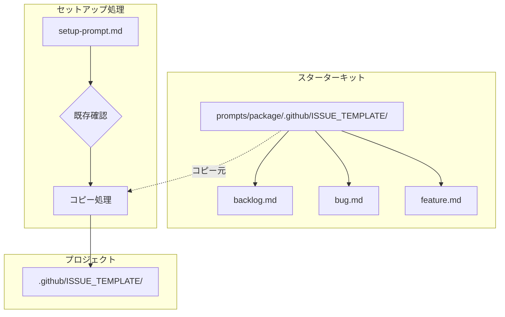

# ドメインモデル: バックログ用Issueテンプレート

## 概要

GitHub Issuesを使ったバックログ管理を可能にするため、Issueテンプレートを定義する。
AI-DLCスターターキットに組み込み、セットアップ時にプロジェクトへコピーできるようにする。

**重要**: このドメインモデル設計では**コードは書かず**、構造と責務の定義のみを行います。

## 構成要素

### 1. IssueテンプレートConfigファイル（任意）

GitHubのIssueテンプレート機能では、`config.yml` で「空のIssue作成を無効化」などの設定が可能。

- **配置**: `.github/ISSUE_TEMPLATE/config.yml`
- **責務**: テンプレート全体の設定（空Issue無効化、外部リンク追加など）
- **今回の対応**: 作成しない（デフォルト設定で十分）

### 2. Issueテンプレートファイル

各テンプレートはMarkdown形式で、YAMLフロントマターとMarkdown本文で構成される。

#### テンプレート共通構造

```
---
name: [テンプレート名]
about: [テンプレートの説明]
title: "[PREFIX] "
labels: [自動付与ラベル]
assignees: ''
---

[Markdown本文]
```

### 3. バックログテンプレート（backlog.md）

- **責務**: AI-DLCのバックログアイテム（気づき・将来の作業）を記録
- **フロントマター**:
  - name: Backlog / バックログ
  - about: 将来対応が必要な気づきや課題を記録
  - title: "[Backlog] "
  - labels: backlog
- **本文の構成**:
  - 概要（必須）
  - 詳細（任意）
  - 発見コンテキスト（サイクル、フェーズ）
  - 優先度（高/中/低）
  - 対応案

### 4. バグ報告テンプレート（bug.md）

- **責務**: バグ報告を標準化
- **フロントマター**:
  - name: Bug Report / バグ報告
  - about: バグや問題を報告
  - title: "[Bug] "
  - labels: bug
- **本文の構成**:
  - バグの概要（必須）
  - 再現手順
  - 期待される動作
  - 実際の動作
  - 環境情報

### 5. 機能要望テンプレート（feature.md）

- **責務**: 機能要望を標準化
- **フロントマター**:
  - name: Feature Request / 機能要望
  - about: 新機能や改善の要望
  - title: "[Feature] "
  - labels: enhancement
- **本文の構成**:
  - 機能の概要（必須）
  - 背景・動機
  - 提案内容
  - 代替案

## セットアップフローとの統合

### 統合点

スターターキットセットアップ（`prompts/setup-prompt.md`）の「8. 共通ファイルの配置」セクションに処理を追加。

### 処理フロー

```
1. プロジェクトの .github/ 状態確認
2. 状態に応じた処理分岐
3. テンプレートのコピー
4. 結果報告
```

### 状態パターンと対応

| プロジェクトの状態 | 対応 |
|------------------|------|
| `.github/` が存在しない | 新規作成・全テンプレートコピー |
| `.github/` は存在するが `ISSUE_TEMPLATE/` がない | `ISSUE_TEMPLATE/` のみ作成・コピー |
| `.github/ISSUE_TEMPLATE/` が存在し、同名ファイルがある | ユーザー確認（上書き/スキップ） |
| `.github/ISSUE_TEMPLATE/` が存在するが、同名ファイルがない | テンプレートのみコピー |

## ユビキタス言語

- **Issueテンプレート**: GitHubでIssue作成時に表示される定型フォーム
- **バックログ**: 将来対応が必要な課題・気づきのリスト
- **フロントマター**: Markdownファイル先頭のYAML形式メタデータ
- **ラベル**: GitHubでIssueを分類するためのタグ

## ドメインモデル図



## 不明点と質問

（なし - Unit定義と技術的考慮事項で十分明確）
