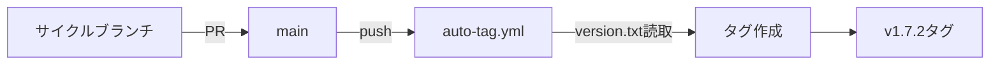

# CI/CD設定

## 概要

v1.7.2では既存のCI/CD設定を継続使用する。新規設定の追加は不要。

## 現在の設定

### 1. 自動タグ付け（auto-tag.yml）

- **トリガー**: mainブランチへのpush
- **動作**: version.txtからバージョンを読み取り、同名タグが存在しなければ自動でタグ作成

```yaml
name: Auto Tag on Main
on:
  push:
    branches: [main]
```

### 2. PRチェック（pr-check.yml）

- **トリガー**: mainブランチへのPR（Markdownファイル変更時）
- **動作**: markdownlint-cli2による構文チェック

```yaml
# 抜粋（詳細は .github/workflows/pr-check.yml を参照）
name: PR Check
on:
  pull_request:
    branches: [main]
    paths: ['**.md', ...]
```

## リリースフロー



## v1.7.2での変更

- 変更なし（既存設定で十分）

## 将来の検討事項

- テンプレート整合性チェックの自動化
- セットアップテストの自動化
