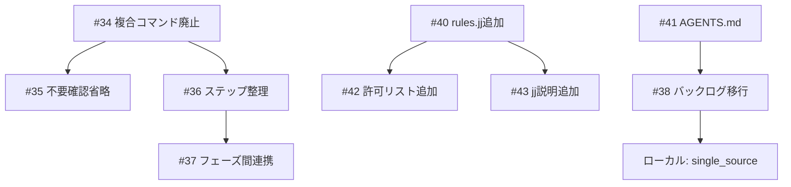

# 既存コード分析

## 分析日
2026-01-12

## 対象ファイル

| ファイル | パス | 関連Issue |
|---------|------|-----------|
| setup-prompt.md | prompts/setup-prompt.md | #40 |
| inception.md | prompts/package/prompts/inception.md | #34, #35, #36, #37 |
| construction.md | prompts/package/prompts/construction.md | #34 |
| operations.md | prompts/package/prompts/operations.md | #34, #38 |
| setup.md | prompts/package/prompts/setup.md | #34 |
| AGENTS.md | prompts/package/prompts/AGENTS.md | #41 |
| jj-support.md | prompts/package/guides/jj-support.md | #43 |
| ai-agent-allowlist.md | prompts/package/guides/ai-agent-allowlist.md | #42 |

## 分析結果

### 1. 複合コマンドの使用状況（Issue #34）

**検出数**:
| ファイル | 複合コマンド数 |
|---------|---------------|
| inception.md | 約9箇所 |
| construction.md | 約7箇所 |
| operations.md | 約9箇所 |
| setup.md | 約1箇所 |

**主なパターン**:

| パターン | 用途 | 置換案 |
|---------|------|--------|
| `[ -z "$VAR" ] && VAR="default"` | 変数デフォルト値設定 | AIがReadツールで読み取り、AIが判断 |
| `git diff --quiet && git diff --cached --quiet \|\| git add -A && git commit` | 条件付きコミット | `git status --short`で確認、AIが判断してコマンド実行 |
| `ls ... 2>/dev/null && echo "EXISTS" \|\| echo "NOT_EXISTS"` | 存在確認 | `ls ... 2>/dev/null`のみ、AIが結果判定 |
| `command -v gh && gh auth status` | GitHub CLI確認 | 各コマンドを個別実行、AIが結果判定 |

### 2. setup-prompt.md のaidlc.tomlテンプレート（Issue #40）

**現状**: `[rules.jj]` セクションが欠落

**対応**: テンプレートに以下を追加
```toml
[rules.jj]
# jjサポート設定
# - true: プロンプト内でjj-support.md参照を案内
# - false: 従来のgitコマンドを使用（デフォルト）
enabled = false
```

### 3. ai-agent-allowlist.md のjjコマンド（Issue #42）

**現状**: jjコマンドの記載なし

**追加対象**:
- 読み取り系: `jj status`, `jj log`, `jj diff`, `jj bookmark list`
- 作成系: `jj git init --colocate`, `jj bookmark create`, `jj new`
- 操作系: `jj describe -m`, `jj git push`, `jj bookmark set`

### 4. jj-support.md の内容（Issue #43）

**現状**:
- コマンド対照表が充実
- AI-DLCワークフローでの使用方法あり
- 「gitとjjの考え方の違い」セクションなし

**追加対象**:
- コミットタイミングの違い（git: 事後、jj: 事前）
- 変更追跡の違い（git: 手動、jj: 自動）
- フローの比較

### 5. AGENTS.md のバックログ管理（Issue #41）

**現状**: バックログ管理方針の記載なし

**追加対象**:
- backlog.mode の説明（git/issue）
- 保存先の対応表
- バックログ追加手順

### 6. セットアップフロー（Issue #35, #36, #37）

**現状の問題点**:
1. サイクルディレクトリ作成で毎回確認
2. ステップ番号が小数（0.5, 2.5, 2.7）
3. セットアップ→インセプション間で情報引き継ぎなし

**改善方針**:
1. 確認なしで作成（プロンプトで明示）
2. ステップ番号を連番に整理
3. Intent/スコープをファイルに保存し引き継ぎ

### 7. バックログ移行処理（Issue #38）

**現状**: mode設定に関わらずファイルベースで処理

**改善方針**:
- mode=git → `docs/cycles/backlog/` へ
- mode=issue → GitHub Issues へ

### 8. backlog.single_source オプション（ローカルバックログ）

**現状**: 存在しない

**追加対象**:
- aidlc.toml に `backlog.single_source` オプション追加
- 各フェーズプロンプトで参照

## 依存関係



## 技術的リスク

1. **複合コマンド廃止の影響範囲**: 多くの箇所で使用されているため、修正漏れに注意
2. **フェーズ間連携**: 新しいファイル形式の設計が必要
3. **バックログ移行**: 既存のバックログファイルとの後方互換性
