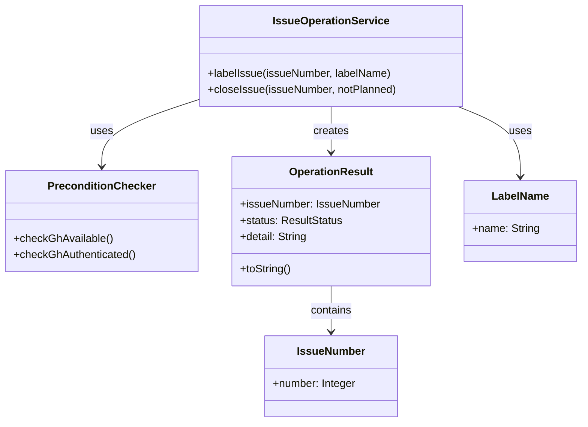

# ドメインモデル: Issue操作スクリプト

## 概要

GitHub IssueへのラベルとClose操作を行うCLIスクリプトのドメインモデル。Issue作成は対象外とし、既存Issueへの操作のみを責務とする。

**重要**: このドメインモデル設計では**コードは書かず**、構造と責務の定義のみを行います。実装はPhase 2（コード生成ステップ）で行います。

## 値オブジェクト（Value Object）

### IssueNumber

- **属性**: number: Integer - Issue番号（正の整数）
- **不変性**: Issue番号は操作中に変更されない
- **等価性**: 数値の一致で判定
- **検証ルール**: 1以上の正の整数であること

### LabelName

- **属性**: name: String - ラベル名
- **不変性**: ラベル名は操作中に変更されない
- **等価性**: 文字列の一致で判定
- **検証ルール**: 空文字でないこと

### OperationResult

- **属性**:
  - issueNumber: IssueNumber - 対象Issue番号
  - status: ResultStatus - 結果ステータス
  - detail: String（optional） - 詳細情報（ラベル名、not-planned、エラー理由など）
- **不変性**: 結果は生成後変更されない
- **出力フォーマット**: `issue:{number}:{status}[:{detail}]`
  - detailがある場合: `issue:123:labeled:cycle:v1.8.0`
  - detailがない場合: `issue:123:closed`

### ResultStatus（列挙型）

| 値 | detail | 出力例 |
|---|---|---|
| labeled | ラベル名 | `issue:123:labeled:cycle:v1.8.0` |
| closed | なし、または `not-planned` | `issue:123:closed` / `issue:123:closed:not-planned` |
| error | エラー理由（ハイフン区切り） | `issue:123:error:not-found` |

### ErrorReason（列挙型）

| 値 | 出力文字列 | 説明 |
|---|---|---|
| NOT_FOUND | not-found | Issueが存在しない |
| GH_NOT_AVAILABLE | gh-not-available | ghコマンドが利用不可 |
| GH_NOT_AUTHENTICATED | gh-not-authenticated | gh未認証 |
| UNKNOWN | unknown | その他のエラー |

**注**: エラー出力文字列はスペースを含まず、機械処理しやすい形式とする。

## ドメインサービス

### IssueOperationService

- **責務**: Issue操作の実行と結果の生成
- **操作**:
  - labelIssue(issueNumber, labelName) → OperationResult: Issueにラベルを付与
  - closeIssue(issueNumber, notPlanned: boolean) → OperationResult: IssueをClose

### PreconditionChecker

- **責務**: 操作実行前の前提条件チェック
- **操作**:
  - checkGhAvailable() → boolean: ghコマンドが存在するか確認
  - checkGhAuthenticated() → boolean: gh認証済みか確認

## 外部インターフェース

### GitHubCLI（外部依存）

- **責務**: gh CLIを通じたGitHub API操作
- **操作**:
  - addLabel(issueNumber, labelName) → 成功/失敗
  - closeIssue(issueNumber, reason) → 成功/失敗

## 処理フロー

### 共通フロー

1. 引数パース
2. 前提条件チェック（gh利用可否、認証状態）
3. 前提条件エラー時は即座にエラー結果を出力して終了
4. 操作実行
5. 結果出力

### labelサブコマンド

```text
入力: issue-ops.sh label <issue_number> <label_name>
処理:
  1. 前提条件チェック
  2. gh issue edit <number> --add-label <label> 実行
  3. 成功時: issue:<number>:labeled:<label> を出力
  4. 失敗時: issue:<number>:error:<reason> を出力
終了コード: 成功=0, 失敗=1
```

### closeサブコマンド

```text
入力: issue-ops.sh close <issue_number> [--not-planned]
処理:
  1. 前提条件チェック
  2. --not-planned時: gh issue close <number> --reason "not planned" 実行
     通常時: gh issue close <number> 実行
  3. 成功時: issue:<number>:closed または issue:<number>:closed:not-planned を出力
  4. 失敗時: issue:<number>:error:<reason> を出力
終了コード: 成功=0, 失敗=1
```

## 境界条件

| 条件 | 対応 |
|------|------|
| Issue作成 | 対象外（gh issue createは複雑なため） |
| リポジトリ選択 | 現在のディレクトリのリポジトリを使用（gh標準動作） |
| 既存ラベルへの重複付与 | ghの標準動作に委ねる（エラーにならない） |
| 存在しないラベルの付与 | ghの標準動作に委ねる（自動作成される） |
| ネットワーク断 | ghのエラーをそのまま伝播、error:unknown として出力 |

## ドメインモデル図



## ユビキタス言語

- **Issue**: GitHubリポジトリ上の課題追跡単位
- **ラベル**: Issueに付与する分類タグ
- **Close**: Issueを完了状態にする操作
- **not planned**: 実施しないことを理由としたClose
- **gh**: GitHub公式CLI（GitHub CLI）

## 不明点と質問（設計中に記録）

現時点で不明点はありません。

---

作成日: 2026-01-17
