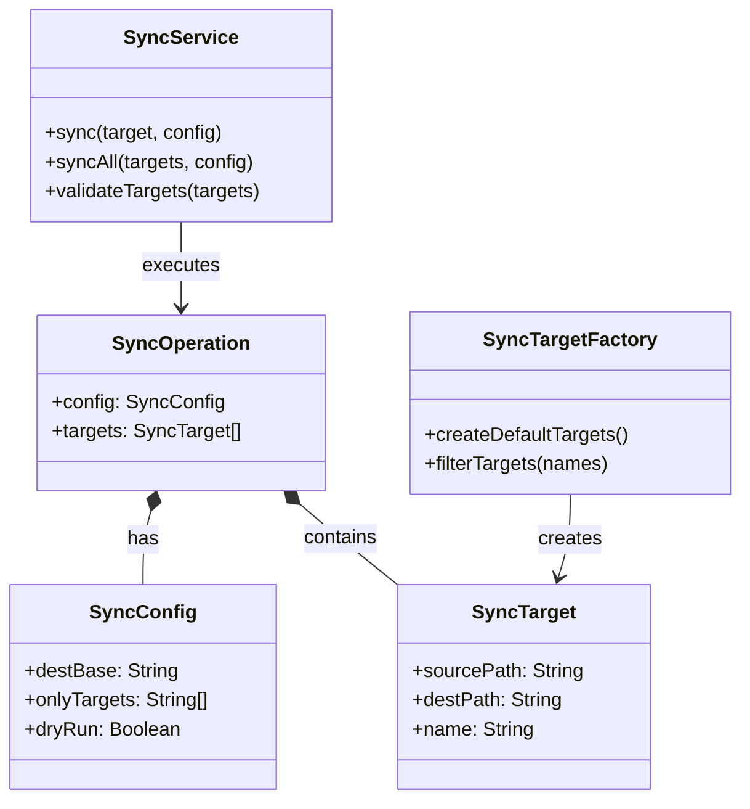

# ドメインモデル: sync-prompts

## 概要

prompts/package配下のリソース（prompts, templates, guides, bin）をdocs/aidlc/配下に一括同期するスクリプトの責務と構造を定義する。

**重要**: このドメインモデル設計では**コードは書かず**、構造と責務の定義のみを行います。実装はImplementation Phase（コード生成ステップ）で行います。

## エンティティ（Entity）

このスクリプトはステートレスなユーティリティのため、永続化が必要なエンティティは存在しない。

## 値オブジェクト（Value Object）

### SyncTarget

同期対象のディレクトリペアを表す。

- **属性**:
  - sourcePath: String - 同期元パス（例: `prompts/package/prompts/`）
  - destPath: String - 同期先パス（例: `docs/aidlc/prompts/`）
  - name: String - 識別名（例: `prompts`, `templates`, `guides`, `bin`）
- **不変性**: 同期対象の定義は実行中に変更されない
- **等価性**: nameで識別

### SyncConfig

スクリプト実行時の設定を表す。

- **属性**:
  - destBase: String - 同期先ベースディレクトリ（デフォルト: `docs/aidlc/`）
  - onlyTargets: String[] | null - 特定ディレクトリのみ同期する場合のリスト
  - dryRun: Boolean - 実行せずにプレビューのみ表示
- **不変性**: 実行開始時に確定し、途中で変更しない
- **等価性**: 全属性の一致

## 集約（Aggregate）

### SyncOperation

同期処理全体を管理する集約。

- **集約ルート**: SyncOperation
- **含まれる要素**:
  - SyncConfig（値オブジェクト）
  - SyncTarget[]（値オブジェクトのリスト）
- **境界**: 1回のスクリプト実行 = 1つのSyncOperation
- **不変条件**:
  - 同期元ディレクトリは必ず `prompts/package/` 配下であること
  - 同期先ディレクトリは存在するか、作成可能であること

## ドメインサービス

### SyncService

同期処理を実行するサービス。

- **責務**: rsyncコマンドを使用して各SyncTargetを同期する
- **操作**:
  - sync(target, config) - 単一ターゲットの同期を実行
  - syncAll(targets, config) - 全ターゲットの同期を実行
  - validateTargets(targets) - 同期元の存在確認

## リポジトリインターフェース

永続化が不要なため、リポジトリは定義しない。

## ファクトリ（必要な場合のみ）

### SyncTargetFactory

定義済みの同期ターゲットリストを生成する。

- **生成対象**: SyncTarget[]
- **生成ロジック概要**:
  1. デフォルトの4ターゲット（prompts, templates, guides, bin）を生成
  2. --only オプション指定時は指定されたターゲットのみフィルタリング

## ドメインモデル図

## ユビキタス言語

このドメインで使用する共通用語：

- **同期元（Source）**: prompts/package/配下のオリジナルファイル
- **同期先（Destination）**: docs/aidlc/配下のコピー先
- **ターゲット（Target）**: 同期対象のディレクトリペア（prompts, templates, guides, bin）
- **rsync**: ファイル同期に使用するUNIXコマンド

## 不明点と質問（設計中に記録）

現時点で不明点はなし。Unit定義で要件が明確に記載されている。
