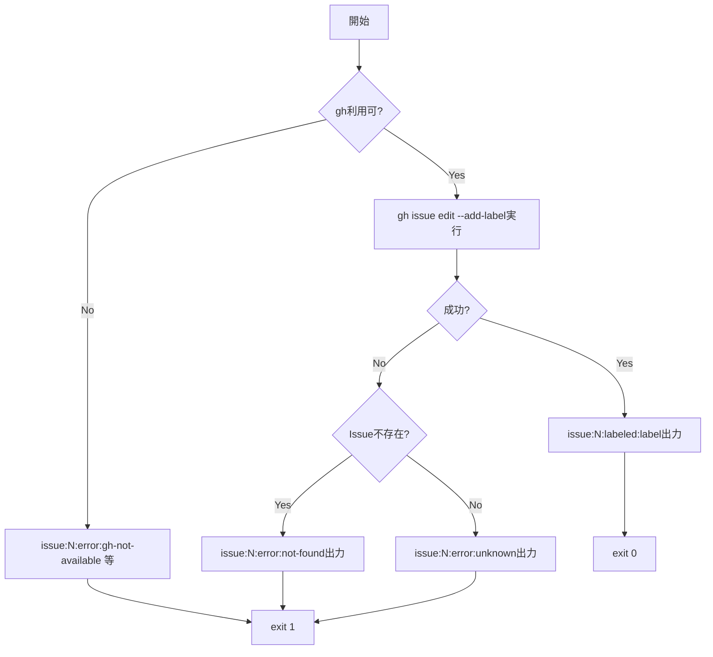
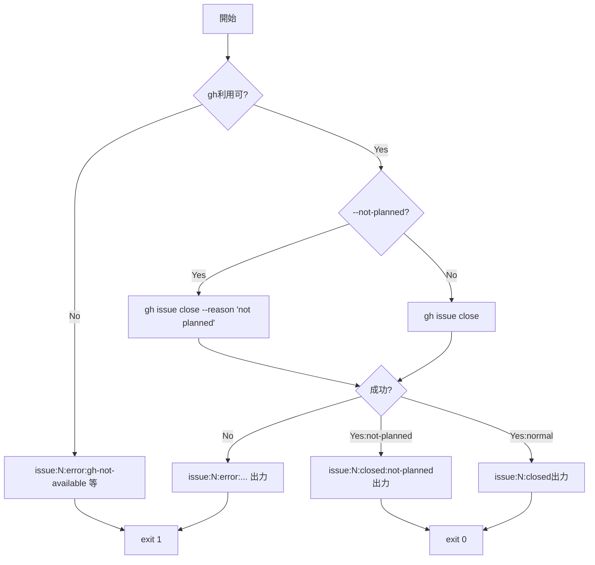

# 論理設計: Issue操作スクリプト

## 概要

GitHub IssueへのラベルとClose操作を行うBashスクリプトの論理設計。サブコマンド形式でlabel/close操作を提供する。

**重要**: この論理設計では**コードは書かず**、コンポーネント構成とインターフェース定義のみを行います。

## アーキテクチャパターン

**サブコマンドパターン**: issue-ops.sh [subcommand] [args]

既存スクリプト（cycle-label.sh等）と同様のBashスクリプト構成を採用：

- ヘッダーコメント + 使用方法ドキュメント
- 共通ユーティリティ関数
- サブコマンド別処理関数
- メイン関数での引数解析とディスパッチ

## コンポーネント構成

### ファイル構成

```text
prompts/package/bin/
└── issue-ops.sh        # メインスクリプト

（rsync後）
docs/aidlc/bin/
└── issue-ops.sh        # 実行時パス
```

### 関数構成

```text
issue-ops.sh
├── show_help()                    # ヘルプ表示
├── check_gh_available()           # gh CLI利用可否確認
├── format_output()                # 出力フォーマット生成
├── cmd_label()                    # labelサブコマンド処理
├── cmd_close()                    # closeサブコマンド処理
└── main()                         # 引数解析とディスパッチ
```

### コンポーネント詳細

#### show_help()

- **責務**: ヘルプメッセージの表示
- **依存**: なし
- **入力**: なし
- **出力**: ヘルプテキスト（stdout）

#### check_gh_available()

- **責務**: gh CLIの利用可否と認証状態の確認
- **依存**: gh コマンド
- **入力**: なし
- **出力**: なし（エラー時はcmd_label/cmd_closeがformat_outputを使って出力）
- **戻り値**: 0=利用可能, 1=gh未インストール, 2=gh未認証

#### format_output()

- **責務**: 統一フォーマットでの出力文字列生成
- **依存**: なし
- **入力**: issue_number, status, detail（optional）
- **出力**: `issue:{number}:{status}[:{detail}]`

#### cmd_label()

- **責務**: Issueへのラベル付与
- **依存**: check_gh_available, format_output, gh issue edit
- **入力**: issue_number, label_name
- **出力**: format_outputの結果（stdout）
- **戻り値**: 0=成功, 1=失敗

#### cmd_close()

- **責務**: IssueのClose
- **依存**: check_gh_available, format_output, gh issue close
- **入力**: issue_number, not_planned（boolean）
- **出力**: format_outputの結果（stdout）
- **戻り値**: 0=成功, 1=失敗

#### main()

- **責務**: 引数解析とサブコマンドへのディスパッチ
- **依存**: show_help, cmd_label, cmd_close
- **入力**: コマンドライン引数
- **出力**: 各サブコマンドの出力
- **戻り値**: 各サブコマンドの戻り値

## インターフェース設計

### コマンドライン インターフェース

#### `issue-ops.sh label <issue_number> <label_name>`

- **パラメータ**:
  - issue_number: Integer - Issue番号（必須）
  - label_name: String - 付与するラベル名（必須）
- **成功時出力**: `issue:{number}:labeled:{label_name}`
- **失敗時出力**: `issue:{number}:error:{reason}`
- **終了コード**: 0=成功, 1=失敗

#### `issue-ops.sh close <issue_number> [--not-planned]`

- **パラメータ**:
  - issue_number: Integer - Issue番号（必須）
  - --not-planned: Flag - not planned理由でClose（任意）
- **成功時出力**: `issue:{number}:closed` または `issue:{number}:closed:not-planned`
- **失敗時出力**: `issue:{number}:error:{reason}`
- **終了コード**: 0=成功, 1=失敗

#### `issue-ops.sh --help` / `issue-ops.sh -h`

- **パラメータ**: なし
- **出力**: ヘルプメッセージ
- **終了コード**: 0

### 出力フォーマット仕様

#### 操作結果（Issue番号が確定している場合）

| ケース | 出力 |
|--------|------|
| ラベル付け成功 | `issue:123:labeled:cycle:v1.8.0` |
| Close成功 | `issue:123:closed` |
| Close成功（not planned） | `issue:123:closed:not-planned` |
| gh未インストール | `issue:123:error:gh-not-available` |
| gh未認証 | `issue:123:error:gh-not-authenticated` |
| Issue不存在 | `issue:123:error:not-found` |
| その他エラー | `issue:123:error:unknown` |

#### 引数エラー（Issue番号が確定していない場合）

| ケース | 出力 |
|--------|------|
| サブコマンド未指定 | `error:missing-subcommand` |
| 未知のサブコマンド | `error:unknown-subcommand:{name}` |
| Issue番号未指定 | `error:missing-issue-number` |
| ラベル名未指定（labelサブコマンド） | `error:missing-label-name` |

**注**: すべての出力はstdoutへ。エラー理由はハイフン区切りで機械処理しやすい形式とする。

## 処理フロー概要

### labelサブコマンドの処理フロー



**注**: precondition失敗時もIssue番号は引数から既知のため、`issue:N:error:...`形式で出力する。

**ステップ**:

1. check_gh_available() でgh利用可否確認
2. エラー時は即座にformat_outputでエラー出力し終了
3. `gh issue edit <number> --add-label <label>` 実行
4. 成功時: `issue:{number}:labeled:{label}` 出力
5. 失敗時: エラー内容を解析し適切なerror出力

**関与するコンポーネント**: main, cmd_label, check_gh_available, format_output

### closeサブコマンドの処理フロー



**注**: precondition失敗時もIssue番号は引数から既知のため、`issue:N:error:...`形式で出力する。

**ステップ**:

1. check_gh_available() でgh利用可否確認
2. エラー時は即座にformat_outputでエラー出力し終了
3. --not-plannedフラグの有無を確認
4. `gh issue close <number> [--reason "not planned"]` 実行
5. 成功時: 適切な成功出力
6. 失敗時: エラー内容を解析し適切なerror出力

**関与するコンポーネント**: main, cmd_close, check_gh_available, format_output

## 非機能要件（NFR）への対応

### パフォーマンス

- **要件**: 各操作5秒以内
- **対応策**: ghコマンドは直接実行、余分な処理を入れない。ネットワーク遅延はgh側の問題として許容。

### 可用性

- **要件**: gh認証済み環境で動作
- **対応策**:
  - gh未インストール時は明確なエラーメッセージ
  - gh未認証時は明確なエラーメッセージ
  - ネットワークエラーはghのエラーを伝播

## 技術選定

- **言語**: Bash
- **外部依存**: gh（GitHub CLI）
- **終了コード規約**:
  - 0: 成功
  - 1: 失敗（引数エラー、前提条件エラー、操作エラー）

## 実装上の注意事項

### 既存スクリプトとの一貫性

- cycle-label.sh と同様の構成パターンを使用
- `set -euo pipefail` でエラー時の安全な終了
- 引数解析はwhile + caseパターン

### エラー処理

- ghコマンドのstderrをキャプチャしてエラー種別を判定
- 「not found」などのキーワードでエラー種別を識別
- 判定できない場合は `error:unknown` として出力

### 出力の機械処理対応

- 空白を含まない区切り文字（コロン）を使用
- エラー理由もハイフン区切りで統一
- すべての出力はstdoutへ（エラーもstdout）

### 既存スクリプトとの差異

本スクリプトは以下の点で既存スクリプト（cycle-label.sh）と異なる方針を採用：

| 項目 | cycle-label.sh | issue-ops.sh |
|------|----------------|--------------|
| エラー出力先 | stderr | stdout |
| エラー形式 | `error:gh-not-installed` | `issue:N:error:gh-not-available` |

理由: issue-ops.shはパイプ処理での利用を想定し、すべての出力をstdoutに統一。

## プロンプト更新箇所

本スクリプト実装に伴い、以下のプロンプトを更新する：

### prompts/package/prompts/inception.md

Inception Phase内のIssue操作（ラベル付け）をスクリプト呼び出しに置換

### prompts/package/prompts/operations.md

Operations Phase内のIssue操作（Close）をスクリプト呼び出しに置換

## 不明点と質問（設計中に記録）

現時点で不明点はありません。

---

作成日: 2026-01-17
