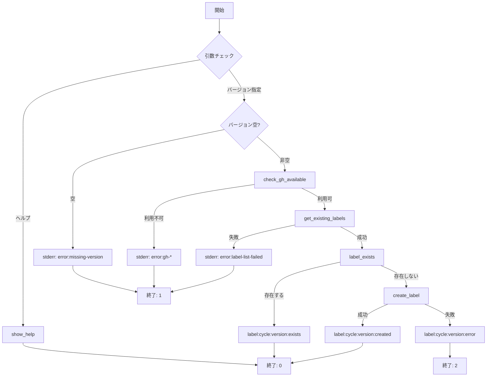

# 論理設計: サイクルラベル操作スクリプト

## 概要

サイクルラベルの確認・作成を行うBashスクリプトの論理設計。
既存の`init-labels.sh`と同様のパターンを踏襲し、一貫性のあるCLIインターフェースを提供する。

**重要**: この論理設計では**コードは書かず**、コンポーネント構成とインターフェース定義のみを行います。

## アーキテクチャパターン

**シンプルCLIスクリプトパターン**

- main関数をエントリーポイントとする
- 関数ごとに単一責務を持たせる
- 外部依存（gh）との連携はゲートウェイ関数で抽象化
- 選定理由: init-labels.shとの一貫性、シンプルさ

## コンポーネント構成

### ファイル構成

```text
prompts/package/bin/
└── cycle-label.sh           # 新規作成
```

### 関数構成

```text
cycle-label.sh
├── main()                    # エントリーポイント
├── show_help()               # ヘルプ表示
├── check_gh_available()      # gh CLI利用可能性チェック
├── get_existing_labels()     # 既存ラベル一覧取得
├── label_exists()            # ラベル存在チェック
└── create_label()            # ラベル作成
```

### コンポーネント詳細

#### main()

- **責務**: 引数解析、処理フロー制御、終了コード決定
- **依存**: 全ての他関数
- **公開インターフェース**: コマンドラインから呼び出される

#### show_help()

- **責務**: ヘルプメッセージの表示
- **依存**: なし
- **公開インターフェース**: `-h`, `--help` オプション時に呼び出し

#### check_gh_available()

- **責務**: ghコマンドの存在確認と認証状態チェック
- **依存**: gh CLI
- **公開インターフェース**: 0=利用可能、1=利用不可を返す
- **エラー出力**: stderrに `error:gh-not-installed` または `error:gh-not-authenticated`

#### get_existing_labels()

- **責務**: リポジトリの既存ラベル一覧を取得
- **依存**: gh label list
- **公開インターフェース**: 改行区切りのラベル名一覧を出力
- **実装詳細**: `--limit 1000` を指定してデフォルト30件制限を回避
- **エラー出力**: stderrに `error:label-list-failed`

#### label_exists()

- **責務**: 指定ラベルが存在するかチェック
- **依存**: なし（既存ラベル一覧を引数で受け取る）
- **公開インターフェース**: 0=存在、1=存在しない

#### create_label()

- **責務**: ラベルを作成
- **依存**: gh label create
- **公開インターフェース**: 0=成功、1=失敗
- **エラー出力**: stderrに `[error] <name>: <詳細>`

## インターフェース設計

### コマンド

#### cycle-label.sh

- **使用方法**: `cycle-label.sh <version>`
- **パラメータ**:
  - version: String（必須）- サイクルバージョン（例: v1.8.0）
  - **制限なし**: vX.X.X以外の形式も許容（任意のサイクル名）
- **オプション**:
  - `-h`, `--help`: ヘルプ表示
- **戻り値（終了コード）**:
  - 0: 成功（exists または created）
  - 1: パラメータエラーまたは環境エラー
  - 2: ラベル作成失敗
- **標準出力**: `label:cycle:<version>:<status>`（init-labels.shと統一）
- **標準エラー出力**: エラー詳細メッセージ

## 処理フロー概要

### ラベル確認・作成の処理フロー

**ステップ**:

1. 引数解析（ヘルプオプションまたはバージョン取得）
2. バージョン引数の存在確認（空でないこと）
3. gh CLI利用可能性チェック
4. 既存ラベル一覧を取得（`--limit 1000`）
5. サイクルラベルの存在チェック
6. 存在しなければラベル作成
7. 結果を標準出力に出力（`label:cycle:<version>:<status>`）
8. 終了コードを決定して終了

**関与するコンポーネント**: main → check_gh_available → get_existing_labels → label_exists → create_label



## 非機能要件（NFR）への対応

### パフォーマンス

- **要件**: 5秒以内
- **対応策**: ghコマンドを最小限の回数で呼び出し（ラベル一覧取得1回 + 作成時1回）

### セキュリティ

- **要件**: N/A
- **対応策**: 入力はラベル名として使用されるが、ghコマンドが適切にエスケープ

### 可用性

- **要件**: gh認証済み環境で動作
- **対応策**: gh利用不可時は明確なエラーメッセージを出力

## 技術選定

- **言語**: Bash
- **外部依存**: gh（GitHub CLI）
- **設定**: set -euo pipefail（厳格モード）

## 実装上の注意事項

- init-labels.shとの一貫性を保つ（関数名、エラーハンドリングパターン、出力形式）
- バージョン文字列は空でなければ許容（形式の制限なし）
- ghコマンドのエラーメッセージを適切にキャプチャしてstderrへ出力
- ラベルの色は `7057FF`（紫系）で固定
- 既存ラベルの色/説明が異なる場合は無視（existsとして扱う）
- `gh label list`には`--limit 1000`を指定してデフォルト30件制限を回避

## 不明点と質問（設計中に記録）

### AIレビュー指摘への対応

[Question] 出力形式はinit-labels.shと完全一致に寄せるか？
[Answer] はい、統一する（`label:<name>:<status>` + stderrにエラー詳細）

[Question] バージョン形式の制限は？
[Answer] 詳細な制限は不要（vX.X.X以外のサイクル名も許容）
