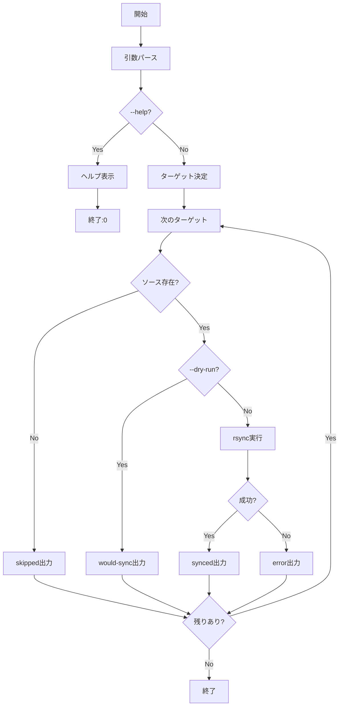

# 論理設計: sync-prompts

## 概要

prompts/package配下の4つのリソースディレクトリ（prompts, templates, guides, bin）をdocs/aidlc/配下に一括同期するシェルスクリプトの設計。

**重要**: この論理設計では**コードは書かず**、コンポーネント構成とインターフェース定義のみを行います。具体的なコードはImplementation Phase（コード生成ステップ）で作成します。

## アーキテクチャパターン

シンプルなシェルスクリプトパターンを採用。既存のbinスクリプト（init-labels.sh等）と一貫したスタイルで実装する。

- `set -euo pipefail` でエラー時に即座に終了
- 構造化された出力形式（`sync:<target>:<status>`）
- --help、--dry-run オプションのサポート

## コンポーネント構成

### スクリプト構成

```text
prompts/package/bin/sync-prompts.sh
├── ヘッダーコメント（使用方法・出力形式）
├── 設定セクション
│   ├── 同期ターゲット定義（SOURCE_DIR, SYNC_TARGETS）
│   └── デフォルト値（DEFAULT_DEST）
├── 関数セクション
│   ├── show_help() - ヘルプ表示
│   ├── parse_args() - 引数パース
│   ├── validate_source() - 同期元存在確認
│   └── sync_target() - 単一ターゲット同期
└── メインセクション
    ├── 引数パース
    ├── バリデーション
    └── 同期実行ループ
```

### コンポーネント詳細

#### 設定セクション

- **責務**: 同期対象ディレクトリと設定値の定義
- **依存**: なし
- **公開インターフェース**:
  - SOURCE_DIR: 同期元ベースパス（`prompts/package/`）
  - DEFAULT_DEST: デフォルト同期先（`docs/aidlc/`）
  - SYNC_TARGETS: 同期対象配列（`prompts templates guides bin`）

#### show_help()

- **責務**: 使用方法を標準出力に表示
- **依存**: なし
- **公開インターフェース**: 引数なし、標準出力にヘルプを出力

#### parse_args()

- **責務**: コマンドライン引数を解析してグローバル変数に設定
- **依存**: なし
- **公開インターフェース**:
  - 設定するグローバル変数: DEST_DIR, ONLY_TARGETS, DRY_RUN

#### validate_source()

- **責務**: 同期元ディレクトリの存在確認
- **依存**: なし
- **公開インターフェース**:
  - 引数: ターゲット名
  - 戻り値: 0（存在）/ 1（不存在）

#### sync_target()

- **責務**: 単一ターゲットのrsync実行
- **依存**: validate_source()
- **公開インターフェース**:
  - 引数: ターゲット名
  - 出力: `sync:<target>:<status>` 形式

## インターフェース設計

### コマンドラインインターフェース

#### sync-prompts.sh

```text
Usage: sync-prompts.sh [OPTIONS]

OPTIONS:
  -h, --help           ヘルプを表示
  --dest <DIR>         同期先ベースディレクトリ（デフォルト: docs/aidlc/）
  --only <TARGETS>     特定ターゲットのみ同期（カンマ区切り）
  --dry-run            実際に同期せず、実行予定を表示
```

#### 引数詳細

| オプション | 型 | 説明 | デフォルト |
|-----------|-----|------|-----------|
| --dest | String | 同期先ディレクトリ | docs/aidlc/ |
| --only | String | カンマ区切りのターゲット名 | 全ターゲット |
| --dry-run | Flag | プレビューモード | false |

#### 有効なターゲット名

- prompts
- templates
- guides
- bin

### 出力形式

標準出力に構造化されたメッセージを出力:

```text
sync:<target>:<status>
```

| status | 意味 |
|--------|------|
| synced | 同期完了 |
| skipped | ソースが存在しないためスキップ |
| would-sync | 同期予定（--dry-runモード） |
| error | 同期失敗（詳細はstderr） |

### 終了コード

| コード | 意味 |
|-------|------|
| 0 | 成功（全ターゲット同期完了） |
| 1 | エラー（引数不正、rsync失敗等） |

## 処理フロー概要

### 同期処理の処理フロー

**ステップ**:

1. コマンドライン引数をパース
2. --help なら使用方法を表示して終了
3. 同期対象ターゲットを決定（--only指定時はフィルタリング）
4. 各ターゲットについてループ:
   a. 同期元ディレクトリの存在確認
   b. 存在しなければskippedを出力して次へ
   c. rsyncを実行（--dry-run時は-nオプション付与）
   d. 結果を構造化形式で出力
5. 全ターゲット完了後、終了

**関与するコンポーネント**: parse_args, validate_source, sync_target



## 非機能要件（NFR）への対応

### パフォーマンス

- **要件**: 数秒以内に完了
- **対応策**: rsyncの効率的なオプション（-a --delete）を使用し、差分のみ転送

### セキュリティ

- **要件**: N/A
- **対応策**: 特になし（ローカルファイル操作のみ）

### スケーラビリティ

- **要件**: N/A
- **対応策**: 特になし

### 可用性

- **要件**: rsyncインストール済み環境で動作
- **対応策**: スクリプト冒頭でrsyncの存在確認を行い、未インストール時はエラーメッセージを表示

## 技術選定

- **言語**: Bash
- **外部コマンド**: rsync
- **rsyncオプション**:
  - `-a`: アーカイブモード（パーミッション・タイムスタンプ保持）
  - `--delete`: 同期元にないファイルは削除
  - `-v`: 詳細出力
  - `-n`: dry-runモード（--dry-run指定時）

## 実装上の注意事項

- パス末尾のスラッシュに注意（rsyncの挙動に影響）
- 同期先ディレクトリが存在しない場合は自動作成
- 既存スクリプト（init-labels.sh等）と一貫した出力形式を維持
- シェバンは `#!/usr/bin/env bash` を使用

## 不明点と質問（設計中に記録）

現時点で不明点はなし。Unit定義で要件が明確に記載されている。
