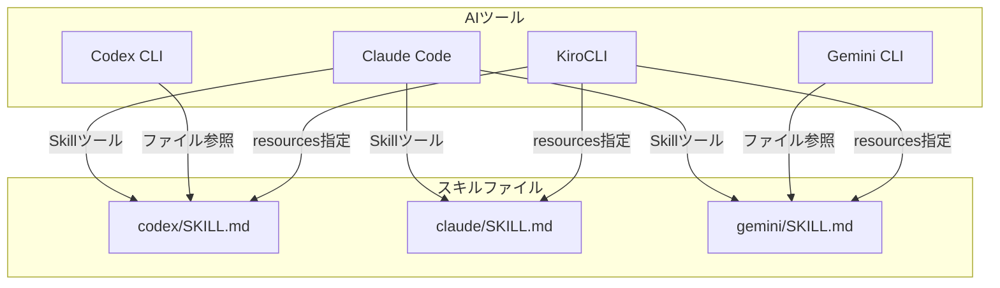

# ドメインモデル: その他のAIツール対応ドキュメント

## 概要

Claude Code以外のAIツール（Codex CLI、Gemini CLI、KiroCLI）がスキルファイルを参照・利用する方式を概念モデルとして整理する。Claude Codeについては既に対応済みのため、本Unitでは比較参照のために記載するが、新規対応は行わない。

**重要**: このUnit はドキュメント作成が主目的のため、コードは生成せず、ドキュメント構造と内容の設計のみを行う。

## 概念モデル: AIツールとスキル参照方式

### AIツール（概念）

各AIツールは以下の特性を持つ:

| ツール | スキル参照方式 | 制約事項 | 対応状況 |
|--------|---------------|----------|----------|
| Claude Code | Skillツール経由（`skill="codex"` 等） | プロジェクトローカルスキルを自動検出 | 対応済み |
| Codex CLI | CLIオプションまたはファイル参照 | プロジェクトディレクトリ指定が必要 | **本Unit対象** |
| Gemini CLI | CLIオプションまたはファイル参照 | プロジェクトディレクトリ指定が必要 | **本Unit対象** |
| KiroCLI | `resources` フィールドで明示指定 | `@ファイルパス` 記法が機能しない | **本Unit対象** |

### スキルファイル（概念）

**ソースの場所**（マスター）: `prompts/package/skills/{tool-name}/SKILL.md`

**セットアップ後の配置先**: `docs/aidlc/skills/{tool-name}/SKILL.md`（rsyncでコピー）

- **形式**: YAMLフロントマター + Markdownコンテンツ
- **含まれる情報**: name, description, 実行コマンド, パラメータ, 使用例

**注**: ユーザーがスキルを参照する場所は `docs/aidlc/skills/` です。`prompts/package/` はスターターキット開発用のマスターソースです。

### 参照関係

## ユビキタス言語

このドメインで使用する共通用語:

- **スキル（Skill）**: AIツールの機能を拡張するための定義ファイル
- **スキルファイル**: YAML frontmatter + Markdownで記述されたスキル定義
- **resources**: KiroCLIでエージェントに読み込ませるファイルを指定するフィールド
- **Skillツール**: Claude Codeでスキルを呼び出すための組み込みツール

## 各ツールの詳細仕様

### Claude Code

- **参照方式**: Skillツール経由
- **設定**: プロジェクトローカル（`.claude/skills/`）またはグローバル（`~/.claude/skills/`）
- **自動検出**: スキルディレクトリ内のSKILL.mdを自動検出

### Codex CLI

- **参照方式**: `-C` オプションでプロジェクトディレクトリを指定し、ファイルを直接参照
- **制約**: 明示的にファイルパスを指定する必要がある場合がある
- **推奨**: プロジェクトルートからの実行

### Gemini CLI

- **参照方式**: プロジェクトディレクトリ内のファイルを参照
- **制約**: 明示的にファイルパスを指定する必要がある場合がある
- **推奨**: プロジェクトルートからの実行

### KiroCLI

- **参照方式**: エージェント設定ファイル内の `resources` フィールドで明示指定
- **制約**: `@ファイルパス` 記法が機能しない（Claude Code固有機能）
- **設定場所**: `.kiro/agents/{agent-name}.json` または `~/.kiro/agents/{agent-name}.json`

## 不明点と質問

現時点で不明点はありません。

---

*作成日: 2026-01-20*
