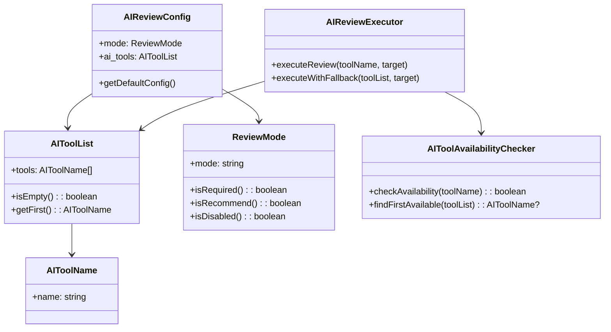

# ドメインモデル: AIレビュー設定強化

## 概要

AIレビューに使用するAIサービスを設定可能にし、複数サービスのフォールバック動作を実現する。

**重要**: このドメインモデル設計では**コードは書かず**、構造と責務の定義のみを行います。実装はImplementation Phase（コード生成ステップ）で行います。

## 値オブジェクト（Value Object）

### AIToolName

- **属性**: name: String - AIサービスの識別子（例: "codex", "claude", "gemini"）
- **不変性**: 設定ファイルから読み取った値は変更されない
- **等価性**: 文字列の完全一致で判定
- **有効な値**: 任意の文字列（将来的なAIサービス追加に対応）
- **未知値の扱い**: 利用可否チェック時にSkill/MCPの両方で利用不可と判定されるため、自動的にスキップされる（エラーにはしない）

### AIToolList

- **属性**: tools: Array<AIToolName> - AIサービスのリスト（優先順位順）
- **不変性**: 設定読み取り後は不変
- **等価性**: 配列の内容と順序の一致で判定
- **デフォルト値**: `["codex"]`
- **正規化ルール**: 空文字・空白のみの値は除外、重複は除外しない（順序通り試行）

### ReviewMode

- **属性**: mode: String - レビューモード
- **有効な値**: "required" | "recommend" | "disabled"
- **デフォルト値**: "recommend"

## 集約（Aggregate）

### AIReviewConfig

- **集約ルート**: AIReviewConfig
- **含まれる要素**:
  - mode: ReviewMode - レビューモード設定
  - ai_tools: AIToolList - AIサービスリスト
- **境界**: `[rules.mcp_review]` セクション全体
- **不変条件**:
  - ai_toolsが空の場合はデフォルト値 `["codex"]` を使用
  - modeが未設定または不正値の場合は "recommend" を使用

## ドメインサービス

### AIToolAvailabilityChecker

- **責務**: 指定されたAIサービスの利用可否を確認する
- **操作**:
  - checkAvailability(toolName) - 指定サービスがSkillまたはMCPで利用可能か確認
  - findFirstAvailable(toolList) - リスト順に確認し、最初に利用可能なサービスを返す

### AIReviewExecutor

- **責務**: AIレビューを実行する
- **操作**:
  - executeReview(toolName, target) - 指定サービスでレビューを実行
  - executeWithFallback(toolList, target) - リスト順にサービスを試行し、レビューを実行

## ドメインモデル図

## ユビキタス言語

このドメインで使用する共通用語：

- **AIサービス（AI Tool）**: AIレビューを実行できるサービス（codex, claude, gemini等）
- **フォールバック**: 優先サービスが利用不可の場合に次のサービスを試行する動作
- **Skill**: Claude Code等のSkillツールによるAIサービス呼び出し方法
- **MCP**: Model Context ProtocolによるAIサービス呼び出し方法
- **利用可否チェック**: SkillまたはMCPでサービスが呼び出し可能かを確認すること

## 処理フロー

1. **設定読み取り**: `docs/aidlc.toml` から `[rules.mcp_review]` セクションを読み取る
   - 注: 編集対象は `prompts/package/aidlc.toml`（rsyncで `docs/aidlc.toml` へコピーされる）
2. **デフォルト値適用**:
   - `ai_tools` が未設定または空の場合は `["codex"]` を使用
   - `mode` が未設定または不正値の場合は `"recommend"` を使用
3. **サービス試行**: `ai_tools` リストの順に利用可否を確認
   - 空文字・空白のみの値はスキップ
   - 未知のツール名は利用不可として次へ進む（エラーにはしない）
4. **レビュー実行**: 最初に利用可能なサービスでレビューを実行
5. **エラーハンドリング**: すべて利用不可の場合
   - `mode = "required"`: 警告メッセージを表示し、ユーザーに確認を求める
   - `mode = "recommend"`: 自動的に人間レビューフローへ移行

## 不明点と質問（設計中に記録）

（AIレビューによる指摘を反映済み）
