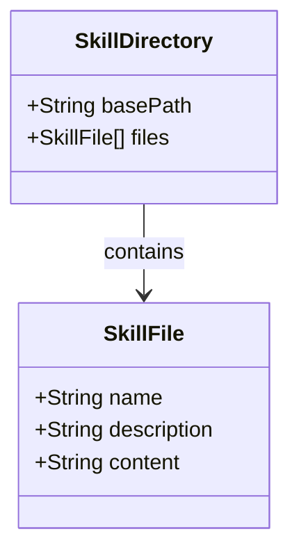

# ドメインモデル: スキルファイル配置

## 概要

AIスキル（codex/claude/gemini）のファイル構造を定義する。このUnitはファイルコピーのみの作業であり、ランタイムのドメインロジックは存在しない。

**重要**: このドメインモデル設計では**コードは書かず**、構造と責務の定義のみを行います。

## 値オブジェクト（Value Object）

### SkillFile

スキルファイルの構造を表す値オブジェクト。

- **属性**:
  - name: String - スキル名（現在: codex/claude/gemini、将来追加可能）
  - description: String - スキルの説明
  - content: String - Markdownコンテンツ
- **不変性**: ファイルシステム上の静的ファイルとして存在
- **等価性**: name を基準に等価性を判定

### SkillFileFormat

スキルファイルのフォーマット仕様。

- **構造**:
  - YAMLフロントマター（`---` で囲まれた領域）
    - name: 必須
    - description: 必須
  - Markdownコンテンツ（フロントマター以降）

### SkillDirectory

スキルファイルを格納するディレクトリ構造を表す値オブジェクト。

- **属性**:
  - basePath: String - ディレクトリのベースパス
  - files: SkillFile[] - 含まれるスキルファイルの配列
- **不変性**: ディレクトリ構造はセットアップ時に決定され、以降は変更されない
- **等価性**: basePath を基準に等価性を判定

**備考**: 全てのAIスキル（codex/claude/gemini）は Claude Code のスキル機能として `~/.claude/skills/` に配置されている。これは各CLIツール固有のディレクトリではなく、Claude Code が他のAI CLIツールを呼び出すためのスキル定義である。

## ドメインモデル図

## ユビキタス言語

- **スキルファイル（Skill File）**: AIツール（codex/claude/gemini）の設定と使用方法を定義するMarkdownファイル
- **フロントマター（Frontmatter）**: ファイル先頭のYAMLメタデータ領域
- **スキルディレクトリ（Skill Directory）**: `{skill-name}/SKILL.md` 形式で配置されるディレクトリ構造

## 不明点と質問（設計中に記録）

なし（既存ファイルのコピーのため、仕様は確定済み）
