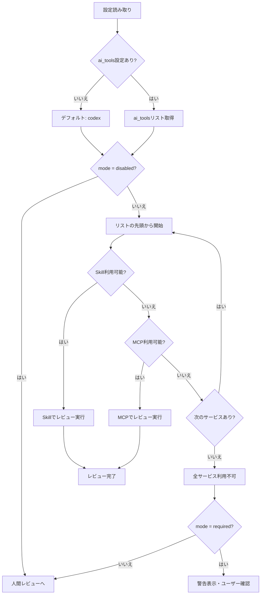

# 論理設計: AIレビュー設定強化

## 概要

`aidlc.toml` に `ai_tools` 設定を追加し、各フェーズプロンプトのAIレビュー優先ルールを複数AIサービス対応に修正する。

**重要**: この論理設計では**コードは書かず**、コンポーネント構成とインターフェース定義のみを行います。具体的なコード（SQL、JSON、実装コード等）はImplementation Phase（コード生成ステップ）で作成します。

## アーキテクチャパターン

設定駆動型アーキテクチャ: TOMLファイルで動作を設定し、プロンプトがその設定を読み取って動作を決定する。

## コンポーネント構成

### 変更対象ファイル構成

```text
prompts/package/
├── aidlc.toml                    # 設定ファイル（ai_tools追加）
└── prompts/
    ├── construction.md           # AIレビュー優先ルール修正
    ├── inception.md              # AIレビュー優先ルール修正
    └── operations.md             # AIレビュー優先ルール修正
```

### コンポーネント詳細

#### aidlc.toml（設定ファイル）

- **編集対象**: `prompts/package/aidlc.toml`（rsyncで `docs/aidlc.toml` へコピーされる）
- **責務**: AIレビュー設定の保持
- **依存**: なし
- **公開インターフェース**:
  - `[rules.mcp_review].mode` - レビューモード（既存）
  - `[rules.mcp_review].ai_tools` - AIサービスリスト（新規追加）
- **デフォルト値処理**:
  - `mode` が未設定または不正値の場合: `"recommend"` を使用
  - `ai_tools` が未設定または空の場合: `["codex"]` を使用

#### 各フェーズプロンプト（construction.md, inception.md, operations.md）

- **責務**: AIレビュー優先ルールに従ったレビュー実行フローの定義
- **依存**: aidlc.toml の設定
- **公開インターフェース**: AIレビュー優先ルールセクション

## インターフェース設計

### 設定インターフェース

#### `[rules.mcp_review]` セクション

**現在の設定（既存）**:

- `mode`: "required" | "recommend" | "disabled"

**追加する設定（新規）**:

- `ai_tools`: 文字列配列（例: `["codex", "claude", "gemini"]`）
  - デフォルト値: `["codex"]`
  - 空配列の場合: デフォルト値を使用
  - 正規化: 空文字・空白のみの値は除外
  - 重複値の扱い: 除外しない（順序通り試行。同じサービスが複数回呼ばれる可能性あり）
  - 未知値の扱い: 利用可否チェック時にスキップ（エラーにはしない）

### AIサービス利用可否チェックインターフェース

各AIサービスの利用可否を確認する方法:

| サービス名 | Skill呼び出し | MCPツール検索 |
|-----------|--------------|------------|
| codex | `skill="codex"` | ツール名に "codex" を含むMCPを探す |
| claude | `skill="claude"` | ツール名に "claude" を含むMCPを探す |
| （任意） | `skill="{name}"` | ツール名に "{name}" を含むMCPを探す |

**注**: MCPツール名は環境によって異なるため（例: `mcp__codex__codex`、`mcp__my_codex__codex`）、サービス名での部分一致検索を行う。

**利用可否チェックの実装方法**（プロンプト内のルール文章で実現）:

1. **Skill確認**: Skillツール一覧から該当スキルが利用可能か確認
   - Claude Code: Skillツールが存在し、`skill="{name}"`で呼び出し可能かを確認
   - KiroCLI等: Skill一覧取得APIがあればそれを利用
2. **MCPフォールバック**: Skills利用不可の場合、利用可能なMCPツール一覧からサービス名を含むツールを探す
   - 例: "codex" → `mcp__codex__codex`、`mcp__my_codex__codex` など
   - MCPツール名は環境によって異なるため、サービス名での部分一致検索を行う
3. **未知サービス**: Skill/MCPの両方で利用不可と判定されるため、自動的にスキップ

**注**: `AIToolAvailabilityChecker` / `AIReviewExecutor` はプロンプト内のルール文章として実装される（実行コードではない）。

## データモデル概要

### ファイル形式（TOML）

**既存セクション（変更なし）**:

```toml
[rules.mcp_review]
mode = "recommend"
```

**拡張後のセクション**:

```toml
[rules.mcp_review]
mode = "recommend"
ai_tools = ["codex", "claude", "gemini"]
```

**主要フィールド**:

- `mode`: String - レビューモード設定
- `ai_tools`: Array<String> - AIサービスの優先順位リスト

## 処理フロー概要

### AIレビュー実行フロー（修正後）

**ステップ**:

1. **設定読み取り**: `docs/aidlc.toml` から `[rules.mcp_review]` セクションを読み取る
   - 注: 編集対象は `prompts/package/aidlc.toml`（rsyncで `docs/aidlc.toml` へコピーされる）
2. **デフォルト値適用**:
   - `ai_tools` 設定を取得（未設定または空の場合は `["codex"]`）
   - `mode` 設定を取得（未設定または不正値の場合は `"recommend"`）
3. **mode確認**: `mode` を確認し、"disabled" なら人間レビューへ
4. **サービス試行ループ**: `ai_tools` リストを順に確認
   - 4.0. 空文字・空白のみの値はスキップ
   - 4.1. 現在のサービスのSkill利用可否を確認
   - 4.2. Skill利用不可ならMCPツール利用可否を確認
   - 4.3. どちらかが利用可能ならレビュー実行してループ終了
   - 4.4. 両方利用不可（未知サービス含む）なら次のサービスへ
5. **全サービス不可時**:
   - `mode = "required"`: 警告メッセージを表示し、ユーザーに確認を求める（人間レビューへの移行可否）
   - `mode = "recommend"`: 自動的に人間レビューフローへ移行

**フローチャート**:



## 非機能要件（NFR）への対応

### パフォーマンス

- **要件**: サービス利用可否チェックは高速に行う
- **対応策**: 順次チェックで最初に利用可能なサービスを発見次第終了

### セキュリティ

- **要件**: 設定ファイルの読み取りのみ
- **対応策**: 設定ファイルの読み取りのみで、外部への書き込みや送信は行わない

### スケーラビリティ

- **要件**: 新しいAIサービス追加時にリスト追加で対応可能
- **対応策**: ai_toolsリストに追加するだけで新サービス対応可能な設計

### 可用性

- **要件**: 複数サービス指定により可用性を向上
- **対応策**: フォールバック機構により、1つのサービスが不可でも他のサービスで対応

## 技術選定

- **設定ファイル形式**: TOML
- **プロンプト形式**: Markdown
- **AIサービス呼び出し**: Skill（優先）/ MCP（フォールバック）

## 実装上の注意事項

- 既存の `mode` 設定との後方互換性を維持すること
- `ai_tools` 未設定時は従来通り `codex` のみを使用
- 各フェーズプロンプトの修正は同一のロジックを適用（DRY原則）
- **全フェーズ共通の反復レビュー**: 全フェーズで反復レビュー（最大3回×2セット＝合計6回）を実施

## 変更箇所の詳細

### 1. aidlc.toml の変更

`[rules.mcp_review]` セクションに `ai_tools` 設定を追加。コメントでデフォルト値と使用方法を記載。

### 2. 各フェーズプロンプトの変更

**変更対象セクション**: 「AIレビュー優先ルール【重要】」

**主な変更点**:

1. **設定確認部分**: `ai_tools` の読み取りを追加
2. **利用可否チェック部分**: ハードコードの `codex` を `ai_tools` リストの順次チェックに変更
3. **処理フロー部分**: フォールバックロジックの追加
4. **エラーハンドリング部分**: 全サービス利用不可時のメッセージ修正

## 不明点と質問（設計中に記録）

（AIレビューによる指摘を反映済み）

**解決済みの指摘**:

1. 設定ファイルパスの不整合 → `prompts/package/aidlc.toml`が編集対象と明記
2. 不正なmode値の扱い → デフォルト値処理を全箇所に明記
3. 未知ツールの扱い → スキップ動作を明記
4. 全サービス不可時の挙動 → mode別の動作を詳細化
5. AIToolAvailabilityChecker/AIReviewExecutorの実装位置 → プロンプト内ルール文章として実装と明記
