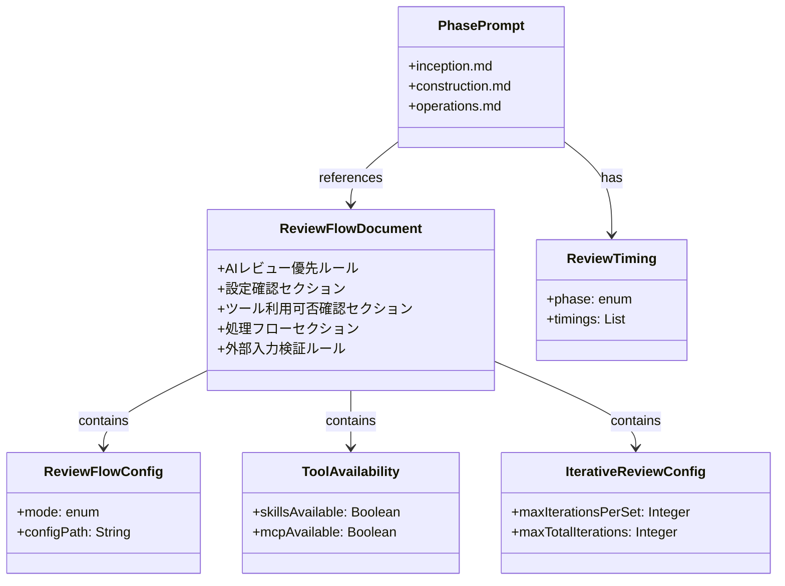

# ドメインモデル: AIレビューフロー外部化

## 概要

AIレビューフロー記述を共通ドキュメントとして外部化し、各フェーズプロンプトから参照可能にする。反復レビュー機能を全フェーズに適用し、品質向上を図る。

**重要**: このドメインモデル設計では**コードは書かず**、構造と責務の定義のみを行います。実装はPhase 2（実装ステップ）で行います。

## エンティティ（ドキュメント単位）

### ReviewFlowDocument（review-flow.md）

- **ID**: ファイルパス `prompts/package/prompts/common/review-flow.md`
- **属性**:
  - AIレビュー優先ルール: Markdown - レビュー実行の基本原則
  - 設定確認セクション: Markdown - mode設定の説明
  - ツール利用可否確認セクション: Markdown - Skills/MCP確認手順
  - 処理フローセクション: Markdown - 6ステップの処理フロー
  - 外部入力検証ルール: Markdown - AIレビュー応答・ユーザー入力の検証手順
- **振る舞い**:
  - 参照可能: 各フェーズプロンプトから「今すぐ `docs/aidlc/prompts/common/review-flow.md` を読み込んで」形式で参照される

## 値オブジェクト（セクション単位）

### ReviewFlowConfig（設定確認）

- **属性**:
  - mode: enum (required | recommend | disabled) - レビュー実行モード
  - configPath: String - `docs/aidlc.toml` の `[rules.mcp_review]` セクション
- **不変性**: 設定ファイルの値は実行時に固定
- **等価性**: mode値が同一であれば等価

### ToolAvailability（ツール利用可否）

- **属性**:
  - skillsAvailable: Boolean - Skillツール（codex）が利用可能か
  - mcpAvailable: Boolean - MCPツール（mcp__codex__codex）が利用可能か
- **不変性**: チェック時点での状態を保持
- **等価性**: 両フラグが同一であれば等価

### IterativeReviewConfig（反復レビュー設定）

- **属性**:
  - maxIterationsPerSet: Integer - 1セットあたりの最大反復回数（3回）
  - maxTotalIterations: Integer - 合計最大反復回数（6回）
- **不変性**: 定数として定義
- **等価性**: 両値が同一であれば等価

### ReviewTiming（対象タイミング）

- **属性**:
  - phase: enum (inception | construction | operations) - フェーズ識別子
  - timings: List\<String\> - フェーズ固有のタイミング一覧
- **不変性**: フェーズごとに固定
- **等価性**: phaseが同一であれば等価

## 集約（ドキュメントグループ）

### ReviewFlowAggregate

- **集約ルート**: ReviewFlowDocument
- **含まれる要素**:
  - ReviewFlowConfig（値オブジェクト）
  - ToolAvailability（値オブジェクト）
  - IterativeReviewConfig（値オブジェクト）
- **境界**: AIレビュー実行に必要な全情報を包含
- **不変条件**:
  - 処理フローは必ず6ステップ構成
  - 反復レビューは全フェーズで同一仕様

### PhasePromptAggregate

- **集約ルート**: 各フェーズプロンプト（inception.md, construction.md, operations.md）
- **含まれる要素**:
  - ReviewTiming（値オブジェクト）- フェーズ固有
  - 外部参照（review-flow.md への参照）
- **境界**: フェーズ固有の情報のみ保持
- **不変条件**:
  - 対象タイミングはフェーズごとに異なる
  - AIレビューフローは共通ドキュメントを参照

## ドメインサービス

### ReviewFlowReferenceService

- **責務**: 各フェーズプロンプトからAIレビューフローを参照可能にする
- **操作**:
  - resolveReference: 「今すぐ `docs/aidlc/prompts/common/review-flow.md` を読み込んで」形式で参照指示

## ドメインモデル図

## ユビキタス言語

- **AIレビュー**: Skills（codex）またはMCPツール（mcp__codex__codex）を使用した自動レビュー
- **反復レビュー**: 指摘がゼロになるまで繰り返すレビューサイクル（1セット最大3回、合計最大6回）
- **人間レビュー**: AIレビュー不可時またはmode=disabled時に実施する人間による確認
- **外部入力検証**: AIレビュー応答やユーザー入力を批判的に評価するプロセス
- **対象タイミング**: 各フェーズでAIレビューを実行すべきタイミング

## フェーズ固有の対象タイミング

| フェーズ | 対象タイミング |
|----------|----------------|
| Inception | Intent承認前、ユーザーストーリー承認前、Unit定義承認前 |
| Construction | 計画ファイル承認前、設計レビュー前、コード生成後の確認前、テスト完了後の確認前 |
| Operations | デプロイ計画承認前、運用ドキュメント承認前 |

## 設計判断

### 完全共通化の採用

- **決定**: 反復レビュー（1セット最大3回、合計最大6回）を全フェーズに適用
- **理由**: 品質向上のため、全フェーズで同一の反復レビュー仕様を適用
- **影響**: inception.md, operations.md でも反復レビューが有効になる

### 対象タイミングの取り扱い

- **決定**: 対象タイミングは各フェーズプロンプトに残す（外部化しない）
- **理由**: フェーズ固有の情報であり、共通化の意味がない

## 不明点と質問（設計中に記録）

なし（ユーザー回答により「完全共通化」を採用）
