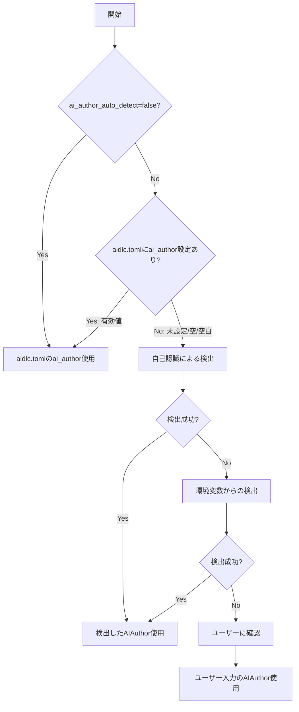
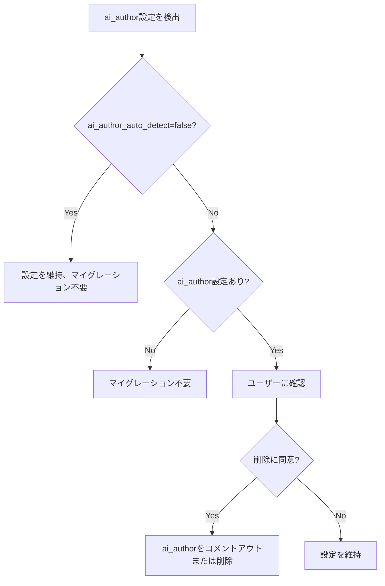

# ドメインモデル: AI著者情報の自動検出

## 概要

使用中のAIツールを自動検出し、適切なCo-Authored-By情報を決定するための概念モデル。

**重要**: このドメインモデル設計では**コードは書かず**、構造と責務の定義のみを行います。実装はImplementation Phase（コード生成ステップ）で行います。

## 値オブジェクト（Value Object）

### AIAuthor

- **属性**:
  - name: String - AI著者の表示名（例: "Claude"）
  - email: String - AI著者のメールアドレス（例: "noreply@anthropic.com"）
- **不変性**: 一度決定されたAI著者情報は変更されない
- **等価性**: name と email の両方が一致する場合に等価
- **フォーマット**: `{name} <{email}>`

### DetectionSource

- **属性**:
  - type: Enum - 検出ソースの種類
- **値**:
  - `CONFIG`: aidlc.toml設定から取得
  - `SELF_RECOGNITION`: AIツールの自己認識
  - `ENVIRONMENT`: 環境変数から検出
  - `USER_INPUT`: ユーザー入力
- **優先順位**: CONFIG > SELF_RECOGNITION > ENVIRONMENT > USER_INPUT

## ドメインサービス

### AIAuthorDetector

- **責務**: AIツールを検出し、適切なAIAuthor値を決定する
- **操作**:
  - detect() - 優先順位に従ってAI著者を検出
  - detectFromConfig() - aidlc.toml設定から取得
  - detectFromSelfRecognition() - AIツールの自己認識による検出
  - detectFromEnvironment() - 環境変数からの検出
  - promptUser() - ユーザーに確認を求める

## AIツールマッピング

### 自己認識パターン

| AIツール | 自己認識キーワード | AIAuthor値 |
|---------|-------------------|-------------|
| Claude Code | "Claude Code", "claude-code" | `Claude <noreply@anthropic.com>` |
| Cursor | "Cursor" | `Cursor <noreply@cursor.com>` |
| Cline | "Cline" | `Cline <noreply@cline.bot>` |
| Windsurf | "Windsurf" | `Windsurf <noreply@codeium.com>` |
| Codex CLI | "Codex", "codex-cli" | `Codex <noreply@openai.com>` |
| KiroCLI | "Kiro", "KiroCLI" | `Kiro <noreply@aws.com>` |

### 環境変数パターン

| 環境変数 | 対応AIツール |
|---------|-------------|
| `CLAUDE_CODE` | Claude Code |
| `CURSOR_EDITOR` | Cursor |
| `CLINE_*` | Cline |
| `WINDSURF_*` | Windsurf |
| `CODEX_*` | Codex CLI |
| `KIRO_*` | KiroCLI |

## 検出フロー



## マイグレーション: 既存ai_author設定の削除

### 対象

v1.9.1以前のプロジェクトで`ai_author`が明示的に設定されている場合

### フロー



### 確認メッセージ

```text
【マイグレーション確認】
aidlc.tomlに ai_author が設定されていますが、v1.9.2から自動検出機能が利用可能です。

現在の設定: ai_author = "{現在値}"

自動検出を有効にするため、この設定を削除しますか？
1. はい - 設定を削除（推奨）
2. いいえ - 現在の設定を維持
```

### 削除時の処理

- `ai_author` 行をコメントアウト（`# ai_author = ...`）
- またはユーザーの希望で完全削除

## ユビキタス言語

- **AIAuthor**: Co-Authored-Byに記載するAI著者情報（名前 + メールアドレス形式）
- **自己認識**: AIツールが自身のアイデンティティを認識し、対応するAIAuthor値を返す能力
- **検出ソース**: AIAuthor情報の取得元（設定/自己認識/環境変数/ユーザー入力）
- **未設定**: キーが存在しない、空文字、または空白のみの状態
- **マイグレーション**: 既存設定を新しい自動検出方式に移行する処理

## 不明点と質問（設計中に記録）

なし（Unit定義で仕様が明確化済み）
