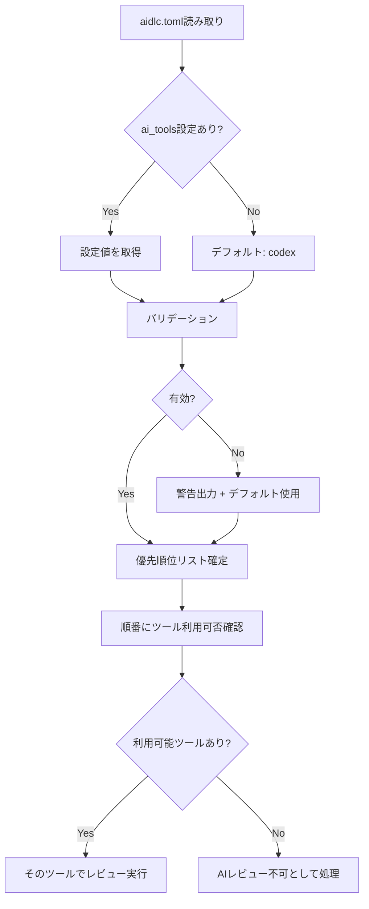

# ドメインモデル: ai_tools設定による複数AIサービス対応

## 概要

aidlc.tomlの`ai_tools`設定を読み取り、AIレビューに使用するサービスの優先順位判定ロジックを定義する。

**重要**: このドメインモデル設計では**コードは書かず**、構造と責務の定義のみを行います。

## 値オブジェクト（Value Object）

### AIToolConfig

AIレビューツールの設定を表す値オブジェクト。

- **属性**:
  - `ai_tools`: string[] - AIレビューに使用するツール名の優先順位リスト
- **不変性**: 設定読み込み後は変更されない
- **等価性**: ai_toolsの内容と順序が一致すれば等価

**有効なツール名**:

| ツール名 | 説明 | Skills呼び出し | MCPフォールバック |
|----------|------|----------------|-------------------|
| codex | OpenAI Codex CLI | `skill="codex"` | `mcp__codex__codex` |
| claude | Claude AI | `skill="claude"` | なし |
| gemini | Google Gemini | `skill="gemini"` | なし |

### ValidationResult

設定バリデーション結果を表す値オブジェクト。

- **属性**:
  - `valid`: boolean - バリデーション成功/失敗
  - `errors`: string[] - エラーメッセージ一覧
  - `warnings`: string[] - 警告メッセージ一覧

## ドメインサービス

### AIToolConfigReader

aidlc.tomlからai_tools設定を読み取るサービス。

- **責務**: 設定ファイルからAIツール優先順位リストを取得
- **操作**:
  - `readConfig()` - aidlc.tomlを読み取り、AIToolConfigを返す
  - デフォルト値: ai_tools未設定時は`["codex"]`を返す

### AIToolConfigValidator

設定値の妥当性を検証するサービス。

- **責務**: ai_tools設定のバリデーション
- **操作**:
  - `validate(config)` - 設定を検証し、ValidationResultを返す
- **バリデーションルール**:
  - 空配列の場合: 警告を出し、デフォルト`["codex"]`を使用
  - 未知のツール名: 警告を出し、そのツールをスキップ
  - 配列以外の型: エラーとし、デフォルトを使用

### AIToolSelector

利用可能なツールを選択するサービス。

- **責務**: 優先順位に従って利用可能なAIツールを選択
- **操作**:
  - `selectTool(config)` - 優先順位リストを順に確認し、最初に利用可能なツールを返す
- **選択ロジック**:
  1. ai_toolsリストを先頭から順に確認
  2. 各ツールについてSkillsで利用可能か確認
  3. Skills利用不可の場合、MCPフォールバックを確認（codexのみ）
  4. 利用可能なツールが見つかったら、そのツールを選択して終了
  5. すべて利用不可の場合、「AIレビュー不可」として処理

## ドメインモデル図

## ユビキタス言語

- **ai_tools**: AIレビューに使用するサービスの優先順位を定義する設定項目
- **Skills**: Claude CodeのSkillツール機能
- **MCPフォールバック**: Skillsが利用できない場合のMCPツールによる代替手段
- **優先順位リスト**: ai_tools配列の順序（先頭が最優先）

## 不明点と質問（設計中に記録）

現時点で不明点はありません。
