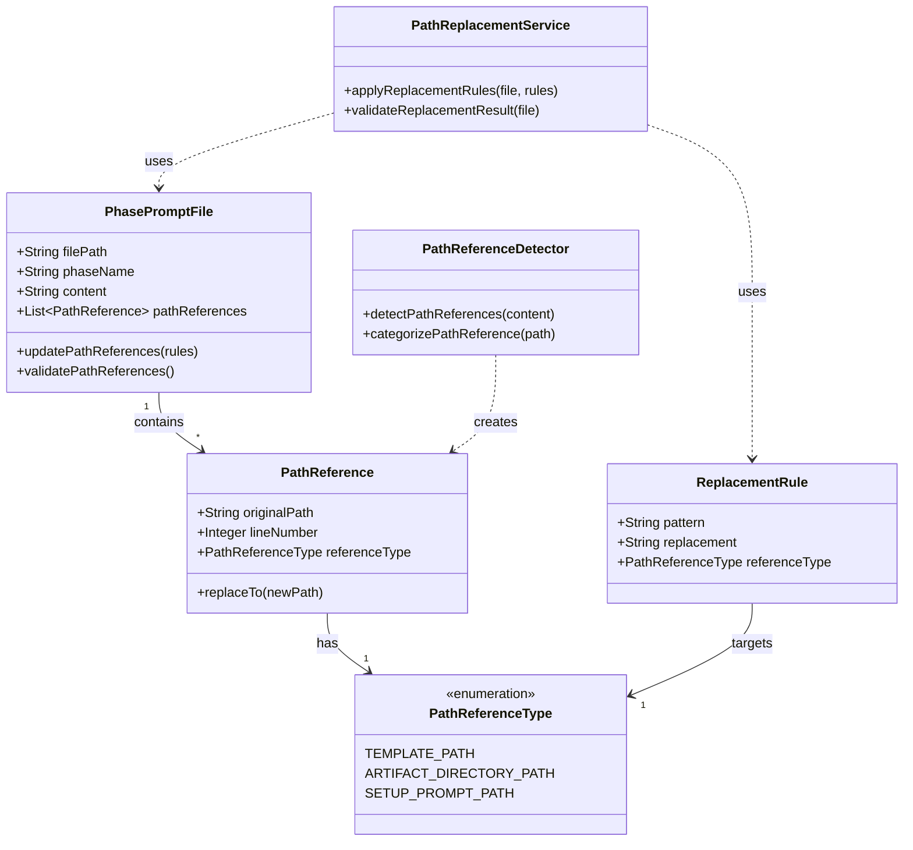

# ドメインモデル: Unit2 - 各フェーズプロンプトのパス参照更新

## 概要
各フェーズプロンプト（inception.md、construction.md、operations.md）内のパス参照を、新しいディレクトリ構造に対応した変数ベースのパス参照に更新するドメインモデル。setup-prompt.md の変数置換ロジックとの整合性を保ちながら、パス参照の一貫性と保守性を向上させます。

**重要**: このドメインモデル設計では**コードは書かず**、構造と責務の定義のみを行います。実装はImplementation Phase（コード生成ステップ）で行います。

## エンティティ（Entity）

### PhasePromptFile
- **ID**: ファイルパス（例: `docs/versions/v1.0.0/prompts/inception.md`）
- **属性**:
  - filePath: String - プロンプトファイルの絶対パス
  - phaseName: String - フェーズ名（"Inception", "Construction", "Operations"）
  - content: String - ファイルの内容
  - pathReferences: List<PathReference> - ファイル内のパス参照のリスト
- **振る舞い**:
  - updatePathReferences(replacementRules: List<ReplacementRule>): void - パス参照を一括更新
  - validatePathReferences(): Boolean - パス参照が正しく置換されているか検証

### PathReference
- **ID**: パス文字列とファイル内の位置（行番号）
- **属性**:
  - originalPath: String - 置換前のパス
  - lineNumber: Integer - ファイル内の行番号
  - referenceType: PathReferenceType - パス参照のタイプ（テンプレート参照、成果物ディレクトリ参照、セットアッププロンプトパス）
- **振る舞い**:
  - replaceTo(newPath: String): PathReference - 新しいパスに置換

## 値オブジェクト（Value Object）

### ReplacementRule
- **属性**:
  - pattern: String - 置換対象のパスパターン
  - replacement: String - 置換後のパス（変数を含む）
  - referenceType: PathReferenceType - 対象とする参照タイプ
- **不変性**: 置換ルールは一度定義されたら変更されない
- **等価性**: pattern と replacement が同じ場合に等価

### PathReferenceType
- **属性**: type: Enum - 参照タイプ（TEMPLATE_PATH, ARTIFACT_DIRECTORY_PATH, SETUP_PROMPT_PATH）
- **不変性**: 参照タイプは変更されない
- **等価性**: type が同じ場合に等価

## 集約（Aggregate）

### PhasePromptUpdateAggregate
- **集約ルート**: PhasePromptFile
- **含まれる要素**:
  - PhasePromptFile（ルート）
  - List<PathReference>
  - List<ReplacementRule>
- **境界**: 1つのプロンプトファイルとそのパス参照の更新処理
- **不変条件**:
  - すべてのパス参照は有効なパスまたは変数参照でなければならない
  - setup-prompt.md で定義されている変数のみを使用する

## ドメインサービス

### PathReplacementService
- **責務**: パス参照の置換ルールを適用し、プロンプトファイルを更新する
- **操作**:
  - applyReplacementRules(file: PhasePromptFile, rules: List<ReplacementRule>): PhasePromptFile - 置換ルールを適用
  - validateReplacementResult(file: PhasePromptFile): ValidationResult - 置換結果の妥当性を検証

### PathReferenceDetector
- **責務**: プロンプトファイル内のパス参照を検出し、PathReferenceエンティティを生成する
- **操作**:
  - detectPathReferences(content: String): List<PathReference> - パス参照を検出
  - categorizePathReference(path: String): PathReferenceType - パス参照のタイプを判定

## リポジトリインターフェース

### PhasePromptFileRepository
- **対象集約**: PhasePromptUpdateAggregate
- **操作**:
  - findByFilePath(filePath: String): PhasePromptFile - ファイルパスでファイルを取得
  - save(file: PhasePromptFile): void - 更新したファイルを保存
  - findAllPhasePrompts(version: String): List<PhasePromptFile> - 指定バージョンのすべてのフェーズプロンプトを取得

## ファクトリ（必要な場合のみ）

### ReplacementRuleFactory
- **生成対象**: ReplacementRule
- **生成ロジック概要**:
  - テンプレート参照パス用の置換ルール生成
  - 成果物ディレクトリ参照パス用の置換ルール生成
  - セットアッププロンプトパス用の置換ルール生成

## ドメインモデル図

## ユビキタス言語

このドメインで使用する共通用語：

- **フェーズプロンプト（Phase Prompt）**: Inception、Construction、Operations の各フェーズで使用するプロンプトファイル
- **パス参照（Path Reference）**: プロンプトファイル内で記述されているファイルパスやディレクトリパスへの参照
- **テンプレート参照パス（Template Reference Path）**: `docs/versions/v1.0.0/templates/` 配下のテンプレートファイルへのパス参照
- **成果物ディレクトリ参照パス（Artifact Directory Reference Path）**: `docs/versions/v1.0.0/requirements/`、`docs/versions/v1.0.0/story-artifacts/` などの成果物ディレクトリへのパス参照
- **セットアッププロンプトパス（Setup Prompt Path）**: setup-prompt.md への参照パス（各フェーズプロンプトの先頭に記載）
- **変数置換（Variable Substitution）**: `{{AIDLC_ROOT}}` や `{{VERSIONS_ROOT}}/{{VERSION}}/` などの変数をパス参照に使用すること
- **置換ルール（Replacement Rule）**: パス参照を新しい形式に置換するためのパターンと置換後の文字列のペア

## 不明点と質問（設計中に記録）

現時点では不明点はありませんが、論理設計時に具体的なパス置換パターンを定義する際に質問が生じる可能性があります。
