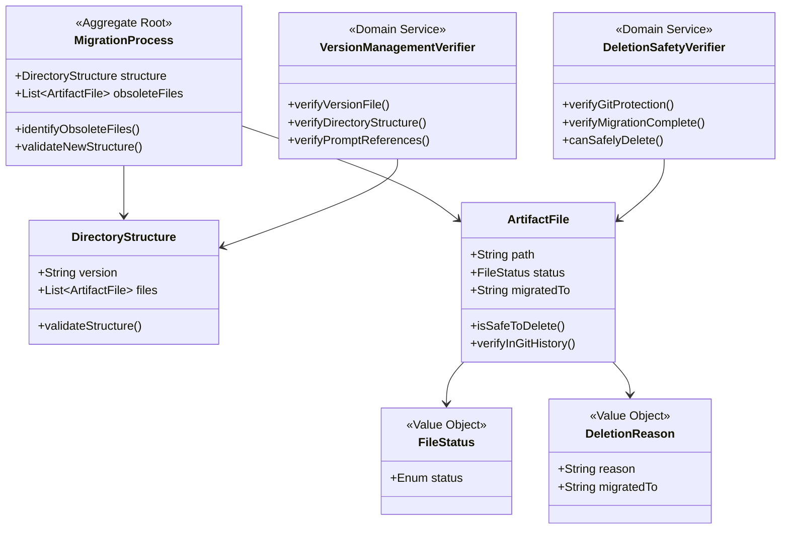

# ドメインモデル: Unit5 - 旧構造の削除とバージョン管理

## 概要
v1.0.0への移行完了後、開発初期に暫定的に作成されたファイルと旧バージョンのサンプルを安全に削除し、新構造でのバージョン管理を確立する。

**重要**: このドメインモデル設計では**コードは書かず**、構造と責務の定義のみを行います。実装はImplementation Phase（コード生成ステップ）で行います。

## エンティティ（Entity）

### 成果物ファイル（ArtifactFile）
- **ID**: ファイルパス（文字列）
- **属性**:
  - path: String - ファイルシステム上のパス
  - status: FileStatus - ファイルの状態（暫定/正式/サンプル/削除済み）
  - createdAt: DateTime - 作成日時
  - migratedTo: String (nullable) - 移行先パス（移行済みの場合）
- **振る舞い**:
  - isSafeToDelete(): Boolean - 削除しても問題ないか判定
  - verifyInGitHistory(): Boolean - Git履歴で保護されているか確認

### ディレクトリ構造（DirectoryStructure）
- **ID**: プロジェクトルート
- **属性**:
  - version: String - バージョン番号（例: "1.0.0"）
  - artifactFiles: List<ArtifactFile> - 管理下のファイル群
  - structure: Map<String, DirectoryNode> - ディレクトリツリー
- **振る舞い**:
  - identifyObsoleteFiles(): List<ArtifactFile> - 削除対象ファイルを特定
  - validateStructure(): Boolean - 新構造の整合性を検証

## 値オブジェクト（Value Object）

### ファイル状態（FileStatus）
- **属性**: status: Enum(暫定, 正式, サンプル, 削除済み)
- **不変性**: ファイルの状態は作成時に決定され、変更はライフサイクルイベントとして記録される
- **等価性**: status値の一致で判定

### 削除理由（DeletionReason）
- **属性**:
  - reason: String - 削除理由（例: "正式版に移行済み"、"新構造では不要"）
  - migratedTo: String (nullable) - 移行先パス
- **不変性**: 削除判断の根拠を明確に記録するため不変
- **等価性**: reasonとmigratedToの両方が一致

## 集約（Aggregate）

### 移行プロセス（MigrationProcess）
- **集約ルート**: DirectoryStructure
- **含まれる要素**:
  - DirectoryStructure（ルート）
  - List<ArtifactFile>（削除対象ファイル）
  - List<DeletionReason>（削除理由）
- **境界**: プロジェクト全体のディレクトリ構造と削除対象ファイルの整合性
- **不変条件**:
  - 削除対象ファイルは必ずGit履歴で保護されている
  - 移行済みファイルは移行先が存在する
  - 新構造の必須ディレクトリ（docs/aidlc/, docs/versions/）が存在する

## ドメインサービス

### 削除安全性検証サービス（DeletionSafetyVerifier）
- **責務**: ファイル削除の安全性を検証
- **操作**:
  - verifyGitProtection(file): Boolean - Git履歴での保護を確認
  - verifyMigrationComplete(file): Boolean - 移行先の存在を確認
  - canSafelyDelete(file): DeletionSafetyResult - 総合的な削除可否判定

### バージョン管理検証サービス（VersionManagementVerifier）
- **責務**: 新構造でのバージョン管理機能を検証
- **操作**:
  - verifyVersionFile(): Boolean - docs/aidlc/version.txt の内容確認
  - verifyDirectoryStructure(): Boolean - 新構造の整合性確認
  - verifyPromptReferences(): Boolean - プロンプトからの参照が正しいか確認

## リポジトリインターフェース

### ファイルシステムリポジトリ（FileSystemRepository）
- **対象集約**: MigrationProcess
- **操作**:
  - listFiles(directory): List<ArtifactFile> - ディレクトリ内のファイル一覧
  - deleteFile(path): void - ファイル削除
  - deleteDirectory(path): void - ディレクトリ削除（再帰的）
  - verifyExists(path): Boolean - ファイル/ディレクトリの存在確認

### Gitリポジトリ（GitRepository）
- **対象集約**: MigrationProcess
- **操作**:
  - isInHistory(path): Boolean - Git履歴に存在するか
  - getStatus(): GitStatus - Git status の結果
  - hasUncommittedChanges(): Boolean - 未コミット変更の有無

## ドメインモデル図

## ユビキタス言語

このドメインで使用する共通用語：

- **暫定成果物（Provisional Artifact）**: 開発初期に暫定的に作成され、後で正式な場所に移行される成果物
- **正式成果物（Official Artifact）**: Inception/Construction Phaseで正式に作成された成果物
- **サンプル成果物（Sample Artifact）**: 旧バージョンの実行例として作成された成果物
- **移行済み（Migrated）**: 暫定成果物が正式な場所に移行され、元のファイルが不要になった状態
- **Git履歴保護（Git History Protection）**: 削除されたファイルがGit履歴から復元可能な状態
- **新構造（New Structure）**: docs/aidlc/ と docs/versions/ を中心とした新しいディレクトリ構造
- **旧構造（Old Structure）**: v0.1.0で使用されていた、またはv1.0.0開発初期の暫定的な構造

## 不明点と質問（設計中に記録）

特に不明点はありません。削除対象と保持対象が明確で、Git履歴で保護されていることを確認すれば安全に削除できます。
