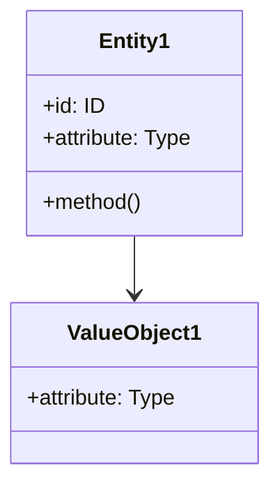

# ドメインモデル: [Unit 名]

## 概要
[このドメインモデルの目的と責務]

## エンティティ（Entity）

### [エンティティ名1]
- **ID**: [識別子の型と説明]
- **属性**:
  - [属性名]: [型] - [説明]
  - [...]
- **振る舞い**:
  - [メソッド名]: [説明]
  - [...]

## 値オブジェクト（Value Object）

### [値オブジェクト名1]
- **属性**:
  - [属性名]: [型] - [説明]
  - [...]
- **不変性**: [なぜ不変であるべきか]
- **等価性**: [等価性の判定基準]

## 集約（Aggregate）

### [集約名1]
- **集約ルート**: [エンティティ名]
- **含まれる要素**:
  - [エンティティ or 値オブジェクト]
  - [...]
- **境界**: [この集約が管理する範囲]
- **不変条件**: [常に満たすべき条件]

## ドメインサービス

### [サービス名1]
- **責務**: [このサービスの役割]
- **操作**:
  - [操作名]: [説明]
  - [...]

## リポジトリ（Repository）

### [リポジトリ名1]
- **対象集約**: [集約名]
- **操作**:
  - find(id): ID で検索
  - save(aggregate): 保存
  - delete(id): 削除
  - [その他のクエリメソッド]

## ファクトリ（Factory）

### [ファクトリ名1]
- **生成対象**: [エンティティ or 集約]
- **生成ロジック**: [複雑な生成処理の説明]

## ドメインモデル図

## ユビキタス言語

このドメインで使用する共通用語：

- **[用語1]**: [定義]
- **[用語2]**: [定義]
- [...]
