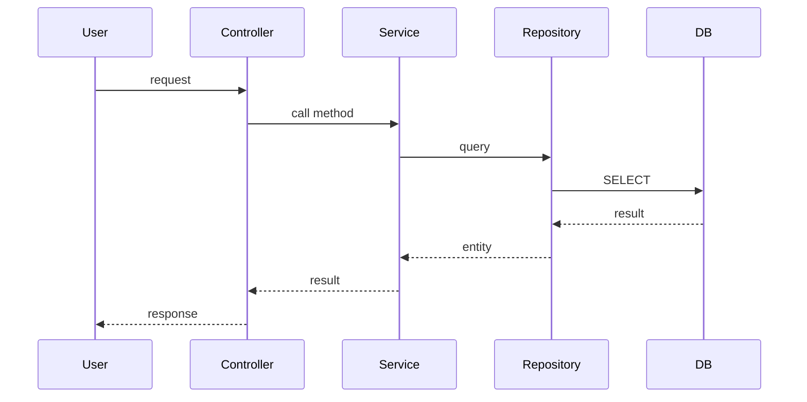

# 論理設計: [Unit 名]

## 概要
[この論理設計の目的]

## アーキテクチャパターン
[採用するパターン名と理由]

## コンポーネント構成

### レイヤー / モジュール構成

```
[Layer/Module 名]
├── [Sub-module 1]
│   ├── [Component A]
│   └── [Component B]
└── [Sub-module 2]
    └── [Component C]
```

### コンポーネント詳細

#### [コンポーネント名1]
- **責務**: [役割]
- **依存**: [依存するコンポーネント]
- **公開インターフェース**: [...]

## インターフェース設計

### API エンドポイント（該当する場合）

#### `[HTTP Method] /path/to/endpoint`
- **説明**: [...]
- **リクエスト**:
  ```json
  {
    "field": "value"
  }
  ```
- **レスポンス**:
  ```json
  {
    "result": "value"
  }
  ```
- **エラー**: [エラーケース]

### コマンド（該当する場合）

#### [コマンド名]
- **パラメータ**: [...]
- **戻り値**: [...]
- **副作用**: [...]

### クエリ（該当する場合）

#### [クエリ名]
- **パラメータ**: [...]
- **戻り値**: [...]

## データモデル

### データベーススキーマ（該当する場合）

#### テーブル: [テーブル名1]
```sql
CREATE TABLE table_name (
    id INTEGER PRIMARY KEY,
    field1 TEXT NOT NULL,
    field2 INTEGER,
    created_at TIMESTAMP DEFAULT CURRENT_TIMESTAMP
);
```

### ファイル形式（該当する場合）
[JSON, YAML, CSV 等の形式]

## 処理フロー

### [ユースケース1] の処理フロー



## 非機能要件（NFR）への対応

### パフォーマンス
- **要件**: [Unit 定義の NFR を参照]
- **対応策**:
  - [キャッシュ戦略]
  - [非同期処理]
  - [...]

### セキュリティ
- **要件**: [Unit 定義の NFR を参照]
- **対応策**:
  - [認証・認可]
  - [入力バリデーション]
  - [...]

### スケーラビリティ
- **要件**: [Unit 定義の NFR を参照]
- **対応策**:
  - [ステートレス設計]
  - [水平スケーリング]
  - [...]

### 可用性
- **要件**: [Unit 定義の NFR を参照]
- **対応策**:
  - [エラーハンドリング]
  - [リトライ戦略]
  - [...]

## 技術選定
- **言語**: [...]
- **フレームワーク**: [...]
- **ライブラリ**: [...]
- **データベース**: [...]

## 実装上の注意事項
- [...]
- [...]
